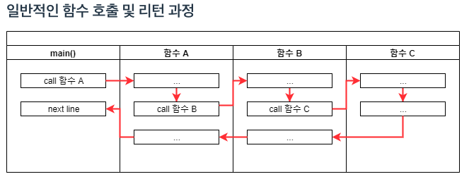
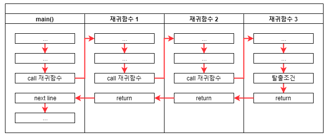

# [Recursion] -  재귀함수 호출의 원리

###  | 일반적인 함수 호출 및 리턴 과정 



### | 재귀함수의 호출 및 리턴 과정



함수의 실행코드는 메모리에 한 번만 저장되어 같은 공간인 것이 맞지만, 로컬 변수 및 파라미터 등은 전혀 다른 공간에서 새로 생성되어 이전 함수 호출과 전혀 연관없는 진행이 이루어 진다. 따라서 호출 할 때마다 **새로운 객체**가 생성된다고 생각하면 된다. 실제로 JVM 에서는 Stack에 각 메소드가 호출될 때마다 Frame을 생성해서 관리한다. 

새로운 객체가 생성된다는 것이 재귀함수를 이해하는 과정에서 가장 중요한 포인트이다. 위 그림과 같이 재귀함수는 함수 내부에서 재귀 함수를 호출하는 시점에 새로운 객체가 생성되고, 각 함수의 리턴 시점에 호출했던 코드의 바로 아래로 되돌아 온다. 

### | 예시 

#### 단방향 연결 리스트의 끝에서 K 번째 노드의 값을 찾는 알고리즘 구현

```java
static int KthFromTail(Node node, int k) {
  if (node == null) {
    return 0; 
  }
  // 
  int count = KthFromTail(node.next, k) + 1; 
  // 탈출 조건
  if (count == k) {
    System.out.println(k + "th from the tail is : " + node.data);
  }
  return count; 
}
```


### | Reference 

###### http://10bun.tv/beginner/episode-4/#%ED%95%B5%EC%8B%AC-%EA%B0%95%EC%9D%98