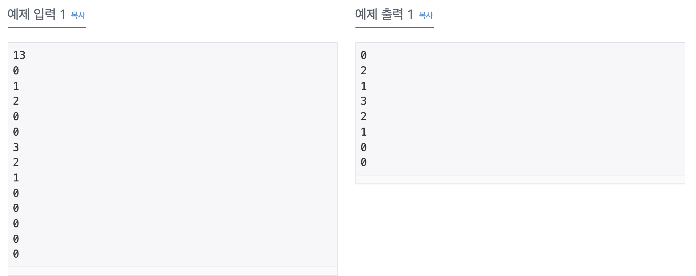

# [BAEKJOON] 최대 힙 11279번

### | 문제 

널리 잘 알려진 자료구조 중 최대 힙이 있다. 최대 힙을 이용하여 다음과 같은 연산을 지원하는 프로그램을 작성하시오. 

1. 배열에 자연수 X를 넣는다.
2. 배열에서 가장 큰 값을 출력하고, 그 값을 배열에서 제거한다.

### | 입력 

첫째 줄에 연산의 개수 N (1 <= N <= 100,000)이 주어진다. 다음 N개의 줄에는 연산에 대한 정보를 나타내는 정수 X가 주어진다. 만약 X가 자연수라면 배열에 X라는 값을 넣는 연산이고, X가 0이라면 배열에서 가장 큰 값을 출력하고 그 값을 배열에서 제거하는 경우이다. 입력되는 자연수는 2^31보다 작다.

### | 출력

입력에서 0이 주어진 만큼 답을 출력한다. 만약 배열이 비어 있는 경우인데 가장 큰 값을 출력하라고 한 경우에는 0을 출력하면 된다.

### | Reference

###### https://www.acmicpc.net/problem/11279
