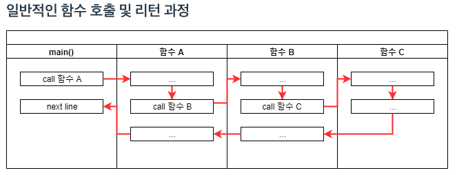
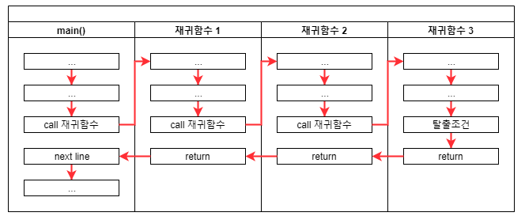
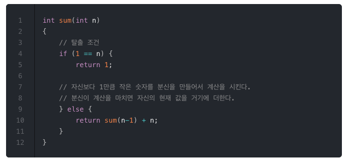
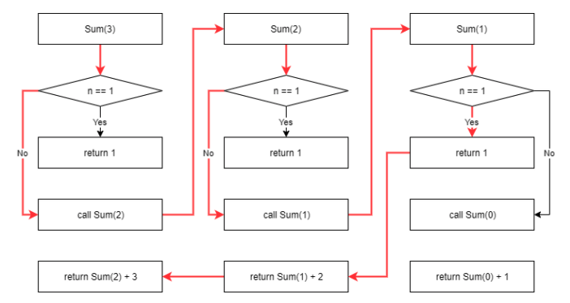

### Recursive0 -  함수 호출의 원리 및 재귀호출 

출처 : http://10bun.tv/beginner/episode-4/#%ED%95%B5%EC%8B%AC-%EA%B0%95%EC%9D%98

**일반적인 함수 호출 및 리턴 과정** 

함수가 호출되고 되돌아오는 과정은 위와 같다. 

**재귀함수의 호출 및 리턴 과정**

함수의 실행코드는 메모리에 한 번만 저장되어 같은 공간인 것이 맞지만, 로컬 변수 및 파라미터 등은 전혀 다른 공간에서 새로 생성되어 이전 함수 호출과 전혀 연관없는 진행이 이루어 진다. 따라서 호출 할 때마다 **새로운 객체**가 생성된다고 생각하면 된다. 

새로운 객체가 생성된다는 것이 재귀함수를 이해하는 과정에서 가장 중요한 포인트이다. 위 그림과 같이 재귀함수는 함수 내부에서 재귀 함수를 호출하는 시점에 새로운 객체가 생성되고, 각 함수의 리턴 시점에 호출했던 코드의 바로 아래로 되돌아 온다. 

**예시** 

 	

기본적으로 함수의 호출과 리턴에 대한 흐름을 알고 있는 것이 재귀 함수의 흐름을 이해하는데 중요하다고 생각이 들었다. 재귀함수가 호출될 때 위 그림과 같이 새로운 객체 속에서 흐름이 진행된다는 점은 그동안 해결되지 않았던 부분을 해결해주었다. 

재귀함수는 그 자체로 무한히 호출되는 문제가 있을 수 있고 이는 곧 메모리 문제를 야기할 수 있다. 따라서 예시에서 볼 수 있듯이 '탈출조건'을 두고 무한 재귀를 막는 것도 매우 중요한 포인트이다. 

재귀함수에서 더 공부할 주제 

@탈출 조건

@Palindrome(회문), 팩토리얼 함수, 거듭제곱 

@Back tracking - Reacitve Streams 관련 

@Parser and Compiler 