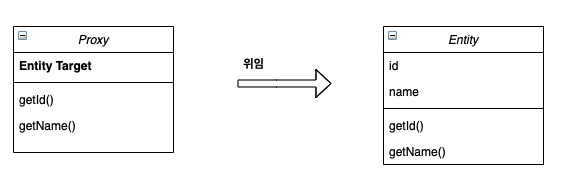
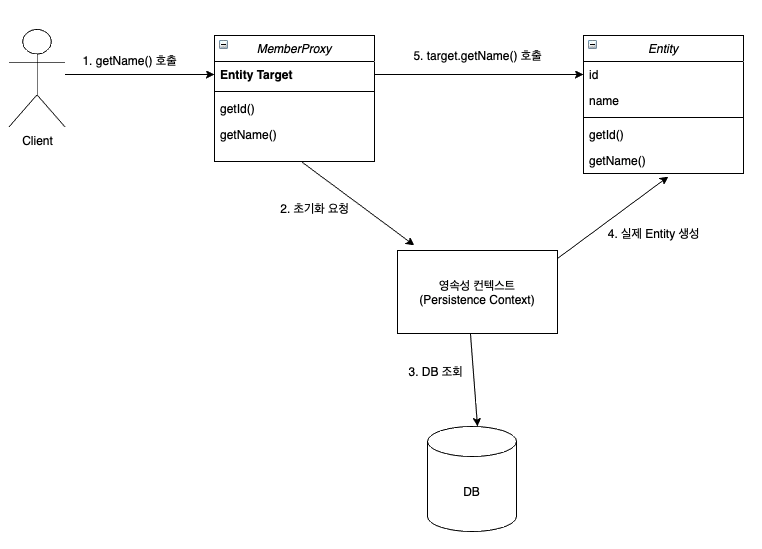

# [8장] 프록시와 연관관계 정리 (1)

##### - 8.1 프록시 ◀︎ **현재 글**

##### - 8.2 즉시 로딩과 지연 로딩 ◀︎ **현재 글**

##### - 8.3 지연 로딩 활용 ◀︎ **현재 글**

##### - 8.4 영속성 전이: CASCADE

##### - 8.5 고아 객체 & 영속성 전이 + 고아 객체, 생명주기

___

### | 프록시 

영어 단어 *proxy* 는 대리, 위임과 같은 무엇인가를 대체하는 주체를 의미한다. JPA에서는 프록시를 통해서 어떤 문제를 해결하려고 했을까? 각 객체 간 연관 관계가 있는 객체를 탐색할 때는 객체 그래프로 (참조 관계에 있는) 연관된 객체를 탐색한다. 이 때 탐색 대상인 연관 관계에 있는 객체가 영속화가 되지 않는 경우 데이터베이스로부터 조회해야 한다. 여기서 문제는 **시점**이다. A 객체를 조회할 때 A와 연관 관계가 있는 모든 객체를 모두 조회하는 것보다는 자주 함께 사용되는 연관 객체만 조회하고, 자주 사용하지 않는 객체는 필요할 때만 조회하는 것이 이상적일 것이다. 

바로 이러한 문제를 해결하기 위해 JPA에서 도입한 개념이 프록시다. 위에서 언급한 것과 같이 프록시를 통해서는 연관 관계에 있는 객체를 조회를 필요한 시점에 할 수 있도록 지연 시킬 수 있는 것이 **지연 로딩**이다. 지연 로딩을 하기 위해서는 실제 연관 관계를 갖는 엔티티 대신 특정 시점에 실제 엔티티를 조회할 수 있도록 중간 다리가 필요한데 이를 프록시 객체라고 부른다. 

(참고)

<u>JPA 표준 명세는 지연 로딩의 구현 방법을 JPA 구현체에 위임했다. 따라서 지금부터 설명할 내용은 하이버네이트 구현체에 대한 내용이다.</u> 

#### - 프록시 특징 

```java
// 1) find() 메소드를 통해 영속화되지 않은 경우에는 데이터베이스에서 실제 엔티티를 조회한다.
Member member = em.find(Member.class, "member1");

// 2) 실제 엔티티 객체를 조회하지 않고, 대신 특정 시점에 데이터베이스에 접근을 위임 받은 프록시 객체를 반환한다. 
Member member = em.getReference(Member.class, "member1");
```

프록시 객체는 실제 클래스를 <u>상속</u> 받아서 만들어진다. 따라서 겉 모양이 같고 사용하는 입장에서는 해당 객체로 서비스 로직을 전개할 구현할 때 실제 객체인 지 프록시 객체인 지를 구별할 필요 없이 사용하면 된다. 


​																					 <그림 1> 

프록시 객체는 데이터베이스로부터 실제 객체를 조회할 때 필요한 참조 값이 필요하고, 이 값(<u>target</u>) 역시 가지고 있다. 이 참조 값을 활용해서 프록시 객체에서 메소드가 호출되면 이를 실제 객체의 메소드를 호출한다. 



​											 <그림 2>

#### - 프록시 객체의 초기화 

여기서  <u>초기화</u>에 대한 정의가 중요한데, 프록시 객체의 초기화의 의미는 프록시 객체를 통해 특정 사용 시점에 데이터베이스로부터 실제 객체를 생성하는 것을 말한다. 프록시 객체의 초기화 도식화는 다음과 같다. 



​					  <그림 3> 

<그림 3>을 보면, 프록시 객체를 통해서 메소드가 호출되는 시점에 초기화 요청을 보내는데, 프록시 객체는 최초 사용되는 시점에 한 번만 초기화된다. 이는엔티티 영속화와 관련이 있는데, 영속화된 엔티티의 경우에는 데이터베이스에서 조회하지 않아도 해당 엔티티를 반환할 수 있는 구조가 있기 때문이다. 또한 이미 1차 캐시에 보관 중인 엔티티의  경우에는 실제 데이터베이스에서 조회할 필요가 없다. 또한 초기화는 영속성 컨텍스트의 도움을 받아야 한다. 따라서 준영속 상태의 프록시를 초기화하는 경우 `org.hibernate.LazyInitalizationException` 예외가 발생한다. 그리고 프록시 객체는 앞서 언급한 것과 같이 실제 객체를 상속 받았기 때문에 프록시 객체와 실제 객체를 타입을 통해서 명확히 구분하는 경우 주의가 필요하다. 

#### - 프록시와 식별자 

```java
// 프록시를 통해 Team 엔티티 조회 
Team team = em.getReference(Team.class, "team1");

// 프록시 객체 초기화 하지 않는다. 
team.getId(); 
```

위 코드와 같이 프록시를 통해 엔티티를 조회하는 경우, 파라미터로 식별자 값인 "team1"을 전달하는데, 프록시 객체는 이 식별자 값을 보관한다. 프록시 객체가 식별자 값을 가지고 있는 형태는 엔티티 접근 방식에 따라서 프록시 객체의 초기화 여부를 결정하게 된다. <u>예를 들어, `@Access(AccessType.PROPERTY)`로 설정한 경우에는 이미 프록시 객체가 식별자 값을 보관하고 있으므로 프록시 객체를 초기화 하지 않지만, `@Access(AccessType.FIELD)`로 설정하는 경우 JPA가 `getId()` 메소드가 단순히 식별자 값을 조회하는 메소드인 지 다른 필드까지 활용해서 어떤 일을 하는 메소드인지 알 수 없으므로 프록시 객체를 초기화 한다.</u>  

각 엔티티 간 연관 관계를 설정할 때는 식별자 값만 사용하므로 프록시를 사용하면 데이터베이스 접근 횟수를 줄일 수 있다. 또한 참고로 <u>연관관계를 설정할 때는 엔티티 접근 방식을 필드로 설정해도 프록시를 초기화하지 않는다.</u> 

#### - 프록시 확인 

JPA가 제공하는 `PersistenceUnitUtil.isLoaded(Object entity)` 메소드를 사용하면 프록시 인스턴스의 초기화 여부를 확인할 수 있다. 아직 초기화가 되지 않은 경우 `false`를 반환한다. 반대로 이미 초기화가 되어 프록시 인스턴스가 아닌 경우 `true`를 반환한다. 또한 실제 눈으로 해당 객체를 출력 함으로써 확인할 수 있는데, 프록시 객체의 클래스 명 뒤에는 `..javassist..`가 잇다. 단, 프록시를 생성하는 라이브러리에 따라 다를 수 있다.


### | 즉시 로딩과 지연 로딩 

#### - 즉시 로딩 

`회원 : 팀` 관계에 있어서 회원 정보를 조회할 때 `즉시 로딩`로 설정하면, 연관된 객체인 팀 객체도 동일한 시점에 조회하게 된다.  

```java
@Entity
public class Member {
  	...
    @ManyToOne(fetch = FetchType.EAGER)
    @JoinColumn(name = "TEAM_ID")
    private Team team; 
  	... 
}
```

위 예시 코드와 같이 즉시 로딩을 위한 설정을 할 수 있다. 회원 객체와 팀 객체를 한 시점에 조회하기 위해서는 각각 한 번씩 쿼리를 통해 조회하는 것이 아닌, `Join` 문을 통해서 하나의 쿼리로 조회한다. 

(참고)

위 상황에서 회원 객체와 해당 회원이 속한 팀 객체를 함께 조회할 때 JPA는 기본적으로 `Left Outer Join`을 활용한다. 이를 벤 다이어그램으로 표현하면 다음과 같다.

​																	 

​																	 <그림 4> 	

Table_1을 회원 테이블로 가정했을 때, JPA는 <그림 4>와 같이 `Left Outer Join` 문을 활용해서 두 객체를 조회한다. 이 때 하나의 가정이 더 필요한데, 회원 중 특정 팀에 속하지 않은 회원이 있을 수 있다는 전제가 필요하다. 이러한 경우에는 <그림 4>와 같이 팀에 속하지 않은 회원과 특정 팀에 속한 회원을 모두 조회할 수 있어야 한다. 실제 객체 진영에서도 참조 관계가 설정되지 않았음으로 회원 입장에서 팀 객체가 NULL로 있을 것이고, <그림 4>에서 Table_1에만 속한 회원들은 데이터베이스가 팀 컬럼에 NULL로 채운다.  	


​																	  <그림 5>  

반대로, 모든 회원이 가입할 때 특정 팀에 속해야 한다는 전제가 있다면 <그림 5>와 같이 `Inner Join`을 통해서 최적화를 도모할 수 있다. 굳이 필요 없는 데이터를 조회할 필요가 없는 것이다. 하지만 앞서 언급한 것 처럼 JPA는 기본적으로 <그림 4>와 같이 `Left Outer Join`을 활용한다. 따라서 `Inner Join`을 사용하기 위해서는 설정을 명시하여 JPA로 하여금 `Inner Join`을 사용해도 된다는 것을 알게 해줘야 한다. (<u>두 가지</u> 방법)

```java
// 1 
@Entity
public class Member {
  	...
    @ManyToOne(fetch = FetchType.EAGER)
    @JoinColumn(name = "TEAM_ID", nullable = false)
    private Team team; 
    
    ...
}

// 2 
@Entity
public class Member {
  	...
    @ManyToOne(fetch = FetchType.EAGER, optional = false)
    @JoinColumn(name = "TEAM_ID")
    private Team team; 
    
    ...
}
```

#### - 지연 로딩 

```java
@Entity
public class Member {
  	...
    @ManyToOne(fetch = FetchType.LAZY)
    @JoinColumn(name = "TEAM_ID")
    private Team team; 
  	... 
}
```

회원과 팀을 지연 로딩을 설정했기 때문에, 회원을 조회할 때 팀 객체를 조회하지 않고 프록시 객체를 반환한다. 프록시 객체를 통해서 실제 팀 객체가 사용될 때까지 팀 객체를 조회하는 것을 미룰 수 있게 되는 것이다. 다만, `JPA`에서 객체를 조회하는 것은 결국 영속성 컨텍스트 맥락 속에서 이뤄지는 행위인데 만약 팀 객체가 영속화가 이미 되어 있는 경우에는 프록시 객체를 사용하지는 않는다. 객체를 조회할 때 1차적으로 1차 캐시에 있는 객체를 조회하기 때문이다. 

즉시 로딩과 지연 로딩과 관련하여 모든 상황을 아우르는 방법론은 없다. 비즈니스 요구사항에 맞춰서 연관관계가 있는 두 엔티티를 즉시 로딩 관계로 설정할 지 또는 지연 로딩으로 설정할 지에 대해서는 판단하고 선택할 옵션이다. 

### | 지연 로딩 활용 

이번 장에서는 `JPA`가 연관관계에서 디폴트로 선택한 Fetch 전략과 주의사항을 다룬다. 기본 설정은 다음과 같다.

##### - @ManyToOne, @OneToOne : 즉시 로딩 (FetchType.EAGER)

##### - @OneToMany, @ManyToMany : 지연 로딩 (FetchType.LAZY)

위 기본 전략을 보면, 연관된 엔티티가 하나면 즉시 로딩, 컬렉션인 경우에는 지연 로딩을 사용한다. 두 엔티티를 한 번에 조회할 때 컬렉션인 경우에는 대상 엔티티가 많은 경우 비용이 많이 소요되기 때문이다. 직관적으로 생각해도 필요할 때만 불러오는 것이 효율적인 선택이라고 쉽게 이해할 수 있다. 자바 ORM 표준 JPA 프로그래밍 저자인 김영한 님은 모든 연관관계에서 지연 로딩 전략을 사용하는 것을 추천한다. 그리고 실제 개발이 어느 정도 완료된 후 실제 사용하는 상황을 분석 후 필요한 곳에만 즉시 로딩을 통해 최적화하는 것을 제안한다. JPA를 통해 쿼리를 동적 생성하지 않고 직접 SQL을 작성하는 것은 최적화 시점 (또는 유지보수)에 해당 코드를 계속해서 변경해야 하는 점에서 취약하다. 단, `FetchType.EAGER` 즉시 로딩을 사용할 때 주의할 것이 있는데 다음과 같다. 

##### - 컬렉션을 하나 이상 즉시 로딩하는 것은 권장하지 않는다. 

두 연관관계에 있는 엔티티를 조회할 때 SQL 조인문을 사용하는데, 컬렉션과 조인하는 경우에는 일대다 조인의 형태가 된다. 서로 다른 컬렉션과 일대다 조인을 통해서 조회를 하면, 각각의 컬렉션의 수를 곱한 만큼 데이터가 조회 대상이 되므로 비용이 커질 수 있고 결국 성능상에 이슈가 생긴다. 

##### - 컬렉션 즉시 로딩은 항상 외부 조인을 사용한다.

앞서 `FetchType.EAGER` 설정과 조인 전략을 설정해서 `Left Outer Join` 또는 `Inner Join` 을 선택할 수 있었는데, JPA는 컬렉션이 포함된 엔티티 연관관계에서는 즉시 로딩 시 항상 `Left Outer Join` (외부조인)을 사용한다. 

### | Reference 

#### 자바 ORM 표준 JPA 프로그래밍 (김영한 지음)

https://towardsdatascience.com/what-is-the-difference-between-an-inner-and-an-outer-join-in-sql-5b5ec8277377
