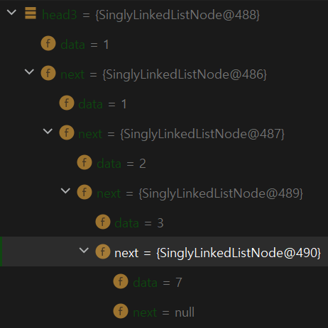

# Merge two sorted linked lists 

https://www.hackerrank.com/challenges/merge-two-sorted-linked-lists/problem

[예]

1 -> 3 -> 7 -> Null

1 -> 2 -> Null

자료구조 문제를 풀 때 시간을 정해놓고 (15~20분) 그 시간을 넘어가게 되면 우선 다른 사람이 풀어놓은 코드를 보고 분석하기 시작했다. 

    static SinglyLinkedListNode mergeLists(SinglyLinkedListNode head1, SinglyLinkedListNode head2) {
        
        SinglyLinkedListNode head3 = null;
        
        if (head1.data < head2.data) {
            head3 = head1;
            head1 = head1.next;            
        } else {
            head3 = head2;
            head2 = head2.next;
        }
        
        SinglyLinkedListNode current_node = head3;
        
        while (head1 != null && head2 != null) {
            
            if (head1.data < head2.data) {
                current_node.next = head1;
                head1 = head1.next;
            } else {
                current_node.next = head2;
                head2 = head2.next;
            }
            
            current_node = current_node.next;
        }
        
        if (head1 == null) {
            current_node.next = head2;
        } else {
            current_node.next = head1;
        }
        
        return head3;
        
    // https://www.youtube.com/watch?v=yuMEpwt-YB4
    }

위 코드를 분석하는 과정에서 막히는 부분이 있었다. 

한 줄 한 줄 직접 손으로 값을 적어 내려 가면서 따라갔지만 결과적으로 내가 합친 두 연결리스트는 

1 -> 1 -> 2 -> 3  (<u>정답 : 1 -> 1 -> 2 -> 3 -> 7 -> Null</u>)

가장 이해가 안 되는 부분은 3에서 7로 연결하는 부분이었고, 결국 InteliJ 디버깅 툴을 이용해서 직접 확인을 했다. 가장 마지막 코드인 return head3;에 토글 포인트를 놓고 직접 데이터를 확인했다. 

**결론**

앞서 내가 코드를 보고 분석했을 때 얻은 head3은 1 -> 1 -> 2 -> 3 -> Null 이었다. 

하지만 내가 이해하지 못하고 있었던 것은 파라미터 중 하나인 연결리스트 1 -> 3 -> 7 -> Null에서 

이미 데이터 3을 갖고 있는 노드의 다음 노드에 대한 정보가 이미 남아 있었고 따라서 내가 이 문제에서 3 -> 7로의 관계를 지정할 필요가 없었다. 연결 리스트를 공부하는 과정에서 두 노드의 관계를 맺는 것에만 초점을 두고 이 문제의 맥락을 정확히 이해하지 못했던 것 같다. 

참고 

https://www.hackerrank.com/challenges/merge-two-sorted-linked-lists/problem / 문제출처 

https://www.youtube.com/watch?v=yuMEpwt-YB4 / 문제 해설 참고 

https://jojoldu.tistory.com/149 / InteliJ 디버깅 툴 (디버깅 툴에 대해서 익숙하지 않은 분께 추천드립니다.)

