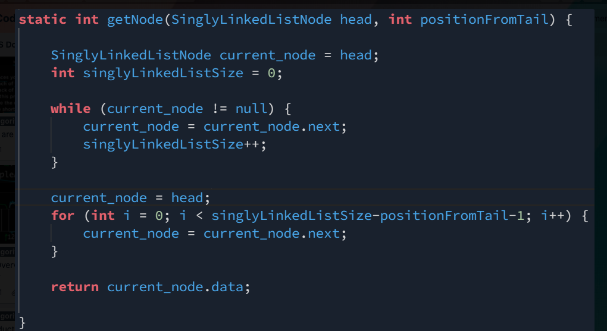
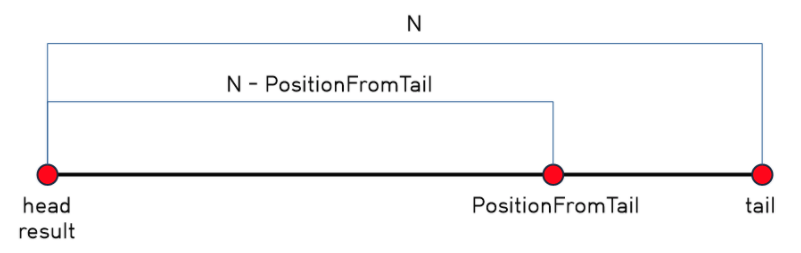

# Get Node Value

https://www.hackerrank.com/challenges/get-the-value-of-the-node-at-a-specific-position-from-the-tail/problem

# 1

이 문제를 **처음** 읽었을 때 들었던 생각은 

"Tail Node가 몇 번째 인덱스에 위치했는 지 구하자 그리고 주어진 포지션에 맞게 다시 Loop를 돌려서 해당 데이터를 구하자"

위 방식대로 진행을 하면 Tail 노드가 몇 번째 위치했는 지 구하는 과정 --> Loop 1 

주어진 포지션에 위치한 노드의 값을 구하는 과정 --> Loop 2 

---

# 2 

전체 노드 사이즈 : N

문제에서 주어진 포지션의 노드 값을 구해야 한다. 이는 결국 **N-PositionFromTail** 만큼 이동을 해야 하는 상황이다. 

그러면, 어떻게 그만큼(= N-PositionFromTail)만 이동할 수 있을까? 

우선 두 개의 포인터가 필요하다. 

위 그림에서 표현된 것처럼 head와 result 포인터가 있다. 

연결리스트 사이즈만큼 loop가 있는 상황에서 head 포인터는 Tail 노드까지 이동하게되고 result 포인터는 조건부로 특정 조건이 됐을 때 이동을 시작한다. 

head 포인터는 주어진 PositionFromTail 만큼 리스트 내부를 이동한다. (head 포인터가 PositionFromTail 만큼 이동)

result 포인터는 head 포인터가 PositionFromTail에 도달한 시점부터 포인터를 이동하게되면 while loop에서 N-PositionFromTail 만틈 이동할 수 있다.

https://www.youtube.com/watch?v=cCOLEFuQqKc  풀이 참조

https://chauchi.tistory.com/entry/HackerRank-Get-Node-Value 그림자료 참조 

