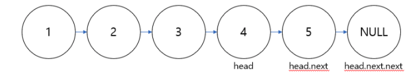
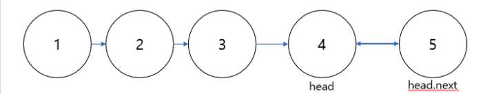
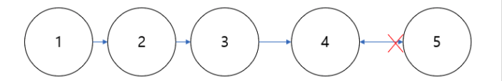

# Reverse Linked List

https://www.hackerrank.com/challenges/reverse-a-linked-list/problem


**Recursive** 

재귀 함수 호출 :

문제 상황에 맞게 기준이 되는 가장 마지막 노드를 기준으로 다시 앞으로 오면서 리턴하는 방식 

[예시 상황 그림 참조 https://bcp0109.tistory.com/entry/Reverse-Linked-List-Java]







우선 재귀함수의 `탈출` 조건은 다음과 같다.

```java
if (head == null || head.next == null) return head; 

"The head pointer given may be null meaning that the initial list is empty" 문제 조건 
  
문제 지문 기준으로 'head'가 null인 경우에는 주어진 Linked List는 Empty 상태이다. 또한 'head.next'가 null인 경우에는 주어진 Linked List의 사이즈가 1 이므로 위 두 상황에서는 head를 반환하면 된다. 
  
또한 재귀함수가 위 조건식에 부합하는 경우 탈출하는 조건이 된다.
```

이 문제에서 가장 헷갈렸던 부분 : 

`head.next.next=head`  

위 연산을 통해서 head와 head.next가 서로를 참조하는 상황

`head.next=null` 

head.next를 통해서 head.next의 노드 자체를 없애는 것이 아닌, 현재 head의 next를 null로 설정하는 것! 


**Loop**


