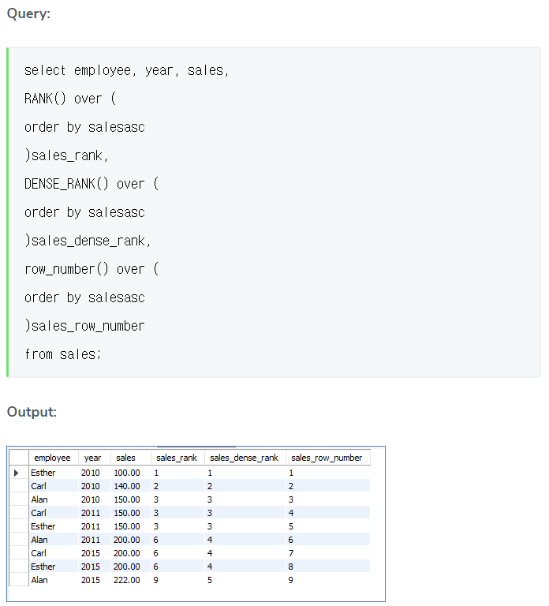

### Introduction to MySQL RANK()

https://www.educba.com/mysql-rank/

The RANK() function in MySQL will display **the rank of a row**. This rank of a row will be **defined within its partition**, and this rank will have gaps in-between. (* in-between : 중간 치) Consider there is a set of rows with different values like the cost of a commodity, marks of students, and so on. When ordered in ascending order, if we need to get the rank of a student with a certain score, it is easy to capture with the RANK() function.RANK() function has similarities with ROW_NUMBER() function and DESE_RANK() function.

Rank()는 말 그대로 순위를 매기는 함수이다. 

### Syntax 

The RANK() function is used along with the ‘**over**’ clause, ‘**partition** by’ clause, and ‘**order by**’ clause. But the ‘partition by’ clause is optional. The RANK() function can be performed on small sets of the entire result set or the complete result set as is. Incase, small sets of the result set is to be considered, then the ‘partition by’ clause is a must. Note that the function is re-initialized as partition boundary is crossed.

Rank() 

- OVER() 
- PARTITION BY() - Optional
- ORDER BY()

```sql
SELECT column_name
RANK() over (
PARTITION BY {expression}
ORDER BY {expression} [ASC|DESC] ) rank_column_name
from table_name;
```

- RANK() is used in the SELECT query, to return the desired ranks of rows as output from the table which is considered.
- RANK() over ( … ) rank_column_name – this part of the query will return the result of RANK() function and the output will hold the column as rank_column_name
- PARTITION BY {expression} – this part of the query will do the partition (if needed), according to the expression provided in the clause. This is an optional clause in RANK()
- ORDER BY {expression} [ASC|DESC] – this part of the query will order the result set in ascending or descending order. Ordering the results is mandatory to assign the ranks to rows. Once arranged in an order, only then can we identify whether there are ties in the values.

### How RANK() works in MySQL?

So as discussed, the RANK() function returns ranks of rows under a specific partition which is neatly ordered in ascending or descending order. This function considers **the same values in a column as ties and skips assigning the consecutive ranks** instead assigns the same rank to the row with a tie. This makes **the gaps or holes** in the rankings.


위에서 언급하는 **gaps or holes**는 3위가 현재 3 ROWS가 있으므로, 바로 6위로 이어지면서 누락된 4, 5위를 가르킨다. 이와 반대로 이 **gaps or holes**를 제거하고 순위를 매길 수 있는데, **DENSE_RANK()**와 **row_number()** 함수를 사용하면  가능하다. 



https://github.com/AnghelLeonard/Hibernate-SpringBoot/tree/master/HibernateSpringBootRankFunction