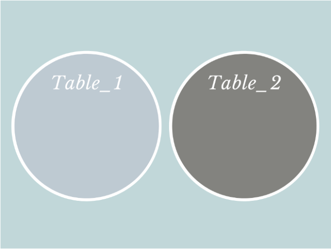
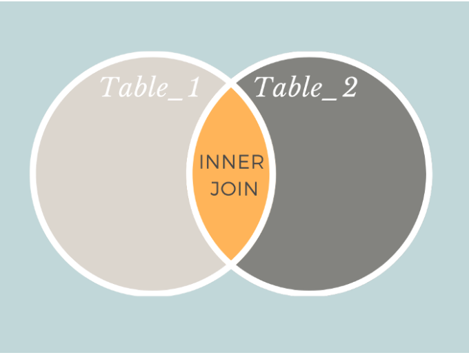
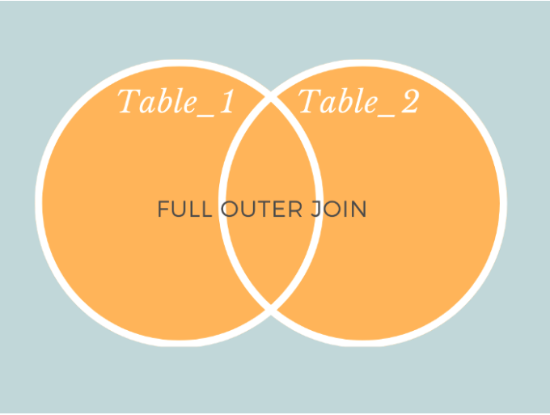
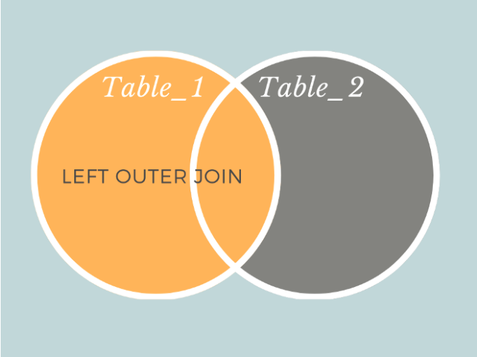
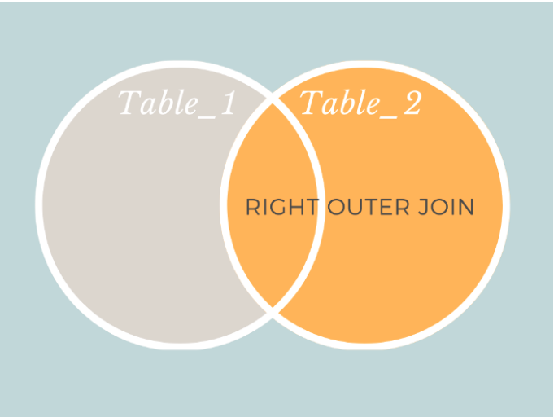

# [MySQL] What is the diff between an inner join and an outer join via diagram.

### | 4 Types of Join in SQL 

Joins in SQL are used to combine the contents of different tables. You can specify how you want the data from tables to be joined in many ways, one of which is the type of join. There are four main types of joins: **<u>inner join, full outer join, left outer join and right outer join.</u>**

​																	  <그림 1> 

​																      <그림 2> 

​																	  <그림 3>

​																	  <그림 4> 

​																	  <그림 5> 

### | Reference

https://towardsdatascience.com/what-is-the-difference-between-an-inner-and-an-outer-join-in-sql-5b5ec8277377