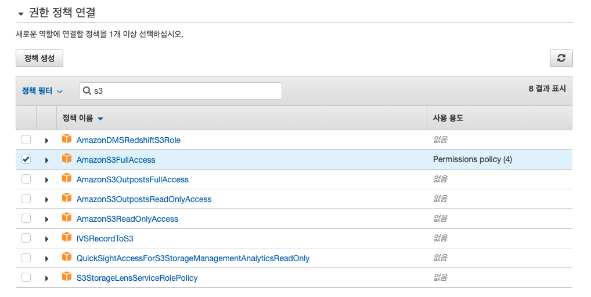

# AWS EC2 배포 환경에서 Spring Boot과 S3 연동 

### [참고 글]

https://jojoldu.tistory.com/300 : SpringBoot & AWS S3 연동하기 

https://docs.aws.amazon.com/IAM/latest/UserGuide/id.html : AWS 공식 홈페이지 IAM 개념과 구성요소 개념 설명 

### [상황]

로컬 환경에서 개발 할 때 `application.yml` 설정 파일에 AWS IAM user에서 발급 받은 Credentials (Access, Secret Key)를 등록해서 S3에 이미지를 업로드 했었다. IAM user Credentials 정보를 .gitignore에 추가했고, 배포 환경에서는 직접 업로드한 설정 파일을 참조하도록 설정해놓은 상황이었다. 

### [문제]

기본적으로 IAM user가 자주 바뀌는 설정은 아니지만, Spring Boot과 연동 과정에서 특정 Access Key, Secret Key를 설정해놓는 것은 결국 해당 값이 바뀔 때 마다 배포된 Spring Boot 실행파일이 참조하는 설정 파일을 직접 수정해야 하는 불편함이 있었다. 또한 현재 프로젝트와는 관계 없지만, <u>오토스케일링 환경에서 증설되는 각각의 EC2 마다 (예를 들어 AWS Credentials 정보를 포함하고 있는) yml 설정 파일을 포함시키는 측면에서도 불편함이 있을 것이다. 

### [해결] 

EC2에 직접 S3 Role (IAM Role)을 추가한 뒤 IAM Role을 통해 Spring Boot에서 S3에 업로드 할 수 있는 권한을 부여하는 방향으로 문제를 해결 

___

### IAM roles 이란 ? 

An IAM role is very similar to a user, in that it is an identity with permission policies that determine what the identity can and cannot do in AWS.  However, a role does not have any credentials (password or access keys) associated with it. Instead of being uniquely associated with one person, a role is intended to be assumable by anyone who needs it.

기본적으로 IAM role은 Credentials (위에서 언급됐던 IAM user의 Access Key, Secret Key)를 포함하지 않고, 해당 권한이 필요한 <u>개체가</u> 사용할 수 있다. 위에서 언급된 `개채`에는 다음을 포함한다. 


<그림 1> 

- 다른 계정의 IAM user
- **AWS 리소스에서 작업을 수행해야 하는 EC2 인스턴스에서 실행 중인 애플리케이션 코드 (예 - Spring Boot)**, **위 그림에서 선택된 영역**
- 계정 내 리소스에서 작업을 수행하여 기능을 제공해야 하는 AWS 서비스
- SAML을 통해 인증 연동을 사용하는 사내 디렉토리의 사용자 

지금은 배포 환경인 EC2 인스턴스에서 실행 중인 애플리케이션 (Spring Boot) 코드에 대한 IAM role 활용하는 상황이다. IAM role은 짧은 기간 도안 유효한 키를 발행함으로써 AWS 리소스 (예 - S3)에서 작업 수행을 가능하게 한다. 

___

### EC2에 IAM role 연결 

우선 지금 상황에서는 Spring Boot 내부 서비스 로직을 통해 AWS S3에 업로드 해야 하는 상황이므로, IAM role도 S3에 대한 role을 포함해야 한다. 


<그림 2>  

IAM role을 EC2에 적용해야 하므로, 위와 같이 설정 후 다음으로 넘어갑니다. 



<그림 3> 

검색 필터에 's3'를 입력 한 뒤, AmazonS3FullAccess 정책을 추가 한 뒤 다음으로 넘어갑니다. 


<그림 4> 

마지막으로 역할 이름과 설명을 기입한 뒤 역할을 생성합니다. 


​													   <그림 5> 

생성된 IAM role을 EC2 인스턴스에 연결하기 위해서 인스턴스 정보를 볼 수 있는 페이지에서 <그림 5>와 같이 IAM 역할 수정을 누른 뒤 IAM 역할을 새로 생성한 IAM role을 적용합니다. 

 

<그림 6> 

___

###  로컬 환경에서 Spring Boot aws.yml 파일

```properties
cloud:
  aws:
    region:
      static: ap-northeast-2
    # There is not EC2 meta data available, because the application is not running in the EC2 environment.
    # Region detection is only possible if the application is running on a EC2 instance
    # 로컬 환경에서 Spring Boot 애플리케이션이 구동될 때는 EC2 Region 정보를 반드시 기재해야 한다. 
    credentials:
      access-key: -
      secret-key: -
```

### aws-cli iam-role 적용 이후 & 배포 환경에서 Spring Boot aws.yml 파일 

```
$ aws configure list (EC2 인스턴스에 IAM role 적용 후)

      Name                    Value             Type    Location
      ----                    -----             ----    --------
   profile                <not set>             None    None
access_key     ****************7Z4H         iam-role    
secret_key     ****************bhsh         iam-role  
    region                <not set>             None    None
```

```properties
cloud:
	aws:
		s3:
			bucket: 
		region:
			static: 
		stack:
			auto: false
		credentials:
			instanceProfile: true 
```

`cloud.aws.stack.auto: false` 

- EC2에서 Spring Cloud 프로젝트를 실행시키면 기본으로 **CloudFormation 구성을 시작**합니다. (<u>어떤 의미 인 지 아직 잘 모르겠다!</u>)
- 설정한 CloudFormation이 없으면 프로젝트 시작이 안되니, 해당 내용을 사용하지 않도록 `false`를 등록합니다.

`cloud.aws.credentials.instanceProfile: true` 

- AWS의 `instanceProfile`을 사용하겠다는 의미
- $ aws confiture list에서 확인한 Accès, Secret Key를 사용한다는 의미
- 위 값이 없다면 application.yml (aws.yml 내부 내용 참조), Environment (환경변수) 등에서 해당 키 값들을 찾아서 사용

