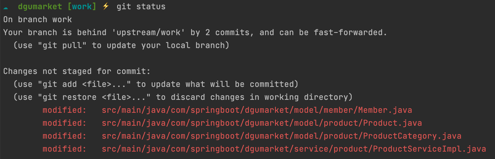
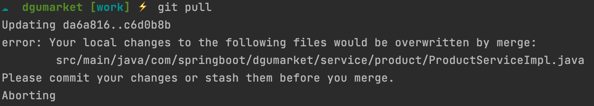

# [Error] : Your local changes ... overwritten by merge. 

< 그림 1 >

< 그림 2 >

 

### 상황 : 

1. `work` 브랜치에서 작업한 내역이 아직 commit 되지 않은 상황 
2. `work` 브랜치가 `tracking` 하고 있는 원격 브랜치로부터 업데이트 내역을 `pull` 시도 
3. 에러 발생 

___

우선 이 상황에서  확인 사항 :

- 충돌되는 파일 (=ProductServiceImpl.java) 이 있는 경우에 위 에러가 발생 
- 에러 해결 메시지를 통해서도 알 수 있지만 이 경우를 해결하기 위해서는 
  - 충돌된 파일을 커밋 (pull 하기 전에 원격 브랜치 상태를 먼저 바꾸고, 로컬 환경으로 해당 변경 내역을 병합하는 케이스)
  - stash를 통해서 현재 작업 목록 중 충돌되는 파일을 저장하고, 현재 작업 브랜치 내에서는 원래 파일 형태로 되돌려 충돌 상황을 회피 

