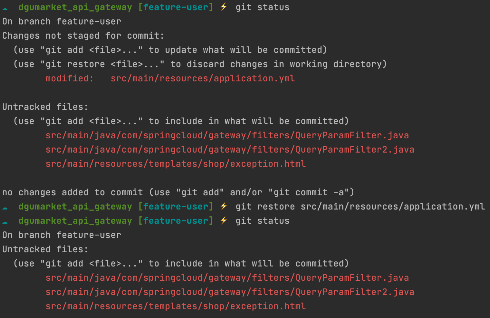

# Git - Restore : Restore working tree files

## Description

Restore specified paths in the working tree with some contents from a restore source. 

작업 디렉토리에 위치한 파일의 작업 내역을 복원시킨다. (특정 파일 지정)

If a path is tracked but does not exist in the restore source, it will be removed to match the source.

Tracked 상태의 파일이지만 복원 기준이 되는 시점에는 없던 파일인 경우에는 해당 파일을 삭제한다. 


## 상황 

팀원이 ___에 대한 기능 구현 여부에 대해서 문의가 와서 테스트 후에 해당 작업 내역을 커밋하지 않고 되돌리고 싶은 상황이었다. 

작업 디렉토리(Working tree)에서 변경 이전 시점으로 명령어 의미 그대로 `복원` 처리 해준다. 



____

Untracked 파일을 대상으로 `restore` 시도하는 경우 아래와 같은 에러 메시지를 출력한다. 

```
error: pathspec 'src/main/java/com/springcloud/gateway/filters/QueryParamFilter.java' did not match any file(s) known to git
```

