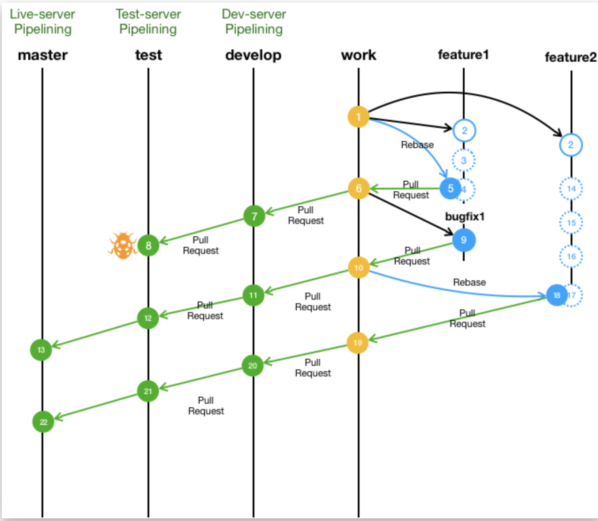
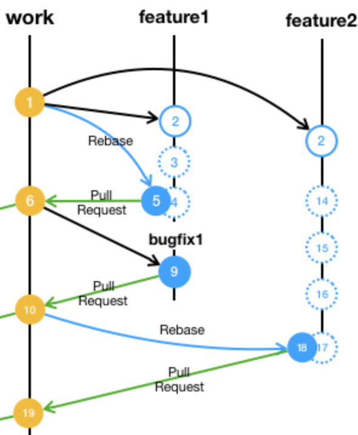
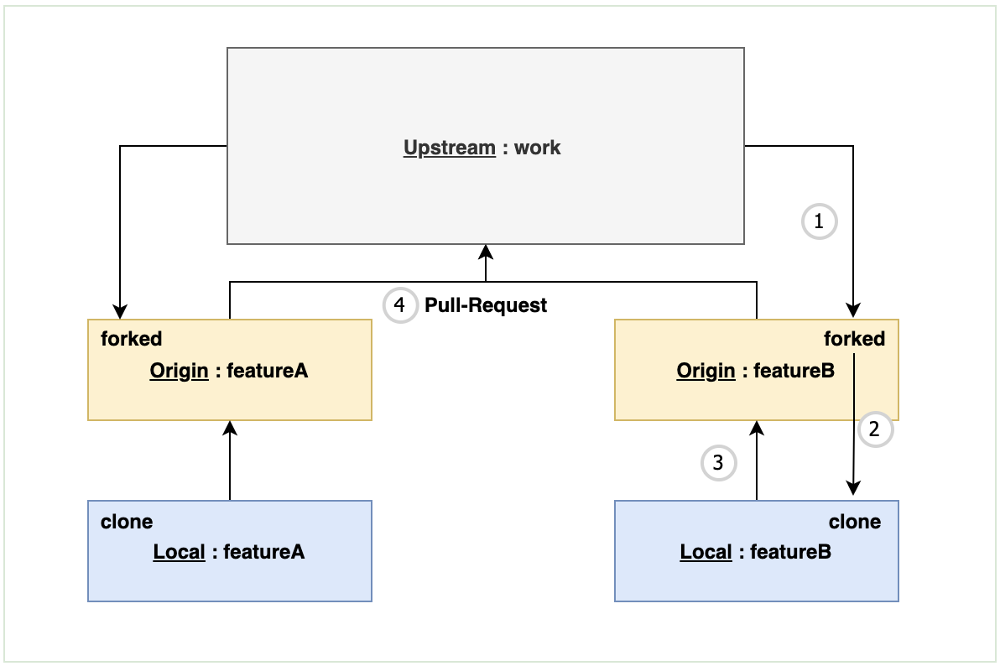
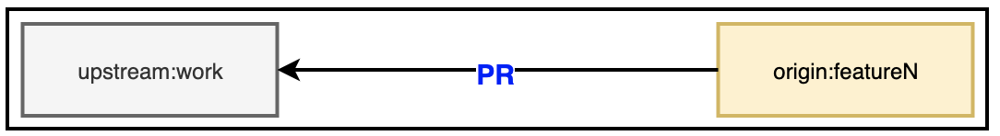

# Team Zext, Git Flow (1)

##### 팀 Zext 사용한 Git Flow 전략을 소개합니다. 이번 글에서는 Git Flow workflow를 소개합니다. 전반적인 흐름을 이해하기 위해 필요한 선수 지식은 아래 리스트에서 확인하실 수 있고 필요하신 경우 해당 개념을 파악하신 뒤 이어서 읽어가시면 좋을 것 같습니다. 아래 상황은 FE, BE 각 서버 배포 환경에 따라 달라질 수 있는 점 미리 알려드립니다.

### | 선수 지식 

- ###### Pull Request 

### | 목차

- ###### Git Flow Network ◀︎ **현재 글**

- ###### Git Flow Network: Details (Feature to Work Branch) ◀︎ **현재 글**

- ###### Practice (Feature to Work Branch) (1) 

- ###### Practice (Feature to Work Branch) (2) 

- ###### Practice (Feature to Work Branch) (3)

- ###### Git Flow Network: Details (Work to Master Branch)

___

### | Git Flow Network 

Git Flow Network에서 사용되는 브랜치 종류는 아래와 같습니다. 각각의 브랜치가 어떤 목적으로 사용되는지를 중점적으로 보시면 됩니다.

​							    <그림 1 https://taes-k.github.io/2019/08/09/git-gitflow> 

- ###### master : 실제 라이브 서버와 파이프라이닝 되어있으며, 해당 브랜치는 test 브랜치에서의 pull-request를 통한 머지만을 허용하도록 한다.

- ###### test : QA 서버와 파이프라이닝 되어있으며, 해당 브랜치는 develop 브랜치에서의 pull-request를 통한 머지만을 허용하도록 한다.

- ###### develop : 개발 서버와 파이프라이닝 되어있으며, 해당 브랜치는 work 브랜치에서의 pull-request를 통한 머지만을 허용하도록 한다.

- ###### work : 실제 개발의 루트를 잡고있는 브랜치로서 실제 개발 플로우들의 루트를 관리한다. 

- ###### feature/ : 신규 기능 개발이슈가 있을때 사용하는 브랜치

- ###### hotfix/ : 긴급 수정 이슈가 있을때 사용하는 브랜치

- ###### bugfix/ : 오류 수정 이슈가 있을때 사용하는 브랜치

### | Git Flow Network: Details 

<그림 1>의 `git flow network` 를 `work branch` 를 기준으로 두 부분으로 분리해서 설명드리겠습니다. `work branch` 를 기준으로 나눈 이유는 `work branch`가 기능, 디자인, 디버깅 등 모든 변경 내역의 root이기 때문입니다. <그림 1>을 위 기준으로 나누면 다음과 같습니다.

- ###### feature to work branch 

  이 파트에서는 로컬에서의 개발 환경 구축과 로컬 개발 내역을 remote repository에 병합하는 과정 그리고 PR을 활용한 협업 전략에 대해서 다룹니다. 

- ###### work to master branch 

  이 파트에서는 개발 flow의 root인 `work branch`를 시작으로 test, dev, prod 서버에 배포 파이프라인이 어떤식으로 연결되는 지를 다룹니다.

___

### | Feature to Work Branch 

###### \# 로컬 개발환경 구축 \# remote repo 병합 과정 \# PR 협업 전략 \# fork 

​										 								 <그림 2 : feature to work> 

<그림 1> Git Flow Network를 보면 마치 하나의 repository에서 모든 flow가 진행되는 것으로 보이지만, `feature to work` flow에서는 총 세 개의 repository가 활용됩니다. 세 개의 repository가 어떤식으로 관계를 가지고 <그림 2> flow가 진행되는 지를 알아보겠습니다. 

<그림 3>에서 볼 수 있듯이 `upstream:work` , `upstream:work`를 <u>fork</u>한 `origin`, `origin`을 <u>clone</u>한 `local` 총 세 개의 repository를 사용합니다. 세 repository가 서로 협력하는 플로우는 다음과 같습니다.

###### ⓵ upstream:work branch를 <u>fork</u>해서 origin repo를 생성합니다. 

###### ⓶ origin repo를 로컬 환경에서 clone하여 로컬 개발을 위한 repo를 생성합니다. 

###### ⓷ 로컬에서 기능 개발을 위한 feature branch 생성 후 개발을 마친 뒤 origin에 push합니다. 

###### ⓸ origin에 push한 내역을 PR을 통해 upstream:work에 병합합니다. 

<그림 3>에서 로컬에서 기능 개발을 위해 `local:feature`를 생성 하고 이를 최종적으로 `upstream:work`에 병합한다고 했습니다. 이 과정을 <그림 3> 보다 좀 더 자세히 표현하면 아래 <그림 4>와 같습니다. 

<그림 4> 

로컬에서 `feature branch`를 생성하고 이를 `origin:feature`으로 <u>push</u> 합니다. 이 후 PR을 통해 `upstream:work`에 병합시키게 되는데 PR 대상은 아래 <그림 5>와 같습니다. 

<그림 5> 

앞서 `upstream:work`는 모든 개발 진행 플로우에서 <u>root</u>라고 언급했었는데, 이를 통해서 PR을 통한 병합 대상은 항상 `upstream:work`임을 쉽게 상기할 수 있습니다. 

##### | 협업 전략 (<u>*추가 예정</u>)

###### - PR 처리 (Merge Approved)는 항상 PR을 생성자가 처리한다. 

###### 	- Default Reviewer 1명 + 필요한 인원 Reviewer 등록

###### - PR Approved 이후, Local, Origin Feature branch는 삭제한다. (필요 시 남기는 것 제외)

###### - 1 기능 per 1 커밋 

### | Reference

###### https://taes-k.github.io/2019/08/09/git-gitflow

###### https://taes-k.github.io/2020/01/07/clean-git-flow

###### https://techblog.woowahan.com/2553

