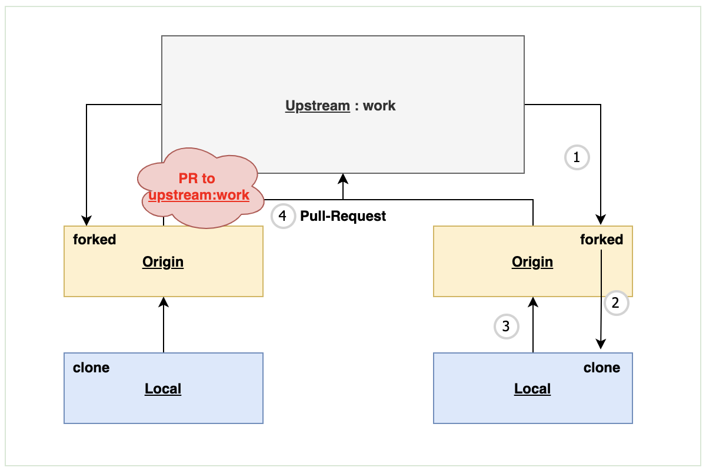

# Team Zext, Git Flow (2) 

###### Github : https://github.com/taekwon-dev/gitflow-demo

이번 글에서는 앞서 (1)장에서 다뤘던 `feature to work` 실습 과정을 다룹니다. 아래 깃헙 주소를 통해서 직접 실습을 진행해볼 수 있습니다. 단, access 권한을 얻기 위해서 제가 invite를 드려야 해서 혹시 github 계정을 알려주시면 access를 드리겠습니다. 

### | 목차

- ###### Git Flow Network 

- ###### Git Flow Network: Details (Feature to Work Branch) 

- ###### Practice (Feature to Work Branch) (1) ◀︎ **현재 글**

- ###### Practice (Feature to Work Branch) (2)

- ###### Git Flow Network: Details (Work to Master Branch)

___

_1.png)

<그림 1 : fork 대상이 되는 <u>upstream:work</u>> 

> <그림 1>에서 박스 처리된 `fork` 클릭 

_2.png)

<그림 2 : fork 이후 본인 계정에 생긴 <u>origin:work</u>>

여기까지 진행하시면, 이제 로컬에 `origin:work`를 복제합니다. 

```shell
$ git clone https://github.com/tkyoun94/gitflow-demo.git 
```

로컬에 `origin:work` 복제가 완료되면, 아래 <그림 4>와 같이 로컬 기준으로 remote repo를 등록해야 합니다.



<그림 4>

```shell
$ git clone https://github.com/tkyoun94/gitflow-demo.git
```

로컬 특정 디렉토리(본인이 원하는)에 위 명령어를 치면, origin repo가 복제됩니다.

_3.png)

​														    <그림 5>

이 때, 로컬 repo에서 remote repo 정보를 확인할 수 있는 

```shell
$ git remote -v 
```

를 치면, <그림 5>와 같이 origin이 등록된 것을 확인할 수 있습니다. 우리는 upstream 까지 등록해야 하므로 아래 명령어를 통해서 upstream 까지 추가해보겠습니다.

```shell
$ git remote add upstream https://github.com/taekwon-dev/gitflow-demo.git
```

`git remote add upstream` 명령어를 통해서 upstream repo까지 추가를 하면 아래 <그림 6>과 같이 remote repo가 추가된 것을 확인할 수 있습니다. 이제 위에 <그림 4>처럼 관계가 설정됐다고 보시면 됩니다. 

_4.png)

​												   <그림 6>

```shell
$ git remote update
```

참고로 현재 remote로 등록한 repo에서 push or pull 등 여러 API가 잘 동작하는 지 확인하기 위해 먼저 `git remote update` 명령어를 통해서 확인할 수 있습니다. 이 부분에서 에러가 나는 경우 에러 메시지를 기반으로 해결 해주시면 됩니다.

