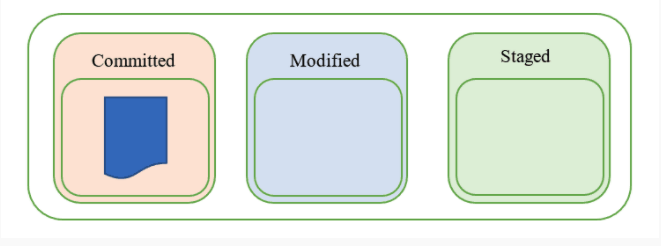
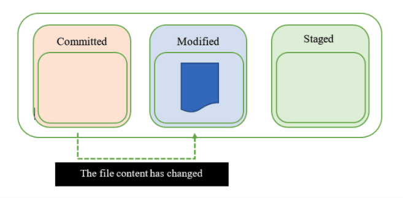
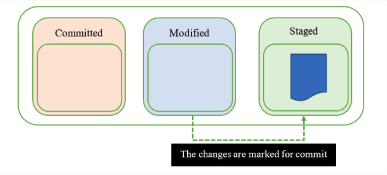
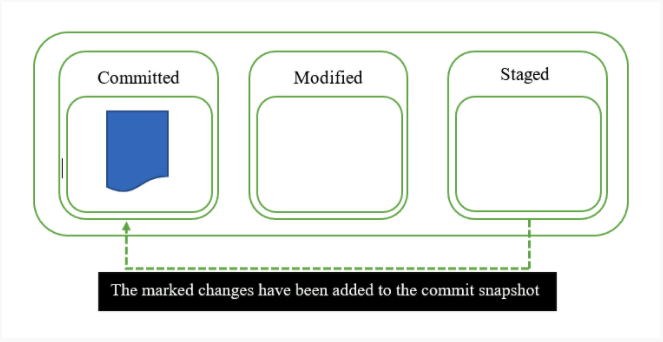
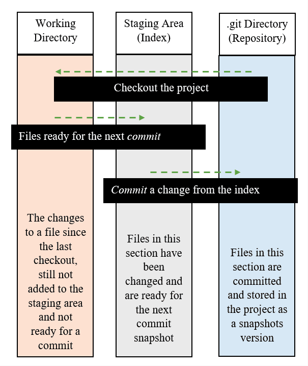
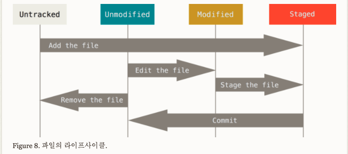

# Three States of Git

https://serengetitech.com/tech/three-states-of-git-and-three-sections-of-a-git-project/

**Git** 은 파일을 *Committed*, *Modified*, *Staged* 세 가지 상태로 관리한다.  

- **Committed**란 데이터가 로컬 데이터베이스에 **안전하게 저장**됐다는 것을 의미한다.

  This state indicates that the file is safely stored in the local database. 

- **Modified**는 수정한 파일을 아직 로컬 데이터베이스에 커밋하지 않은 것을 말한다.

  When any change to the file occurs, the state of the file changes from committed to modified. This means that the document has chagned since its last committed version which is saved to our local database. We can see this state as 'we' are currently working on this file. 

- **Staged**란 현재 수정한 파일을 곧 커밋할 것이라고 표시한 상태를 의미한다.

  When we're finished with all the modifications to our file, it moves to the staged state. The file is now ready to be added to the local git database, you have marked it to go into your next commit snapshot. 

  It's important to note that these three file states refer only to files tracked in a Git project. A file can be in a project but the changes to it are not tracked by Git. When we start tracking changes in Git for a file we haven't been tracking, it automatically goes into the staged state. 

   **Tracking** 상태의 파일은 Staged 상태로 보면 된다. 






 									





**[참고] 커밋이란?** 

https://ko.wikipedia.org/wiki/%EC%BB%A4%EB%B0%8B

http://itnovice1.blogspot.com/2019/01/commit.html

COMMIT : 저장되지 않은 모든 데이터를 데이터베이스에 저장하고 현재의 트랜잭션을 종료하라는 명령

위에서 **Committed** 는 "안전하게 저장된 이후" 라는 맥락을 갖는 것이다. 따라서 안전하게 저장된 시점을 보장한다. 

# Three sections of a Git Project.   




A Git project consists of three different sections. 

**.git directory** : 

Also known as the repository. This is where Git store the metadata and object database for your project. 

**working directory** : 

This is a single checkout of one version of the project. This is where you can modify files. 

**staging area** :

Also known as the index. It's the area between the working directory and the .git directory like above. All the files which are ready for a commit are stored here. 


**When we commit, what is in the staging area moves to the new version of the repository. This excludes what is in the working directory. This allows us to change files however we like, but only what we move to the staging area will be committed. Everything we changed but do not want to put in a repository stays in the working directory.** 

```
-> 커밋 명령어를 실행시키면 staged area에 위치한 파일들은 리포지토리에 저장소로 이동합니다. 이 때 working directory에 위치한 파일들은 제외되는데, 이는 내가 작업한 파일들 (변화가 발생한) 중 원하는 파일들만 골라서 저장소에 저장할 수 있음을 의미합니다. 
```

---




출처

https://git-scm.com/book/ko/v2/Git%EC%9D%98-%EA%B8%B0%EC%B4%88-%EC%88%98%EC%A0%95%ED%95%98%EA%B3%A0-%EC%A0%80%EC%9E%A5%EC%86%8C%EC%97%90-%EC%A0%80%EC%9E%A5%ED%95%98%EA%B8%B0

워킹 디렉토리의 모든 파일은 크게 Tracked과 Untracked 상태로 나뉜다. Tracked 파일은 이미 스냡샷에 포함돼있던 파일이다. Tracked 파일은 또 Unmodified와 Modified 그리고 Staged 상태 중 하나이다. 

그리고 나머지 파일은 모두 Untracked 파일이다. Untracked 파일은 워킹 디렉토리에 있는 파일 중 스냅샷에도 Staging Area에도 포함되지 않은 파일이다. 마지막 커밋 이후 아직 아무것도 수정하지 않은 상태에서 어떤 파일을 수정하면 Git은 그 파일을 Modified 상태로 인식한다. 실제로 커밋을 하기 위해서는 이 수정한 파일을 Staged 상태로 만들고, Staged 상태의 파일을 커밋한다. 이런 라이프 사이클을 계속 반복한다. 


