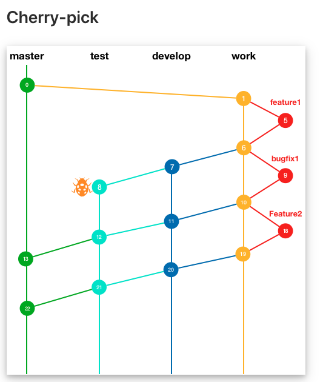

# [Git] Cherry-pick 

git-cherry-pick - Apply the changes introduced by some existing cmmits

### | A metaphor of Cherry-pick 

A metaphor, from the idea of picking through a bowl of cherries and seeking the best for oneself, or the idea of picking off the cherries for oneself from a cake or desert. 

### | 언제 사용할 수 있을까? 

다양한 상황이 있을 수 있지만, 대표적으로 다음과 같은 상황이 있다. 



​												<그림 1 https://taes-k.github.io/2019/08/09/git-gitflow/> 

위 그림 1 Git 히스토리에서 1번 커밋 (<u>베이스</u>)를 기준으로 새로운 브랜치를 생성해서 `feature3` 을 개발한다고 가정하자. 이 때 `feature1`과 `bugfix1` 커밋을 제외하고, `feature2` 커밋에서 추가된 기능한 필요할 때, Cherry-pick 기능을 통해 가져올 수 있다. 

```bash
$ git checkout -b feature3 
$ git cherry-pick (가져오고 싶은 커밋 넘버)
```

### | Reference

###### https://backlog.com/git-tutorial/kr/stepup/stepup7_4.html
