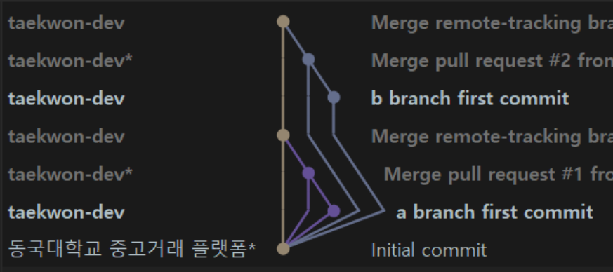
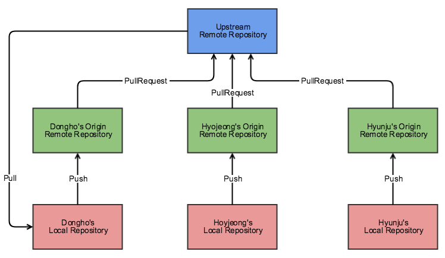
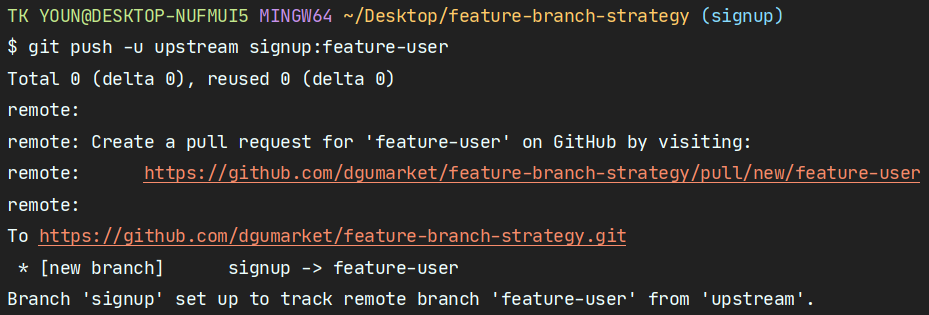
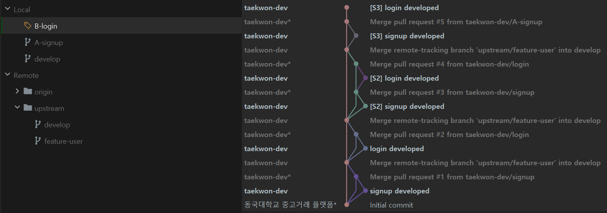
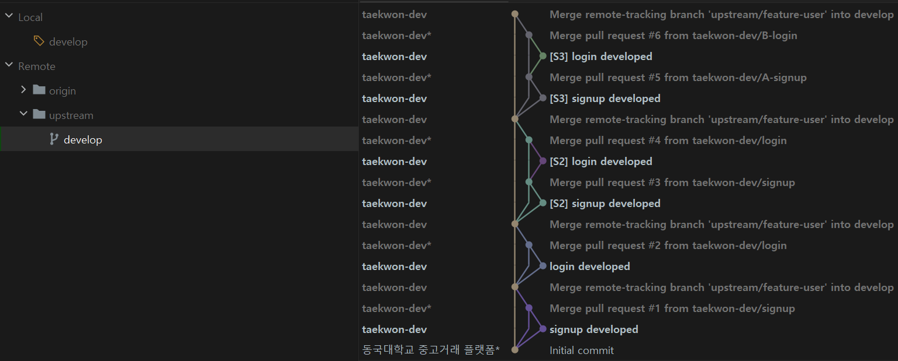
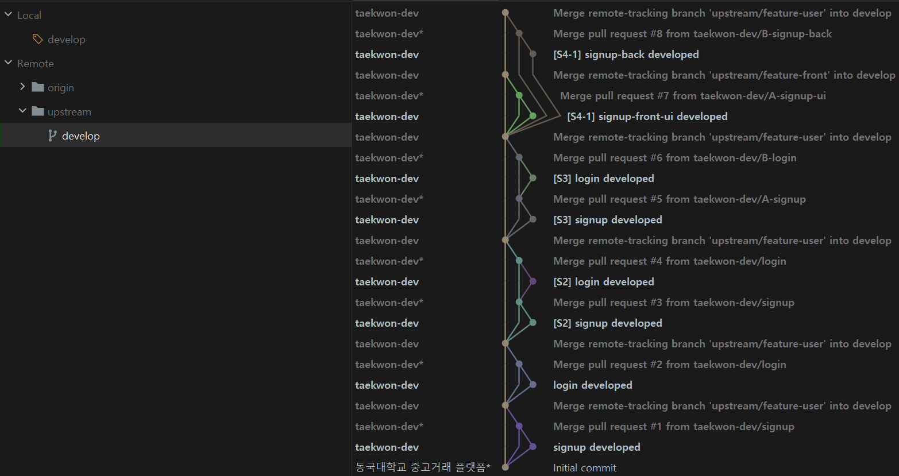
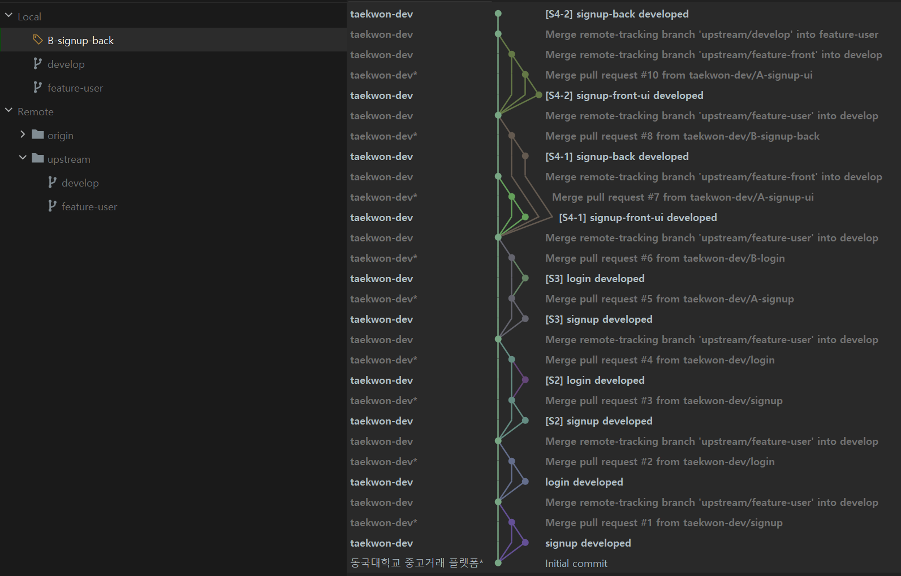
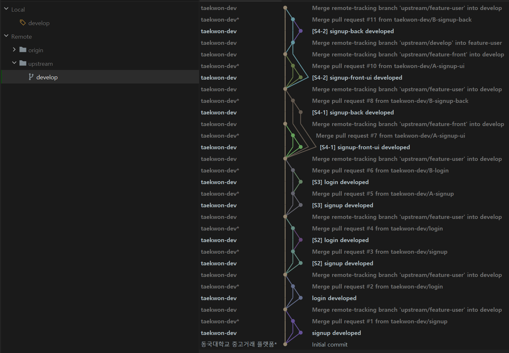

---

Git flow - feature branch strategy (2020 - 12 - 18 ~ 2020 - 12 - 21)
---

# DguMarket Team Project  

**GIt flow - feature branches** 

이 문서에서는 *git flow* 에서 feature branch 사용 전략에 대해서 논의합니다.

**목차**

1. 이전 까지의 feature branch 전략의 문제 & 개선한 부분
2. feature branch 생성/삭제 시점  
3. 시나리오를 위한 기본 설정 
4. 시나리오 1 
5. 시나리오 2 
6. 시나리오 3
7. 시나리오 4
   - 4-1
   - 4-2

---

# 1.  Feature branch 전략의 문제 & 개선한 부분 

https://nvie.com/posts/a-successful-git-branching-model/ 

"feature branches always have a limited life time, since they will be removed eventually." 

feature branch는 *git flow* 전략에 맞게 사용하지 않은 점, 즉 계속 커밋을 누적시키면서 사용한 것이 문제였다. 

(feature branch의 생명주기를 고려하지 않음)

우리는 최초 upstream repository에서 feature-user, feature-frontUI, feature-chat을 생성하고 위와 같이 사용하지 않았다. 이는 *git flow*에서 feature branch를 다루는 방식을 따르지 않았다는 점에서도 문제지만, 아래 <그림1>과 같이 동일한 베이스를 기준으로 생성한 feature branch가 많아질 수록 *git history* 자체가 복잡해질 수 밖에 없는 구조를 갖게된다. 

---

​          <그림 1> 

---

따라서  개선한 부분의 핵심 역시 *feature branch 생명주기 (생성과 삭제)*이고,

기존에 Upstream Repository에서의 feature-user, feature-chat, 등은 모두 삭제의 대상이된다. (**가장 다른 지점**)

---

# 2.  Feature branch 생성/삭제 

feature branch는 develop, master branch와 달리 제한된 생명 주기를 갖고 있고, 이는 결국 프로젝트 관리 과정에서 feature branch가 생성/삭제 패턴이 반복되는 것을 의미한다. 

**feature branch 생성**

*feature branch는 develop branch를 베이스로 생성되고, 반드시 develop branch로 병합됩니다.* 

(여기서 develop branch를 언급할 때 local, upstream repository를 구분하지 않은 이유는 local/develop & upstream/develop의 상태가 동일한 경우를 전제로 구분할 필요가 없기 때문이다. 아래 구체적인 시나리오를 따라가면서 이해할 수 있다고 판단한다. 이 부분이 당장 너무 헷갈리더라도 우선은 계속 읽어보자.)

**feature branch 삭제** 

---

​		             <그림 2> 출처 : https://woowabros.github.io/experience/2017/10/30/baemin-mobile-git-branch-strategy.html 

---

feature-branch 생성 후, 작업이 마무리되면 *origin to upstream* 방향으로 **Pull Request**를 보낸다. 

이 후 과정은 아래 세 단계를 거쳐서 upstream/develop이 업데이트된다.

- **PR** merge Approved (PR 승인)
- upstream/feature-branch → local/develop merge : (local develop) git merge --no-ff upstream/feature-branch
- local/develop → upstream/develop

*feature-branch의 삭제는 upstream/develop이 업데이트된 시점이다.*

---

# 3. 시나리오  기본 설정 

- local/develop branch는 upstream/develop branch를 **track**한다. 

  -  (local develop) git branch -u upstream/develop : Branch 'develop' set up to track remote branch 'develop' from 'upstream'
  -  출처 : https://www.git-tower.com/learn/git/faq/track-remote-upstream-branch/

- Upstream/feature branch : 시나리오에서 사용되는 feature branches 

  - feature-user ; 유저 계정 관리
  - feature-chat ; 채팅 
  - feature-product ; 중고거래 상품

- 초기 세팅 : 아래 시나리오 마다 새롭게 이 세팅을 하지 않고, 한 번에 모든 시나리오를 진행할 예정 

  ---
  
  
  
  

​       <그림 3>

---

# 4.  시나리오 1  

---

<그림 3>

---

위 상태에서 **윤태권**이 feature-user 브랜치를 생성해서 **회원가입, 로그인**을 처리하려고 한다.

**[시나리오 1]**에서는 다음과 같은 순서로 진행된다.

**회원가입**

**1. (local develop) git pull** : upstream develop 상태를 최신화하기 위해서 진행한다. (최신 상태인 경우 Already up to date)

**2. (local develop) git checkout -b signup** : develop을 기준으로 local/signup branch를 생성한다. 

**3. (local signup) git push -u upstream signup:feature-user** : upstream repository에 feature-user branch를 생성하고, local/signup  → upstream/feature-user *track* 하도록 설정한다. 

----

  <그림 4> 

---

"Branch 'signup' set up to track remote branch 'feature-user' from 'upstream'" 메시지를 통해서 --track 관계가 설정됨을 알 수 있다. 

**(local signup) git push -u upstream signup:feature-user** 이 명령어의 수행 결과 시점이 upstream/feature-user branch의 생성 시점이다. ★중요★

**4. (local signup)** signup.txt 파일 생성 후, "signup developing ..."을 입력한다. 

**5. (local signup) git add & git commit -m "signup developed"**

**6. (local signup) git pull --rebase upstream feature-user** --- *Optional : 이유는 시나리오 N에서 확인, 우선 실행*

**7. (local signup) git push origin signup** : PR을 보내기 위해 origin repository로 push.

**8. (PR) upstream/feature-user ← origin/signup 진행 후 merge**

**9. (local develop) git merge --no-ff upstream/feature-user** 

**10. (local develop) git push **: upstream/develop updated

**11. (local develop) git branch -d signup & git push upstream --delete feture-user** : local/signup, upstream/feature-user branch를 삭제한다.  ★중요★

- 출처 : https://www.git-tower.com/learn/git/faq/delete-remote-branch/

---

1~11번까지 진행했을 때 upstream/develop history : 결과 자체는 동일한 것을 확인할 수 있다.

<그림 5>

---

이어서 **로그인**을 추가해보자. 

위 1~11번 로직과 완벽하게 동일하다. 

예상 질문 또는 어색할 수 있는 지점에 대해서 잠깐 언급하자면, **"또 upstream에 feature-user를 만드네..?"** 

이렇게 하는 이유는 다음 그림에서 찾을 수 있다. 

---

<그림 6> 

---

**로그인** 과정을 끝낸 뒤, upstream/develop history 상태이다. 

회원가입과 로그인은 모두 feature-**user**의 하부 기능이라고 볼 수 있다. 만약 시나리오1에서 회원가입과 로그인을 처리할 때 upstream feature-branch 이름을 일관성 있게 한다면 어떤 이점이 있을까? <그림 6>에서 주황색 박스된 곳을 보면 두 작업 이력이 모두 feature-user에서 추가된 것을 확인할 수 있다. 만일 커밋 메시지로 어떤 작업인 지 불문명하더라도, upstream/feature-user에 속한 작업임을 알 수 있다. 즉 하나의 **카테고리**로 역할 할 수 있다는 것이다. 

**#규칙 : upstream feature-branch naming은 아래와 같이 지정한다.**

Upstream/feature branch : 

- feature-user ; 유저 관련 기능 추가 
- feature-chat ; 채팅 관련 기능 추가 
- feature-product ; 중고거래 상품 관련 기능 추가
- feature-front ; UI 및 JS 작업 관련 기능 추가

**시나리오 1 중요한 부분**

- [시나리오 1]에서는 우선 기존 방식과 다른 feature-branch 생성과 삭제

- local/branch & remote/branch 간 **track** 개념 

- upstream/feature-branch 이름을 지정하는 규칙 

  ---

# 5. 시나리오 2

**[시나리오 2]** :

 **회원가입**, **로그인**기능을 추가할 때 두 작업 단위가 크지 않다면, 굳이 로그인 작업을 마무리하고, upstream/feature-user branch를 삭제할 필요가 없다. 회원가입 기능을 구현하기 위한 local branch를 생성할 때 upstream/feature-user branch를 추적하는 브랜치를 생성하고 upstream/feature-user branch에 커밋이력을 추가할 수 있기 때문이다. [시나리오 1]에서 진행했던 **로그인**과 **회원가입**을 [시나리오 2]에서 다시 진행해보자. 

---

**[시나리오 2]**에서는 다음과 같은 순서로 진행된다. 

<그림 7>  

- 시나리오 1이 마무리된 상황에서 local/login, upstream/feature-user 삭제 
- (remote origin) signup, login branch 삭제 

---

**1. git pull** : upstream/develop 업데이트를 반영하기 위해 진행한다. 

**2. (local develop) git checkout -b signup**  

**3. (local signup) git push -u upstream signup:feature-user** 

**4. (local signup)** signup.txt 파일에, "[S2] signup developing ..."을 입력한다. 

**5. (local signup) git add & git commit -m "[S2] signup developed"**

**6. (local signup) git pull --rebase upstream feature-user** --- *Optional : 불필요

앞서 [시나리오 1]에서 6번 과정을 옵션으로 지정한 이유는 [시나리오 1] 상황에서는 혼자서 upstream/feature-user branch에 해당하는 개발을 진행하기 때문에 upstream feature-user branch에 상태를 제어할 수 있다. 또한 로그인 기능을 개발하고 upstream feature-user가 업데이트된 이후 바로 develop branch와 merge 하기 때문에 --rebase 옵션이 필요하지 않은 상황이라고 할 수 있다. 

그렇다면, [시나리오 2]는 6번 과정이 필요 또는 **불필요** 할까? 

**회원가입** 기능을 feature-user에 반영한 뒤 feature-user branch를 삭제하지 않고 **로그인** 기능도 회원가입이 반영된 기존 feature-user branch에 반영시킬 수 있다. 로그인 기능을 추하기 위해서 branch를 생성할 때 feature-user branch를 베이스로 하면, --rebase 옵션은 필요하지 않을 것이다. (이미 업데이트된 내용을 가지고 있으므로)

### 그렇다면, --rebase 옵션이 필요한 경우는 어떤 상황일까 ...? (시나리오 3에서 언급)

**7. git push origin signup & PR**

**8. git checkout -b login --track upstream/feature-user** : 로그인 기능을 위해 feature-user branch를 베이스로 브랜치 생성 ★중요★

**9. (local login)** login.txt 파일에, "[S2] login developing ..."을 입력한다. 

**10. (local login) git add & git commit -m "[S2] login developed"**

**11. git push origin login & PR**

---

 <그림 8>

---

위 <그림 8>을 보면, --rebase 옵션 업이도 feature-user branch 커밋 히스토리를 위와 같이 관리할 수 있다. 

**12. (local develop) git merge --no-ff upstream/feature-user **

**13. (local develop) git push**

---

<그림 9> : (local) signup, login, (upstream) feature-user branches 삭제 & upstream/develop commit history

---

**시나리오 2 중요한 부분**

- --rebase option 필요한 상황에 대한 인식 
- 작업 단위를 어떻게 설정할 것인가에 대한 고민 

---

# 5. 시나리오 3

[시나리오 3]은 앞에서 다뤘던 상황과 달리 두 명 이상의 개발자가 협업하는 상황을 다룹니다. 

또한, 앞서 언급했던 --rebase 옵션에 대한 설명이 포함되어 있습니다.

### [시나리오 3] 상황 설명   

개발자 : A (Back-End), B(Back-End)

브랜치 명 :  (local) A-signup, B-login, (upstream) feature-user

(두 개발자가 협업한다는 상황이지만, 설명을 위해 동일한 local 상황에서 진행되는 점 알려드립니다.)

두 명의 벡엔드 개발자가 feature-user 하위 기능인 회원가입과 로그인을 구현하는 상황입니다. 두 개발자 중 A가 upstream/feature-user branch를 생성하기로 합의했고, A가 **먼저** 회원가입 기능을 upstream/feature-user에 업데이트한 상황을 가정하겠습니다. 

**1. [A Developer] (local develop) git pull**

***1-1 [B Developer] (local develop) git pull** : 실제 테스트 과정에서는 생략 

**2. [A Developer] (local develop) git checkout -b A-signup** 

**2-1. [B Developer] (local develop) git checkout -b B-login** : 동일한 develop branch를 베이스로 B-login branch 생성 

**3. [A Developer] (local A-signup) git push -u upstream A-signup:featuer-user** : A 개발자, upstream/feature-user 생성 

.

.

A 개발자가 회원가입 기능을 추가하고, upstream/feature-user에 업데이트를 진행합니다. 이 때 --rebase는 생략합니다. (upstream/feature-user 업데이트 이력이 없으므로)

여기 까지 진행했을 때 upstream/feature-user 상황입니다 (아래 <그림 10> 참고)

---

<그림 10> 

---

A가 먼저 feature-user branch에 업데이트하는 것으로 상황을 가정했지만, B 입장에서는 A가 업데이트를 진행하는 일련의 과정 중에 개발 내역이 있을 수 있습니다. 즉, B가 A의 회원가입 기능을 먼저 기다리는 상황이 아니라 이미 로그인과 관련된 기능을 커밋했을 수도 있습니다. 이번 [시나리오 3]에서는 B가 A의 개발 내역을 기다리지 않고 병렬적으로 개발을 이어가는 상황을 전제로 나머지 상황을 진행하겠습니다. 

(B가 A의 개발 내역이 필요해서 기다렸다가 진행하는 상황은 시나리오 2와 유사하기 때문)

.

.

**4. [B Developer] (local B-login) 로그인 관련 코딩 후 git add & git commit**

**5. [B Developer] (local B-login) git pull --rebase upstream/feature-user** : feature-user가 업데이트 된 것을 확인 후 --rebase 

개발자 B 입장에서는 위 상황에서 --rebase 옵션을 통해 feature-user 커밋 히스토리를 보다 관리하기 쉽게 할 수 있습니다. 하지만 만약 B가 PR을 생성하기 전에 feature-user가 B의 로그인 관련 커밋 추가 이전과 동일하다면 --rebase 옵션이 필요 없을 수 있습니다. 

---

<그림 11>

<그림 12> 

---

<그림 11>과 <그림 12>를 비교해서 보면, B-login brach에서 **[S3] login developed** 커밋 이전 히스토리와 featuer-user branch가 동일하지 않다. 따라서 이 경우 --rebase를 통해서 아래 <그림 13>과 같이 만들어준다. 

<그림 13> 

---

**6. [B Developer] (local B-login) git push origin B-login & PR**

 **7. [B Developer] (local develop) git merge --no-ff upstream/featuer-user** : 로그인까지 완료 후 B가 develop branch와 병합 진행

**8. [B Developer] (local develop) git push** 

---

 <그림 14> : 최종 결과 

---

이번 [시나리오 4]의 최종 결과는 사실 [시나리오 3]과 동일합니다. 작업 과정에서의 차이가 있지만 동일한 결과를 얻었다는 부분이 가장 중요한 포인트라고 생각합니다. 

**시나리오 3 중요한 부분**

- --rebase option이 필요한 상황에 대한 이해 
-  협업하면서 정해야 하는 부분은 무엇인 지 (<u>협업 과정에서 지켜야 하는 규칙에 대해서 구체화 예정입니다.</u>)
  - 추가하는 기능에 대한 사전 협의, 업무 분담 등 
  - 작업 진행 상황과 진행 속도 등에 대한 공유 
  - PR 생성 후 동일한 upstream/feature-user branch를 담당하는 개발자에게 리뷰 (특히 동일한 파일을 같이 다루는 경우)
  - 기타

---

# 6. 시나리오 4 

[시나리오 4] 역시 개발자 간 협업 과정을 다룹니다. 

### [시나리오 4] 상황 설명   

개발자 : A (Front-End), B(Back-End)

브랜치 명 :  (local) A-signup-ui, B-signup-back, (upstream) feature-front, (upstream) feature-user

(두 개발자가 협업한다는 상황이지만, 설명을 위해 동일한 local 상황에서 진행되는 점 알려드립니다.)

두 명의 개발자 중, 개발자 A는 프론트엔드 작업인 회원가입 UI 작업을 하고, 개발자 B는 벡엔드 작업인 회원가입 DB 작업을 합니다. 

[시나리오 3]과 달리 이번에는 서로 다른 두 feature-branch에서 작업을 병렬적으로 진행하는 상황입니다. 

[시나리오 4]에서는 세부 카테고리가 두 가지로 나뉘는데, 

- upstream/feature-front & upstream/feature-user 서로 독립인 경우 
- upstream/feature-front & upstream/feature-user 중 서로의 작업 내역이 필요한 경우 (여기서 **충돌 문제**는 고려하지 않습니다.)

먼저, 두 upstream/feature-branches가 서로 독립인 경우는 말 그대로 서로의 개발 내역이 서로 영향을 주고 받지 않는 것입니다. 따라서 먼저 개발이 끝나는 순서로 upstream/develop에 반영되는 상황입니다. 

만약 서로의 작업 내역이 필요한 경우라면, upstream/develop에 업데이트된 코드와 병합을 해야하는 과정이 추가됩니다.  이 때  두 가지 상황으로 나눌 수 있습니다. (upstream/feature-front가 먼저 upstream/develop에 반영된 경우)

- local/B-signup-back(tracking upstream/feature-user)에 커밋 이력이 없는 상황에서, upstream/feature-user와 upstream/develop이 병합하는 경우 
- local/B-signup-back(tracking upstream/feature-user)에 커밋 이력이 있는 상황에서, upstream/feature-user와 upstream/develop이 병합하는 경우 

먼저, local/B-signup-back(tracking upstream/feature-user)에 커밋 이력이 없는 상황에서, upstream/feature-user와 upstream/develop이병합하는 상황은 사실 개발이 병렬적으로 진행되는 상황이 아니고, 순차적 작업으로 볼 수 있습니다. 따라서 사실상 upstream/feature-user가 새로운 상태의 upstream/develop을 베이스로 갖는 상황이라서 [시나리오 4]에서 주로 다루고자 하는 병렬 작업과는 거리가 있습니다. (아래에서 다루지 않음)

반면, 두 번째 경우는 이미 local/B-signup-back(tracking upstream/feature-user)에 커밋 이력이 있다는 점에서 병렬 작업 상황이라고 볼 수 있습니다. 

---

따라서, [시나리오 4] 세부 카테고리 중 다루는 것 중 **병렬 작업 특징**이 있는 것들을 다시 정리하면 아래와 같습니다. 

- upstream/feature-front & upstream/feature-user 서로 독립인 경우 .... (4-1)
- local/B-signup-back(tracking upstream/feature-user)에 커밋 이력이 있는 상황에서, upstream/feature-user와 upstream/develop이 병합하는 경우 .... (4-2)

---

## 4-1 upstream/feature-front & upstream/feature-user 서로 독립인 경우

**1. (local develop) git pull** : 두 개발자 모두 동일한 상태의 upstream/develop를 베이스로 한다. 

**2. (local develop) git checkout -b A-signup-ui, B-signup-back** : 로컬 브랜치 각각 생성

**3.  (local A-signup-ui, B-signup-back) git push -u upstream local branch : upstream feature-branch** : upstream/feature 생성 

---

<그림 15> 

서로 독립적인 feature-branch인 경우에는 위 그림과 같은 결과가 도출된다. 

**독립적인 branch가 있을 때, 꼭 위 방식으로 관리를 할 필요가 있을까?** 라는 질문을 하고 싶다. 

<그림 15-1>

**노란색 원 : 베이스**를 기준으로 두 branch가 서로 순차적으로 병합됐을 때 히스토리이다. 

서로 작업한 파일이 완전히 독립적이거나, 동일한 파일에 대해서 작업한 내역이 있어도 충돌하지 않는 경우, 작업 과정에서 upstream/develop에 업데이트 된 내역을 굳이 가지고 올 필요는 없다. (물론 동일한 파일을 다룬다면, 더 주의가 필요하다) 하지만 분명한 것은 서로 독립적인 작업 내역을 가진 두 branch는 결과적으로 upstream/develop에 반영되는 것은 완전히 **동시에** 진행될 수 없다. 즉, 순차적일 수 밖에 없다는 것이다. 따라서 동일한 베이스를 가진 두 branch의 병합을 관리할 때 <그림 15-1>과 같이 하나의 베이스에서 두 갈래로 나뉘지 않도록 관리할 수 있다. 

그렇다면, 순차적으로 병합하기 위해 어떤 **합의**가 필요할까? 

- PR을 보내는 시점 : **upstream/develop 업데이트 여부** 확인 후, 업데이트 내역이 있는 경우 이 경우 

upstream/develop 업데이트 내역이 있는 경우에는 PR을 생성하기 전, upstream/develop 업데이트 내역을 병합 후 PR을 생성해야 한다. (= **[시나리오 4-2]**와 결과적으로 동일한 패턴)

---

## 4-2 local/B-signup-back(tracking upstream/feature-user)에 커밋 이력이 있는 상황, upstream/develop과 병합하는 경우

다시 한 번 **[시나리오 4-2]**을 설명하자면, 

upstream/feature-front와 upstream/feature-user 중 feature-front 개발 내역이 먼저 upstream/develop에 반영된 상황이다. 이 때 upstream/feature-user 개발 과정 중 이미 local branch인 B-signup-back에 커밋이 있는 상황에서, feature-front 개발 내역이 필요한 상황이고, 해당 내역을 가져오기 위해 upstream/develop과 upstream/feature-user의 병합을 한다. (이 시점에 upstream/feature-front가 삭제되지 않았을 것이라고 단정할 수 없다.)

---

<그림 16>

<그림 17> : (local) B-signup-back branch에 이미 커밋 이력이 있는 경우 

---

### 의문이 생길 수 있는 지점

upstream/develop 최신 업데이트 내역이 필요하다. (결론)

위에서는 upstream/develop 최신 내역을 가져오기 위해 upstream/develop과 upstream/feature-user의 병합을 진행한다. 

하지만 사실, 굳이 upstream/develop과 upstream/feature-user 간에 병합을 하지 않고 local/B-signup-back과 upstream/develop을 병합하고 upstream/feature-user에 PR을 통해 최종 개발 내역을 업데이트하면 되지 않나? 라고 생각할 수 있다. 

결론부터 말하자면, **틀린 방법**은 아니다. 하지만 프로젝트의 소스를 관리하는 과정에서 여러 문제가 야기될 수 있다. 어떤 문제가 있을까? <그림 16> : upstream/develop과 <그림 17> : local/B-signup-back을 병합했을 때 크게 두 가지 옵션이 있다. *merge commit*을 남기는 지 여부에 대해서 결정해야 한다. 지금까지의 시나리오 전반에서는 두 branch 간 병합은  항상 *merge commit*을 남겼다 (--rebase 하는 상황 제외). 이렇게 하는 가장 결정적인 이유는 **되돌리기**에 대한 여지를 남기기 위해서이다. *merge commit*을 남기는 조건으로 <그림 16> : upstream/develop과 <그림 17> : local/B-signup-back을 병합하면 어떤 형태가 될까? <그림 15-1>과 같이 하나의 베이스에서 두 갈래로 나뉘는 형태가 그려질 것이다. 이는 결국 develop branch를 복잡하게 만드는 요인이 될 수 있다. 

위와 같은 이유로, upstream/develop의 업데이트 내역을 병합하는 branch는 upstream/feature-user로 설정한다. B-signup-back (tracking upstream/feature-user) branch는 현재 upstream/feature-user를 --track 하고 있으므로, upstream/develop과 upstream/feature-user가 병합 후 **(local/B-signup-back) git pull --rebase upstream feature-user** 명령어를 통해서 (local) B-signup-back의 커밋이력을 upstream/develop와의 병합과정 중에 생긴 *merge commit*이후에 쌓을 수 있다.

그렇다면, 실제 과정을 통해서 다시 이해해보자. 

---

**1. (local B-signup-back) git checkout -t upstream/feature-user** : (local) feature-user branch를 생성 후, checkout

원격 저장소(upstream)의 feature-user branch로 checkout을 한다. -t 옵션이 없이 remote branch에 checkout을 하는 경우 변경 내역을 commit 하거나 upstream/feature-user에 push 할 수 없다. 

(참고 - https://cjh5414.github.io/get-git-remote-branch/)

**2. (local/feature-user) git merge --no-ff upstream/develop** : 로컬에서 생성된 feature-user와 upstream/develop 병합

<그림 18> : (local/feature-user)

**3. (local/feature-user) git push** : local/feature-user 생성 시 이미 --track 관계가 설정되어 있으므로, git push

**4. (local/B-signup-back) git pull --rebase upstream feature-user** : upstream/feature-user에 업데이트 내역과 병합, --rebase 옵션을 사용해서 기존 B-signup-back에 있던 커밋 이력을 최상위로 둔다. 

<그림 19>

**5. (local/B-signup-back) git push origin B-signup-back & PR**

**6. (local/develop) git merge --no-ff upstream/feature-user**

**7. (local/develop) git push**

<그림 20>

[시나리오 4-2] 최종 결과 모습이다. 가장 중요한 포인트는 upstream/develop의 최신 업데이트 사항을 반영해서 기능을 추가하기 때문에 공통된 베이스에서 여러 갈래로 나뉘지 않는다는 점이다. 

**시나리오 4 중요한 부분**

- [시나리오 4-1]의 경우에도 [시나리오 4-2]와 같이 관리하는 것이 더 유리하다. 
- [시나리오 4-2]에서 upstream/develop과 local/B-signup-back을 병합하지 않는 이유에 대한 이해 

---

지금까지 긴 과정이었다. 위 전체 과정은 git-flow에서 Main Branch 중 하나인 develop branch 까지의 과정이다. 협업 과정에서 기준이 될 [시나리오 4-2]를 따르기 위해서는 몇 가지 **규칙**이 필요하다. 이 규칙에 대한 내용은 다음 주제에서 다루도록 한다. 

끝.