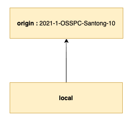

# Git Branch 전략 

- **[2021-1-OSSPC-SanTong-10](https://github.com/CSID-DGU/2021-1-OSSPC-SanTong-10)** (리포지토리)
  - main
- **[2021-1-OSSPC-SanTong-10-webapp](https://github.com/CSID-DGU/2021-1-OSSPC-SanTong-10-webapp)** (리포지토리)
  - main
  - develop
  - feature-작업자이름 (ex - feature-tk, featuer-ye) 

**2021 OSSP 산통깨지마 팀** :

산통깨지마 팀은 크게 `AI 프로젝트 + 웹 서비스 프로젝트` 구조로 진행됩니다. 

___

**2021-1-OSSPC-SanTong-10** 리포지토리에서는 팀 설명, 회의록, 각 팀원의 공부 자료 등을 업로드하는 목적으로 활용합니다. 회의록 업로드의 경우에는 순번에 따라서 한 명씩 돌아가면서 작성 후 업로드하는 구조이고, 각 공부 자료는 디렉토리 별로 관리하므로 기본적으로 <u>충돌 가능성을 배제한 상태</u>로 관리할 수 있습니다. (단, 예외적으로 충돌 가능성이 있는 경우에는 추후 다시 논의 후 업데이트 하겠습니다.)



​																			                    < 그림 1> 

<그림 1>과 같이 원격 리포지토리의 브랜치를 바라보고 있는 구조로 두고 관리합니다. https://git-scm.com/book/ko/v2/Git-%EB%B8%8C%EB%9E%9C%EC%B9%98-%EB%A6%AC%EB%AA%A8%ED%8A%B8-%EB%B8%8C%EB%9E%9C%EC%B9%98를 참고하시면 <그림 1> 구조에서 자주 사용되는 개념과 명령어를 참고할 수 있습니다. 업로드 되는 자료 특성 상 독립적이므로 PR(Pull Request) 또는 리뷰 관련 규칙을 정의하지는 않습니다. 

**커밋 메시지 작성 방식** : 

회의록의 경우에는 "회의록 : 회의 진행 일시"로 작성해주시면 됩니다. 예를 들어 "회의록 : 2021/04/29".  

각 개별 공부자료의 경우에는 "TK : 설명", "YE - 설명" 또는 "YH : 설명"

___

**2021-1-OSSPC-SanTong-10-webapp** 리포지토리에서는 웹 서비스 소스 코드를 관리합니다. 프론트(유은), 백엔드(태권)이 참여하여 관리합니다. 동일한 프로젝트 내부에서 소스 코드 변경이 발생 (특히 설정 파일 관련해서) 하므로 개발 참여자의 작업 이력으로 충돌 가능성을 미리 염두하고 대비해야 합니다.


​								 <그림 2> 

전체적인 리포지토리 구조는 <그림 2>와 같습니다. 위와 같은 구조를 갖는 이유는 협업하는 상황에서 공유하고 있는 원격 브랜치로 직접적인 push를 막고 PR(Pull Request)를 통해 병합 전 소스 코드 리뷰 과정을 추가할 수 있기 때문입니다. 이를 통해 개발에 참여하고 있는 개발자들이 서로 공유하고 리포지토리의 소스코드를 보다 안정적으로 관리하는데 도움을 줄 수 있습니다. 

PR을 관련해서, 자신이 오픈한 PR은 자신이 처리하는 것을 원칙으로 하고 서로를 리뷰어로 등록 합니다. 현실적으로 매번 리뷰를 체크하기 어렵기 때문에 작업 내역이 서로 영향을 주고 받는 요청/응답 부분을 작업했거나 특정 상황에서 리뷰를 요청하는 경우를 제외하고는 스스로 테스트 후 merge 합니다. 

___

### Git-flow (https://nvie.com/posts/a-successful-git-branching-model/)

Git-flow 브랜치 전략 모델 중 일부를 차용해서 **개발 - 배포** 단계에 적용합니다. Git-flow 모델에서 사용되는 각 브랜치에 대한 설명 이후 예시를 통해 작업 흐름을 소개하겠습니다. Git-flow 모델에 대한 자세한 설명은 위 링크에서 확인할 수 있습니다. 

- main :

  브랜치 이름에서 볼 수 있듯이 메인 브랜치로써 언제나 배포 상태로 둘 수 있는 상태를 갖습니다.

- develop :

  (다음) 출시 버전을 개발하는 브랜치로써 해당 서비스에서 개발되는 기능들이 모이는 브랜치입니다. 

  아래 feature-작업자 이름 브랜치에서 작업한 것을 develop 병합하게 됩니다. 

- feature-작업자 이름 :

  기능을 개발하는 브랜치이고,  항상 develop 브랜치를 베이스로 브랜치를 생성합니다. 

  develop 브랜치로 해당 기능을 병합한 후, 삭제됩니다. 


​								  <그림 3> 

작업 흐름은 <그림 3>과 같이 진행됩니다. 다만 위에서 언급했듯이 이번 프로젝트에서는 Git-flow 모델에서 일부만 차용해서 진행하므로 <그림 3>에서 등장하는 `releases`, `hotfixes` 브랜치는 등장하지 않습니다. 

___

### 작업 예시 

<그림 2> 구조를 구성하는 것부터 Git-flow 브랜치 전략을 활용해서 `개발 - PR - Merge` 한 작업 단위를 설명하겠습니다.  

### 1. fork upstream repository :

fork 대상이되는 리포지토리가 <그림 2>에서 upstream에 해당하고, fork한 뒤 생성되는 리포지토리가 <그림 2>에서 origin에 해당합니다.

- [ ] **https://github.com/CSID-DGU/2021-1-OSSPC-SanTong-10-webapp 링크 클릭 후 (깃헙 로그인 상태) 아래 주황색 박스 `fork` 버튼을 클릭합니다.** 

  
  
  <그림 4>

이후 로컬 프로젝트에서 origin 리포지토리를 `clone` 명령어를 통해서 다운로드를 받아서 로컬 환경을 구축할 수 있습니다. InteliJ IDE을 사용하고 있는 경우 아래 방식을 더 추천합니다. 다만, InteliJ 깃헙 계정을 연동시킨 상황에서 `Get from VCS`를 클릭 후 origin 리포지토리의 URL를 입력 후 로컬 환경에서 해당 프로젝트를 다운받을 수 있습니다. 

- [ ] **프로젝트를 생성** Get from VCS --- URL 입력 --- Clone 

  

  ​			   <그림 5>	

  
  
  ​			   <그림 6> 

___

### 2. <그림 2>와 같이 구조화하기 


​								  <그림 2> 

```bash
# 참고로, 아래 명령어는 InteliJ 해당 프로젝트 내부 터미널 (콘솔)에서 사용하시면 됩니다. 

# 원격 브랜치 정보를 조회 
$ git remote -v 
# 원격 저장소 추가 
$ git remote add origin (or upstream)
# 원격 저장소 삭제 
$ git remote remove origin (or upstream)
```

최초 프로젝트 생성 시, 포크한 리포지토리(origin)에서 복사를 해온 것이므로 디폴트 상태로 origin 원격 저장소 정보는 가지고 있습니다. 따라서 `git remote -v` 입력 시 origin에 대한 정보를 조회가 될 것입니다. 여기에 <그림 2> upstream 원격 저장소 (= 포크 대상이 된 저장소)를 추가하기 위해서 `git remote add upstream https://github.com/CSID-DGU/2021-1-OSSPC-SanTong-10.git` 명령어를 활용합니다. 최종적으로 다시 원격 브랜치 정보 조회하는 명령어를 다시 활용하면 upstream, origin 모두 설정된 것을 확인할 수 있습니다.

___

### 3. 'README.md 파일 수정하기' 로 연습하기 

가장 일반적인 시나리오를 통해서 위에서 언급한 Git-flow 작업 단위를 소개하겠습니다. 

**[상황]** :

**README.md 파일을 로컬에서 수정 후 Upstream/develop에 반영하기**

```bash
# README.md 파일을 수정하는 것을 하나의 기능을 추가한다는 관점에서 본다면, 우리는 feature-tk(작업자이름) 브랜치를 새로 생성해서 작업해야 합니다.
$ git checkout -b feature-tk 

# README.md 파일에 _____ 내용을 추가한 뒤 commit 합니다.
$ git add README.md (README.md 파일 경로)
$ git commit -m "README.md 파일 수정"

# 이 명령어는 따로 설명 드리겠습니다. 
$ git pull --rebase upstream develop 

# origin 저장소에 push 
$ git push origin feature-tk 
```

마지막 `origin 저장소에 push` 명령어를 치면,  아래 <그림 7>과 같이 Pull-Request 주소를 반환합니다. 


​					  <그림 7> 

해당 주소를 클릭하면, 아래 <그림 8> 페이지로 이동합니다.


​     <그림 8> 

가장 중요한 점은, `origin/feature-tk` 에서 `upstream/develop` 브랜치로 병합하는 것입니다. 따라서 가장 상단에 주황색 박스를 보면 해당 방향으로 **`Able to merge`** 라고 출력된 것을 확인할 수 있습니다. 

또한 리뷰어를 등록하기 위해서는 오른쪽 주황색 박스에서 깃헙 아이디를 입력 후 추가할 수 있고, 모두 확인 후 가장 하단 주황색 박스 `Create pull request` 버튼을 클릭합니다. 해당 버튼을 클릭하면, 이 PR을 실제로 진행해서 병합을 할 것인 지에 대한 확인 창으로 넘어가게 됩니다. (그림 9)


 <그림 9> 

<그림 9> 페이지에서 `Merge pull request` 버튼을 클릭하면 해당 PR이 반영되게 됩니다. 앞서 PR 관련 부분에서 아래와 같이 언급했었는데,

"PR을 관련해서, 자신이 오픈한 PR은 자신이 처리하는 것을 원칙으로 하고 서로를 리뷰어로 등록 합니다. 현실적으로 매번 리뷰를 체크하기 어렵기 때문에 작업 내역이 서로 영향을 주고 받는 요청/응답 부분을 작업했거나 특정 상황에서 리뷰를 요청하는 경우를 제외하고는 스스로 테스트 후 merge 합니다. " 

자기 PR에 대해서 스스로 merge 한다는 것이 직접 <그림 9>에서 `Merge pull request` 처리한다는 것을 의미 했었습니다. 

___

PR 완료 후에는 작업 브랜치인 `feature-tk` 브랜치를 삭제하고, 내 로컬 `develop` 브랜치를 업데이트 합니다. (방금 upstream/develop 추가된 내역 관련). 로컬 develop 브랜치를 업데이트 하는 이유는 작업 브랜치 생성 시 가장 최신 상태에서 작업 브랜치를 생성하기 위함입니다. (물론 상황별로 다를 수 있습니다.)

___

## Reference

https://woowabros.github.io/experience/2017/10/30/baemin-mobile-git-branch-strategy.html

https://git-scm.com/book/ko/v2/Git%EC%9D%98-%EA%B8%B0%EC%B4%88-%EB%A6%AC%EB%AA%A8%ED%8A%B8-%EC%A0%80%EC%9E%A5%EC%86%8C

https://nvie.com/posts/a-successful-git-branching-model/