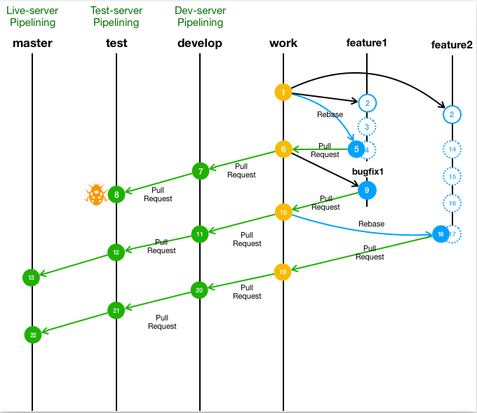
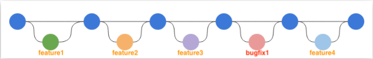
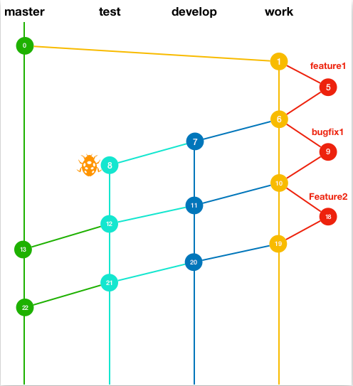
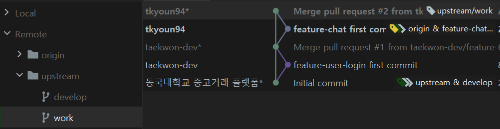

---

Git Flow : Dgumarket Team Git Branch Strategy 
---

### 기존 운영하던  Git Flow 방식의 문제점 

기존 Git Flow 운영 과정의 문제점 중 가장 먼저 체감한 것은 Git Commit History를 한 눈에 파악하기 어렵다는 것이었다. 사실 이 문제는 소스를 관리하는 관점에서의 문제라기 보다는 전체 흐름을 파악하는 상황과 특정 시점으로 돌아가서 에러, 버그 처리 또는 개발을 하는 상황에서 문제가 있다. 또한 Local 작업 브랜치에서 Upstream Develop까지의 병합 과정의 절차가 많다는 점도 불편한 부분이었다. 

이번 개정된 Git Flow 방식에서는 위에서 언급한 문제점인 Git Commit History와 Upstream Develop 까지의 복잡한 병합 과정을 보다 효율적으로 관리하는 방향을 제안하고 더 나아가 에러 또는 버그를 처리하는 상황 또는 Cherry Pick을 활용하는 상황을 설명한다. 

___

### New 

​								<그림 1> 

우선 기존의 Git Flow에서 없었던 work 브랜치를 도입했고, release 브랜치는 제외됐다. (기존의 develop 브랜치의 역할을 work 브랜치가 한다고 생각하면 된다, 자세한 건 아래 설명을 참고)

work 브랜치는 작업 브랜치(feature branches)를 생성할 때 베이스가 된다. 또한 작업 브랜치에서 개발이 완료된 이후 다시 work 브랜치로 PR을 통해 병합을 한다. PR을 보내기 전에 Rebase를 진행하는데, 이는 Commit History를 쉽게 파악하기 위해 진행한다. 위 두 과정을 여러번 반복해서 진행하게 되면 아래 <그림 2>와 같이 work 브랜치를 관리할 수 있다. 

 

​						  <그림 2>

추가적으로 work 브랜치를 관리할 때 한 가지 규칙이 있다. <그림 2>와 같이 운영하기 위해서 1 Function 1 Commit 정책을 도입한다. Commit History를 쉽게 파악하는데 이유도 있지만, 버그 또는 에러 처리 또는 개발 상황에서 특정 브랜치 시점으로 돌아가는 데 용이하게 하기 위해 위 규칙을 도입한다. 

<그림 2>를 보면, 작업 브랜치(feature branch)뿐만 아니라 버그를 수정한 내용도 있는 것을 볼 수 있다. <그림 1>에서 버그가 발생한 위치가 8번이고, 이 때 work 브랜치 6번을 베이스로 하고 있다. 이 경우 메인 브랜치인 work 브랜치에서 다시 bugfix 브랜치를 생성하고 앞서 설명한 것과 같이 동일하게 처리하게 된다. 

___

### Cherry Pick

Cherry Pick 상황에 대해서 가장 이해하기 쉬운 글이라고 생각해서 참고한 내용을 첨부한다.

"위 네트워크에서 1번에서 브랜치를 생성해 feature3을 개발한다고 할때, 이때 현재 브랜치에서는 feature1, bugfix1, feature2에 대해서는 구현이 안되어 있는 상황일텐데, 현재브랜치에 feature2의 기능만이 필요 할때, 체리픽을 통해 feature1, bugfix1에대한 내용은 남겨두고 feature2의 기능만 가져올수 있습니다." (출처 : https://taes-k.github.io/2019/08/09/git-gitflow/)

___

### 실습

아래 내용은 work 브랜치에서 작업 브랜치(feature branch)생성 후 다시 work 브랜치로 PR을 통해 병합하는 과정을 정리한 내용이다.

**(local) git checkout -b feature-user-login --track upstream/work** : 

--track 옵션을 활용해서 upstream work 브랜치를 베이스로 작업브랜치 생성

**(local) git pull --rebase upstream work** 

PR 생성을 위해 origin 리포지토리로 push 하기 전, 다른 동료 개발자에 의해 upstream work 브랜치의 상태가 변경됐을 수 있으므로 rebase를 진행 + 위에서 언급한 work 브랜치 관리 정책

**(local) git push origin feature-user-login** 

**(PR) (origin) feature-user-login → (upstream) work**

**(local) git branch -d feature-user-login**

**(origin) git branch -d feature-user-login** 

<그림 4 : work 브랜치> 

___

참고 

https://taes-k.github.io/2019/08/09/git-gitflow/

https://taes-k.github.io/2020/01/07/clean-git-flow/

___

추후 더 언급할 내용 

**Jira**

**개발환경 : 개발 서버, QA 서버**

