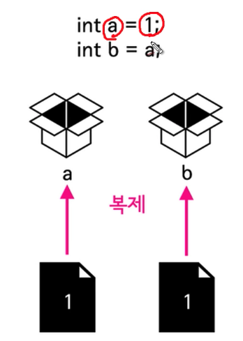
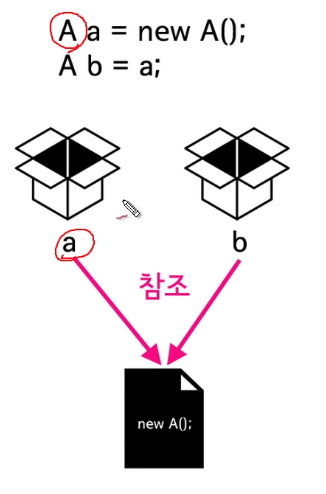

## Java Reference : 참조 

## 

**기본(Primitive) 데이터 타입 ** 

```java
int a = 1;
int b = a;
b = 2;  // a = 1, b = 2 

// # 복제 
```



**참조(Reference) 데이터 타입**

```java
class A {
  public int id; 
  
  A (int id) {
    this.id = id; 
  }
}


A a = new A(1); // a.id = 1 
A b = a; 
b.id = 2;  // a.id = 2, b.id = 2

// a.id = 2 인 이유? 
// # 위치에 대한 정보를 가지고 있다, # 참조
// # 100GB 파일에 대한 바로가기는 실제 물리적 파일을 생성하는 것이 아니다. -> 메모리 활용 측면 
```



