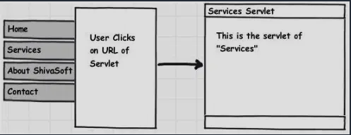
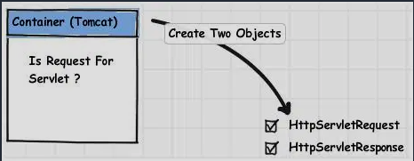
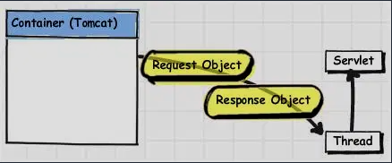
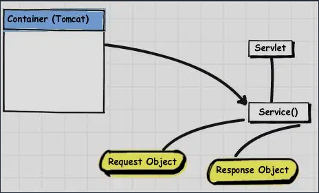
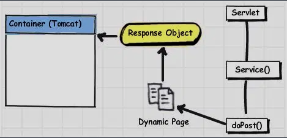
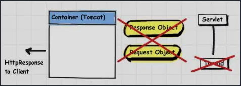

# [Java] How Servlet Container handles HTTP Request

학교 친구와 Spring Boot로 웹 애플리케이션 개발 시작할 때 제대로된 Spring 원리를 공부하고 시작한 것이 아닌 야행성(?)으로 필요한 부분만 채워가면서 진행했다. 물론, 내가 필요한 부분을 채워서 진행을 해도 잘한 것과 잘하지 못한 것에 대한 분별은 물론 하지 못했다. 그런 와중에도 나에게 매우 흥미로운 지점으로 다가온 것이 있었는데 바로 <u>"수 많은 클라이언트의 요청을 어떻게 처리하는 걸까?"</u> 이다. 프로젝트를 마무리하고 하나씩 부족했던 개념에 대한 공부를 하면서 이 주제에 대해서 다루고자 한다. 단, 서블릿과 서블릿 컨테이너에 대한 이해가 전제된 정보를 담고 있다는 점을 강조하고 싶다.

### | How to handle the HTTP request?

클라이언트의 HTTP 요청을 하면, 

​													<그림 1 - Client Browse Servlet URL> 

서블릿 컨테이너(예 - Apache Tomcat)은 해당 요청 메타 정보를 파악하고, `HttpServletRequest`, `HttpServletResponse` 객체를 생성한다. 

​													    <그림 2 - HttpServletRequest and HttpServletResponse> 

서블릿 컨테이너는 URL 기준으로 해당 요청을 처리할 특정 서블릿을 매핑하고, 스레드를 생성 후 해당 서블릿을 처리하도록 할당한다. 

​													  	<그림 3 - Create Thread for Servlet> 

서블릿 컨테이너는 해당 서블릿 객체의 `service()` 메서드를 호출하고, 클라이언트의 요청에 따라서 `doGet()` 또는 `doPost()` 를 호출하여 요청에 대한 서비스 로직을 호출한다.

​														<그림 4 - Service method of servlet> 		

해당 서비스 로직이 전개되고, 클라이언트 요청에 대한 응답을 `Response Object`에 참조시킨다.														

​													  <그림 5 - Servlet - doPost - response object> 

서블릿 컨테이너는  `Response Object` 를 `HttpServletResponse`로 전환하고, 클라이언트에 응답을 보낸다. 최초 요청이 왔을 때 생성한 `HttpServletRequest`, `HttpServletResponse` 를 모두 소멸시킨다. 

​													   <그림 6 - destroy response and request object>

### | Related Topic : 

#### - Thread, ThreadPool

Servlet Container는 클라이언트의 각 요청에 대해서 스레드를 생성한 뒤 처리한다. 

#### - Spring Bean scopes

Spring Bean Scopes 개념이 나올 수 있는 원리를 이해하기 위한 선수 개념 (특히 Web Scope에서 `request scope`) 

### | Reference 

https://www.jitendrazaa.com/blog/java/servlet/how-container-handles-the-servlet-request/