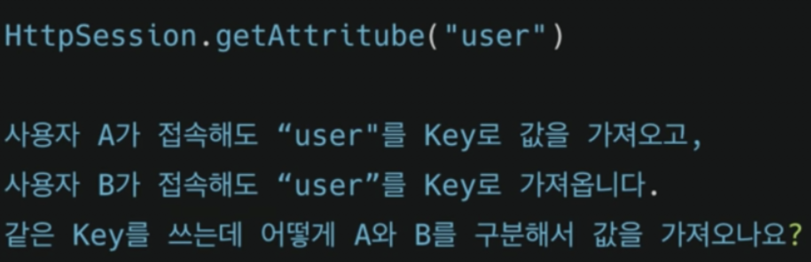
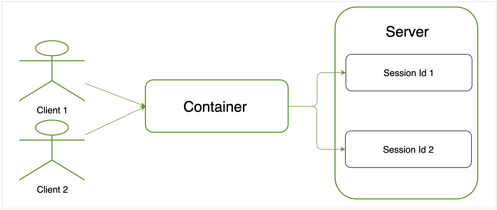

#  [Java] Session Tracking in Servlets 

### | 이 주제를 다루게 된 배경 

유투브 개발바닥의 https://www.youtube.com/watch?v=3ArYMq5AomI 영상에서 배민 백엔드 면접 질문 예시로 다음이 소개됐다. 

 <그림 1 - 백엔드 면접 질문 예시> 

단순히 이 문제에 대한 해답을 찾기 위해서 이 주제를 찾아본 것은 아니고, Spring Security에서 `HttpSession`을 활용한 인증 처리를 다루는 과정에서 위 질문이 떠올라서 `Servlet`이 어떻게 `Session`을 관리하는 지에 대해서 좀 더 깊게 찾아보게 됐다. Spring Framework에서 너무나 편하게 사용했던 것들에 대해서 하나씩 근원을 찾아가는 과정인 것 같고, `Bean Scopes`과 같이 다른 주제를 이해하는데도 매우 유익한 것 같다.

### | Session Tracking (Session Management):

HTTP 프로토콜의 가장 큰 특징 중 하나인 `stateless`를 보완하기 위해 `session tracking`을 사용할 수 있다. 예를 들면, 로그인을 통해 인증된 유저가 다음 요청(인증이 요구되는)할 때 인증 절차를 생략할 수 있는 것을 들 수 있다. 또한 `stateless`는 클라이언트의 HTTP 요청을 매번 새로운 요청으로 인식하는 것을 의미한다. 이런 맥락에서 서버가 각 유저의 상태를 어떻게 관리하는 지 알아보자. 

### | Session Tracking Techniques(4):

`session tracking`을 할 수 있는 방법은 아래와 같다. 

###### - Cookies

###### - Hidden Form Field

###### - URL Rewriting 

###### - HttpSession 

### | Cookies 

#### | Hidden Form Field

#### | URL Rewriting 

### | HttpSession interface 

서블릿 컨테이너는 각 유저에게 세션 아이디를 생성하고, 이 식별 값을 통해서 특정 유저를 특정할 수 있게된다. 

<그림 2> 

##### - How to get the HttpSession object?

`HttpServletRequest` 인터페이스는 두 가지 메소드를 제공한다. 

###### 1) public HttpSession getSession() : Returns the current session associated with this request, or if the request does not have a session, creates one.

###### 2) public HttpSession getSession(boolean create) : Returns the current HttpSession associated with this request or, if there is no current session and create is true, returns a new session. (if create is false, return null)

##### 

##### - Commonly used methods of HttpSession interface:

###### - public String getId()

###### - public long getCreationTime()

###### - public long getLastAccessedTime()

###### - public void invailidate() 

### | Reference

###### https://www.journaldev.com/1907/java-session-management-servlet-httpsession-url-rewriting#servlet-session

###### https://www.javatpoint.com/session-tracking-in-servlets

###### https://www.javatpoint.com/http-session-in-session-tracking

