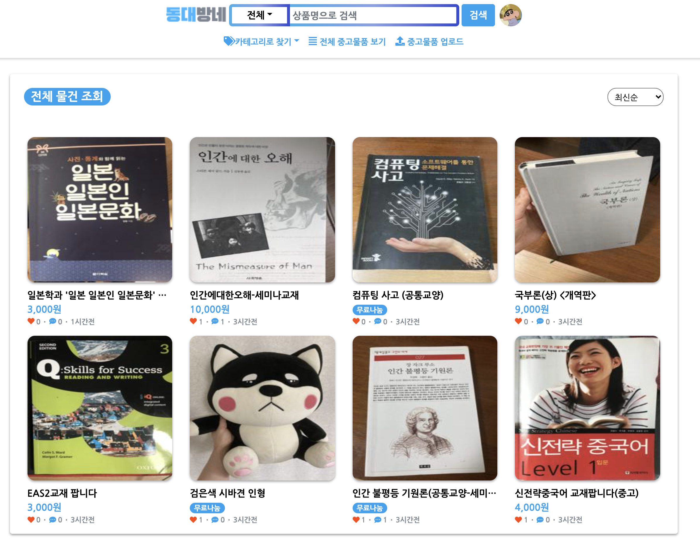
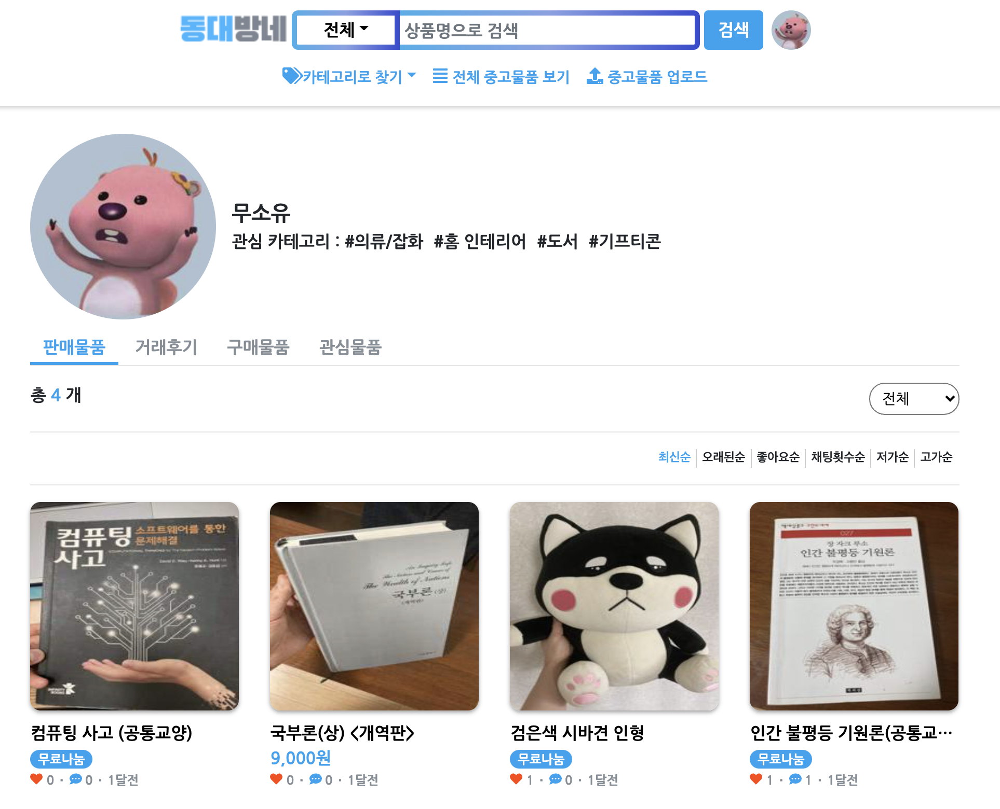
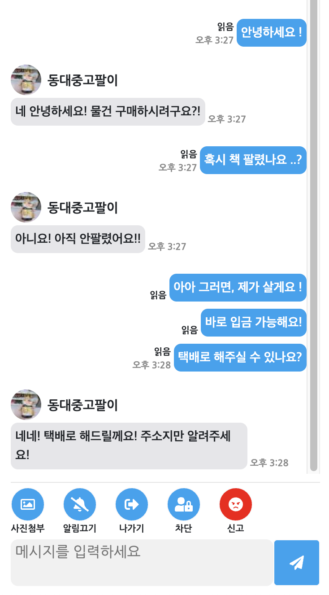

# [동대방네 Spring Data JPA] (1) 비즈니스 요구사항

 

교내 학생 및 교직원 대상 중고거래 플랫폼 서비스를 2021/06/30에 배포하고 드디어 JPA 복기한다. 사실 개발 단계에서 가장 많이 애먹고 찝찝했던 것이 JPA 관련한 것이었는데, 서비스 설계에 대한 고민이 많이 부족했고 ORM 프레임워크에 대한 지식도 너무 부족한데서 기인한 것 같다. 이번 글에서는 `동대방네` 서비스 비즈니즈 요구사항을 토대로 엔티티 클래스를 재점검하고, 엔티티 간 연관관계를 정리할 예정이다. 또한 `영속성 컨텍스트(Persistence Context)` 를 중심으로 지연 로딩과 영속성 전이 옵션 활용에 대한 정리도 포함되어 있다.

단순히 서비스 개발 과정에서 진행했던 것을 있는 그대로 복기하는 방식이 아닌, 기존 방식에서 수정되는 사항은 따로 기재할 예정이다. 물론 수정을 하기 위해 공부를 병행하면서 글을 연재할 예정이다.  본문으로 가기 전, JPA 공부하는데 정말 큰 도움이 된 김영한님에게 무한한 감사를 표하고 싶다 :-) 그리고 JPA를 사용해봤지만, JPA 역할에 대해 명확히 공부하고 싶은 분은 김영한님의 JPA 책을 꼭 정독하길 추천한다. 최근에 찾아보니, 인프런에서도 JPA 관련 강의도 오픈되어 있었는데 참고하면 좋을 것 같다. 

### | 동대방네 프로젝트 소개 

결론부터 말하자면, 동대방네는 동국대학교 학생 및 교직원 대상, 중고거래 플랫폼 서비스이다. 동국대학교 재학생 3명이서 진행한 팀 프로젝트이고, 이미 서비스되고 있는 대학교 커뮤니티에서 중고거래 시장이 잘 형성되어 있었지만 프로젝트 기획보다는 개발자로서 실서비스를 경험하고자 하는 목적의식이 있었기 때문에 프로젝트 주제에 대해서는 생각보다 깊게 고민하진 않았다. 다만, 기존에 참고했던 대학교 커뮤니티 내 중고거래 시 판매자와 구매자의 소통 방식이 구매자가 구매 의사를 보이면,  해당 서비스 내 쪽지를 통해 소통해야 했다. (쪽지를 최신화 하기 위해 업데이트를 계속 유저가 해야 하는 상황) 이러한 점을 보완하기 위해 웹 환경에서 실시간으로 구매자와 판매자가 채팅을 통해 중고거래를 할 수 있도록 하는 방향으로 보완하고자 했다. 

​										 <그림 1 : 회원들의 모든 판매물품 조회 페이지> 

​										 <그림 2 : 유저의 거래 관련 정보 조회 페이지> 

​										<그림 3 : 채팅을 통한 중고거래 상황 예시> 

___

### | 비즈니스 요구사항 : 

비즈니스 요구사항에는 **중고거래 플랫폼** 에서 각 엔티티 간 연관관계를 형성하는 핵심 로직만 추렸다. 대부분 아래 요구사항을 처리하는 과정에서 대부분의 JPA 엔티티 간 연관관게를 매핑하는 것과 영속성 컨텍스트를 통한 영속성 전이 또는 지연 로딩 등 프로젝트에서 활용했던 다양한 옵션들을 활용할 수 있기 때문이다. 

아래 비즈니스 요구사항에 대해서 데이터는 자체 DB 서버를 구축한다. (<u>MySQL</u> 사용)

- **회원** : 

  - 회원가입 시, 회원은 관심 카테고리 (중고상품 카테고리) 중 3가지 이상을 선택해야 가입할 수 있다. 

  - 회원 탈퇴 시, 일정 기간 보관 후 (개인정보 처리방침 의거) 삭제 

    (단, 해당 유저가 주고 받은 채팅 데이터는 참고 관계만 끊는다) 

    

- **중고 거래** :

  - 유저는 업로드된 중고상품들을 대상으로 관심 물품으로 지정할 수 있다. (인스타그램 <u>좋아요 기능</u>)
  - 상품 기준으로, 해당 상품을 관심 품목으로 지정한 유저(들)은 조회할 수 <u>없다</u>.
  - 유저는 관심항목으로 추가한 상품을 조회할 때 관심항목으로 추가한 순서대로 조회할 수 있다.
  - 유저는 본인이 업로드한 중고상품 리스트를 조회할 수 있다.
  - 중고상품 상세 정보화면에서, 해당 중고상품 판매자의 프로필 정보를 조회할 수 있다.

- **채팅** :

  - 유저는 자신이 포함된 채팅방 목록을 조회할 수 있다. 
  - 유저는 참여하고 있는 채팅방 내 메시지를 조회할 수 있다.

___

다음 이어지는 글에서는 위 비즈니스 요구사항을 기반으로 엔티티 설계 후, 각 엔티티 간 연관관계를 설정과 영속정 컨텍스트 기반 여러 옵션들을 어떻게 적용할 지에 대해서 설명할 예정이다. 