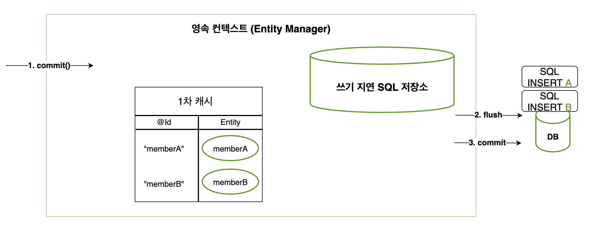

# [JPA] Flush 호출 시점

### | Flush 

> ###### 플러시는 영속성 컨텍스트의 변경 내용을 데이터베이스에 동기화하는 작업인데, 이 때 등록, 수정 또는 삭제한 엔티티를 데이터베이스에 반영한다. 
>
> ###### 좀 더 구체적으로 이야기하면 쓰기 지연 SQL 저장소에 모인 쿼리를 데이터베이스에 보낸다. 이렇게 영속성 컨텍스트의 변경 내용을 데이터베이스에 도식화한 후에 실제 데이터베이스 트랜잭션을 커밋한다. (자바 ORM 표준 JPA 프로그래밍 - 김영한 지음)

<그림 1> 

### | Reference 

###### 자바 ORM 표준 JPA 프로그래밍 (김영한 지음)

###### https://cheese10yun.github.io/jpa-flush/

