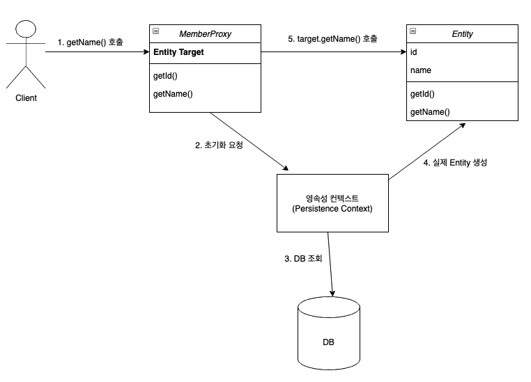

# JPA - 프록시 객체 & 즉시 로딩과 지연로딩

출처 : 자바 ORM 표준 JPA 프로그래밍 (저자 : **김영한**)


**문제 정의** 

"객체는 객체 그래프로 <u>연관된 객체들을 탐색</u>한다. 그런데 객체가 <u>데이터베이스에 저장되어 있으므로</u> 연관된 객체를 마음껏 탐색하기는 어렵다."

**해결**

``` 
proxy : 

1. [명사] 대리(위임)권
2. [명사] 대리인

출처 : https://dict.naver.com/search.dict?dicQuery=proxy&query=proxy&target=dic&ie=utf8&query_utf=&isOnlyViewEE=

연관 개념 - 프록시 서버 :

프록시 서버는 클라이언트가 자신을 통해서 다른 네트워크 서비스에 간접적으로 접속할 수 있게 해주는 컴퓨터 시스템이나 응용 프로그램을 가리킨다. 서버와 클라이언트 사이에 중계기로서 대리로 통신을 수행하는 것을 가리켜 '프록시' 그 중계 기능을 하는 것을 프록시 서버라고 부른다. 

출처 : https://ko.wikipedia.org/wiki/프록시_서버
```

"프록시를 사용하면 연관된 객체를 처음부터 데이터베이스에서 조회하는 것이 아니라 실제 사용하는 시점에 데이터베이스에서 조회할 수 있다. JPA는 즉시 로딩과 지연로딩이라는 방법으로 둘을 모두 지원한다." 


**프록시 기초**

```java
Member member = em.find(Member.class, "member");
// JPA에서 식별자로 하나의 엔티티를 조회할 때 EntityManager.find() 사용 
// 해당 엔티티가 영속성 컨텍스트에 없는 경우 데이터베이스를 조회한다. 
vs
  
Member member = em.getReference(Member.class, "member")
// 엔티티를 실제 사용하는 시점까지 데이터베이스 조회를 미루고 싶을 때는 위 메소드를 사용한다.
// 이 메소드를 호출 할 때 JPA는 데이터베이스를 조회하지 않고, 실제 엔티티 객체도 생성하지 않는다.
// 대신, 데이터베이스 접근을 '위임'한 프록시 객체를 반환한다. 
```


**프록시 특징**

아래 그림 1과 같이 프록시 클래스는 실제 클래스를 상속 받아서 만들어지므로 실제 클래스와 겉 모양이 같다. 실제 사용하는 입장에서는 객체의 진위 여부를 구분할 필요는 없다. 


​																					  <그림 1> 

프록시 객체는 아래 그림 2와 같이 실제 객체를 참조하기 위한 Target를 보관하고, <u>프록시 객체의 메소드를 호출하면 프록시 객체는 실제 객체의 메소드를 호출한다.</u> 


​											<그림 2>


**프록시 객체의 초기화**

프록시 객체는 프록시 객체의 메소드를 호출 했을 때 (= 실제 사용될 때) 데이터베이스를 조회해서 실제 엔티티 객체를 생성하는데, 이를 <u>프록시 객체의 초기화</u>라고 한다. 

```java
// MemberProxy 반환
Member member = em.getRefernce(Member.class, "member")
member.getName();  // -> 프록시 객체의 메소드를 통해 실제 엔티티를 초기화 
```



