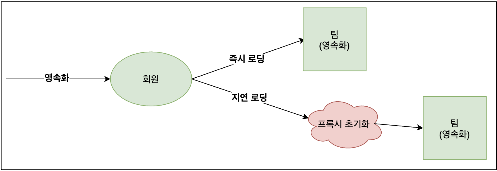
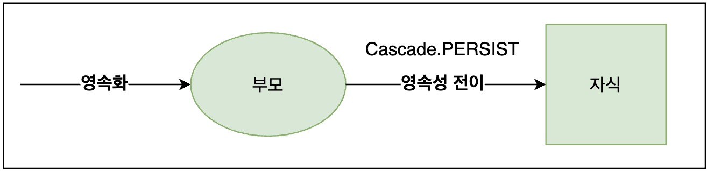

# [8장] 프록시와 연관관계 정리 (2)

##### - 8.1 프록시 

##### - 8.2 즉시 로딩과 지연 로딩 

##### - 8.3 지연 로딩 활용 

##### - 8.4 영속성 전이: CASCADE ◀︎ **현재 글**

##### - 8.5 고아 객체 & 영속성 전이 + 고아 객체, 생명주기 ◀︎ **현재 글**

___

### | 영속성 전이 (저장, 삭제) 

영속성 전이에 대해서 설명하기 전, 즉시로딩과 프록시를 기반으로한 지연로딩에서 **영속화**와 관련된 맥락을 재정리하고자 한다. 지연 로딩을 통해서 연관관계에 있는 엔티티를 필요한 시점에 도달했을 때까지 지연시킨 후 조회할 수 있었다. 프록시 객체를 초기화하는 과정에서 실제 객체를 조회할 수 있었는데, 만약 이미 대상 엔티티가 영속화되어 있었다면 프록시 객체가 사용되는 것이 아닌 영속성 컨텍스트에서 관리되는 실제 엔티티를 사용하게 된다. 만약 영속화되지 않았던 경우에는 실제 사용되는 시점에 해당 엔티티가 영속화될 것이다. 



<그림 1> 

영속성 전이는 어떤 상황에서 사용될까? <u>부모 엔티티를 저장할 때 자식 엔티티도 함께 저장되길 원할 때</u>를 예로 들 수 있다. JPA에서는 엔티티를 저장할 때 <u>연관된 모든 엔티티는 영속 상태</u>여야 한다. 따라서 앞에서 예로 든 상황에서는 부모와 자식 연관관계가 설정된 후 부모 엔티티를 영속화를 하고나면 영속성 전이를 통해 자식 엔티티도 영속화가 되는 것이다. 



<그림 2> 

영속성 전이에서는 두 엔티티의 연관관계에는 의존하지 않고, 단순히 두 엔티티 중 설정에 따라서 하나의 엔티티가 먼저 영속화될 때 나머지 연관된 엔티티도 영속화 처리를 해줄 뿐이다. 

영속성 전이를 통해서 삭제도 가능하다. `Cascade.REMOVE` 옵션을 통해서 부모 엔티티를 삭제했을 경우 연관된 자식 엔티티를 모두 삭제처리할 수 있다. 단, 외래 키 관계를 고려하여 자식 엔티티를 먼저 삭제 후 부모 엔티티를 삭제하는 쿼리가 수행된다. 만약 `Cascade.REMOVE` 옵션 없이 부모 엔티티만 삭제하려고 했을 때는 외래 키 제약 조건으로 인해 예외가 발생한다. 

```java
public enum CascadeType {
  ALL, 
  PERSIST,
  MERGE,
  REMOVE,
  REFRESH,
  DETACH
}
```

```java
@Entity
public class Parent {
  	...
    @OneToMany(mappedBy = "parent", cascade = {CascadeType.PERSIST, CascadeType,REMOVE)})  
    ...
}
```

영속성 옵션은 위와 같이 있고, 두 엔티티 관계에서 여러 속성은 아래 코드와 같이 한 번에 정의할 수 있다. 영속성 전이는 <u>**플러시가 호출**</u>될 때 발생한다.

### | 고아 객체 

Java에서 가비지 컬렉터(Garbage Collector)와 유사하게 부모 엔티티와 연관관계가 끊어진 자식 엔티티를 <u>자동</u>으로 삭제하는 기능을 제공하는데 이를 고아 객체 제거라 한다. 이를 통해서 부모 엔티티의 컬렉션에서 자식 엔티티에 대한 참조만 제거하면 자식 엔티티가 자동으로 삭제되도록 할 수 있다. 고아 객체 제거 기능 역시 영속성 컨텍스트를 플러시할 때 적용된다. 

```java
@Entity
public class Parent {
  @Id 
  @GeneratedValue
  private Long id; 
  
  @OneToMany(mappedBy = "parent", orphanRemoval = true)
  private List<Child> children = new ArrayList<Child>();
  ...
}
```

고아 객체 제거 기능을 다시 한 번 정리하면 부모 엔티티에서 참조가 끊긴 자식 엔티티를 찾아서 제거하는 기능이다. 근데 만약 자식 엔티티가 여러 부모 엔티티와 관계가 있는 경우에는 고아 객체가 제대로 기능할 수 있을까? 물론 아니다. 이미 삭제해버린 경우 다른 부모 엔티티에서 삭제된 자식 엔티티를 참조하는 경우 NPE 등 여러 문제가 발생할 수 있다. 따라서 `orphanRemoval` 옵션은 `@OneToOne` , `@OneToMany` 연관관계에서만 사용할 수 있다.

개념적으로 앞서 설명했던 영속성 전이에서 부모 엔티티를 삭제하게 되면 해당 부모의 자식 엔티티는 모두 고아가 된다. `CascadeType.REMOVE` 옵션을 사용하는 것도 고아 객체 제거 기능으로 볼 수 있다. 

### | 영속성 전이 + 고아 객체, 생명주기 

`CascadeType.ALL` + `orphanRemoval = true` 옵션을 동시에 사용하면 어떻게 될까? 엔티티는 `EntityManager.persist()`를 통해 영속화되고, `EntityManager.remove()`를 통해 영속성 컨텍스트에서 제거된다. 엔티티의 생명주기를 스스로 관리한다는 뜻이다. 그런데 두 옵션을 모두 활성화한 경우 부모 엔티티를 통해서 자식의 생명주기를 관리할 수 있다. 

##### - 저장 (via Cascade.PERSIST)

##### - 삭제 (via orphanRemoval) (부모 엔티티를 삭제하지 않아도 자식 엔티티를 삭제할 수 있다.)

___

### | Reference 

#### 자바 ORM 표준 JPA 프로그래밍 (김영한 지음)