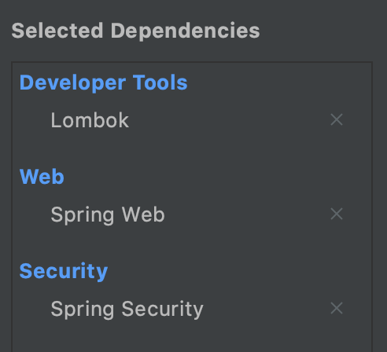
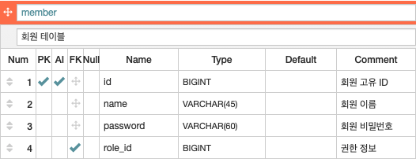
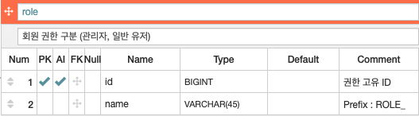

# [Spring Security] Demo Project for Spring Security (1)

###  | 목록

- **프로젝트 생성, DB 연동 (<u>환경 설정</u>)** ◀︎ **현재 글**
- 인증 
  - 인증 방식 선택
  - 인증 성공 
  - 인증 실패 
- 세션 관리 
- 인가  
- 예외 처리 

___

### | 목적 

이번 데모 프로젝트의 목적은 `Spring Security Framework` 공부 내용을 기반으로 실제 로직 흐름을 눈으로 직접 확인하는 것에 있다. 이를 통해 `Spring Security Framework` 내 각 컴포넌트들이 어떻게 협력하고 동작하는 지 그리고 `Security Filters` 역할에 대해서 더 깊게 이해할 수 있을 것으로 기대된다.  인증 방식은 가장 많이 사용되는 `Username/Password`  기반 인증을 사용하고, `Cookie-Session` 을 통해 로그인 상태를 유지할 예정이다. 

**Github** :  https://github.com/taekwon-dev/spring-demo/tree/main/spring-security 

### | 프로젝트 환경 

IDE는 `intelliJ` 를 사용하고, `Spring Boot 2.5.2` 버전에서 프로젝트를 생성했다. 웹 환경에서 로그인 또는 로그아웃 테스트를 진행하기 위해 `Spring Web` 와, `Spring Security Framework` 추가한다. `Lombok`은 필수는 아니지만, 사용하길 권장한다. 



​													 <그림 1> 

데이터베이스는 `MySQL` 을 사용한다. 



​												 <그림 2 - `member` table>



​											    <그림 3 - `role` table>

```sql
# 1 

CREATE TABLE role
(
    `id`    BIGINT         NOT NULL    AUTO_INCREMENT COMMENT '권한 고유 ID', 
    `name`  VARCHAR(45)    NOT NULL    COMMENT 'Prefix : ROLE_', 
     PRIMARY KEY (id)
);

ALTER TABLE role COMMENT '회원 권한 구분 (관리자, 일반 유저)';

# 2

CREATE TABLE member
(
    `id`        BIGINT         NOT NULL    AUTO_INCREMENT COMMENT '회원 고유 ID', 
    `name`      VARCHAR(45)    NOT NULL    COMMENT '회원 이름', 
    `password`  VARCHAR(60)    NOT NULL    COMMENT '회원 비밀번호', 
    `role_id`   BIGINT         NOT NULL    COMMENT '권한 정보', 
    CONSTRAINT PK_member PRIMARY KEY (id)
);

ALTER TABLE member COMMENT '회원 테이블';

ALTER TABLE member
    ADD CONSTRAINT FK_member_role_id_role_id FOREIGN KEY (role_id)
        REFERENCES role (id) ON DELETE RESTRICT ON UPDATE RESTRICT;
```

