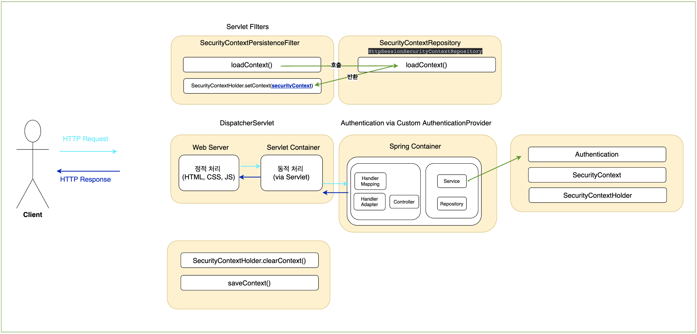

# [Security Filter] SecurityContextPersistenceFilter (1)

**Github** :  https://github.com/taekwon-dev/spring-demo/tree/main/spring-security  (Spring Security Demo 프로젝트)

### | 선수 지식 

###### - Session tracking in Spring Security

###### - Bind HttpSession object 

###### - How come you can access to an Authentication (on SecurityContext) # ThreadLocal 

___

### | What to do 

###### 영어 원문 표현 

Populates the `SecurityContextHolder` with information obtained from the configured `SecurityContextRepository` prior to the request and stores it back in the repository once the request has completed and clearing the context holder. By default it uses an `HttpSessionSecurityContextRepository`. 

`SecurityContextPersistenceFilter` 의 메인 역할은 세션에서 `SecurityContext`를 가져와서 `SecurityContextHolder`에 할당하는 것이다. 이 역할과 책임으로, 로그인 상태를 전제로 하는 필터들이 `SecurityContextPersistenceFilter`에 의존적일 수 밖에 없다. 위에서 설명한 것 처럼 세션 정보에서 `SecurityContext`를 가져오는 역할은 `HttpSessionSecurityContextRepository(default)`에서 처리하고, 이 외에도 기존 세션에서 `SecurityContext`를 찾지 못한 경우에는 새로운 `SecurityContext`를 생성하는 역할을 하고, 유저가 로그인하는 시점에 인증이 완료되면, 해당 유저의 정보를 기반으로 `SecurityContext`를 저장하는 등의 역할을 수행한다. 요청을 완료하기 전, `HttpSession(default)`에 `SecurityContext`를 저장 후 `SecurityContextHolder`에서 제거하는 것까지 담당한다. 

`SecurityContextPersistenceFilter`의 역할을 두 가지로 간추리면, 다음과 같다. 

###### 1) SecurityContext를 SecurityContextHolder에 저장 (from HttpSession)

###### 2) HTTP 요청 완료 전, SecurityContext 제거 + HttpSession에 SecurityContext 저장



<그림 1 - SecurityContextPersistenceFilter Flow>  - 추후 보완 예정

<그림 1>에서는 `SecurityContextPersistenceFilter`이 수행하는 `SecurityContext`를 `SecurityContextHolder`에 저장하는 것과 클라이언트에 요청에 대한 응답을 완료하기 전 `SecurityContext`를 제거하는 과정 흐름을 간단히 표현했다. `CustomAuthenticationProvider`를 통해 인증 처리를 위임시킴으로써 `UsernamePasswordAuthenticationFilter`과 같이 인증을 담당하는 필터에서 처리하지 않고 직접 인증처리를 진행했다. 아래는 포스트맨을 통해 로그인 API 테스트 시 `@EnableWebSecurity(debug = true)`를 통해 사용된 `SecurityFilterChain` 정보다. 아래를 보면 실제 인증을 처리하는 필터가 포함되지 않음을 확인할 수 있었다. (<u>추후 내부 인증 필터 활용 시에도 확인할 예정</u>)

```tex


Request received for POST '/api/auth/login':

org.apache.catalina.connector.RequestFacade@54e40bb9

servletPath:/api/auth/login
pathInfo:null
headers: 
x-xsrf-token: 608f1d2c-2b5e-4592-a343-5009d60fabed
content-type: application/json
user-agent: PostmanRuntime/7.28.0
accept: */*
postman-token: 3c3142db-b228-45af-98a9-70047781776f
host: localhost:8080
accept-encoding: gzip, deflate, br
connection: keep-alive
content-length: 45
cookie: JSESSIONID=FD713F8040228DCDAACBC830BF269C54; XSRF-TOKEN=608f1d2c-2b5e-4592-a343-5009d60fabed


Security filter chain: [
  WebAsyncManagerIntegrationFilter
  SecurityContextPersistenceFilter
  HeaderWriterFilter
  CsrfFilter
  LogoutFilter
  RequestCacheAwareFilter
  SecurityContextHolderAwareRequestFilter
  AnonymousAuthenticationFilter
  SessionManagementFilter
  ExceptionTranslationFilter
  FilterSecurityInterceptor
]
```

`HttpSession`에 저장되어 있는 `SecurityContext`가 없는 경우에는 `Null Authentication` 을 담고 있는 `SecurityContext`를 생성한다. 이 글을 작성하는 시점에서는 어떤 이유로 비어있는 `SecurityContext`를 생성하는 지를 이해했는 지는 못했다. 추론하는 것은 "다른 서블릿 필터와 협력하는 과정에서 필요하지 않을까?" 정도 이다. 

<그림 1>에서도 확인할 수 있듯이 실제 인증 처리를 통해서 `SecurityContextHolder`에 유저의 인증 정보를 담고 있는 `SecurityContext`가 주입되고 난 뒤, 보안을 위해 `SecurityContextHolder`를 클리어하고, `HttpSession`에 `SecurityContext`를 저장한다. 

```java
SecurityContextPersistenceFilter.class
...
SecurityContext contextAfterChainExecution = SecurityContextHolder.getContext();
SecurityContextHolder.clearContext();
this.repo.saveContext(contextAfterChainExecution, holder.getRequest(), holder.getResponse());
...
```

이어지는 글에서는 <그림 1>에서 확인할 수 있었던 `SecurityContextPersistenceFilter`의 책임을 파악하기 위해 코드를 분석해볼 예정이다. 특히 `HttpSession`을 활용해서 각 유저의 인증 상태를 유지하는 맥락과 관련해서 서블릿 컨테이너가 `HttpSession` 객체를 어떻게 관리하는 지에 대해서도 관련지어 공부할 예정이다.

### | Reference

###### https://docs.spring.io/spring-security/site/docs/3.2.8.RELEASE/apidocs/org/springframework/security/web/context/SecurityContextPersistenceFilter.html

###### https://www.programmersought.com/article/5943639580/

###### https://soon-devblog.tistory.com/2 : HttpSession 생성 시점

