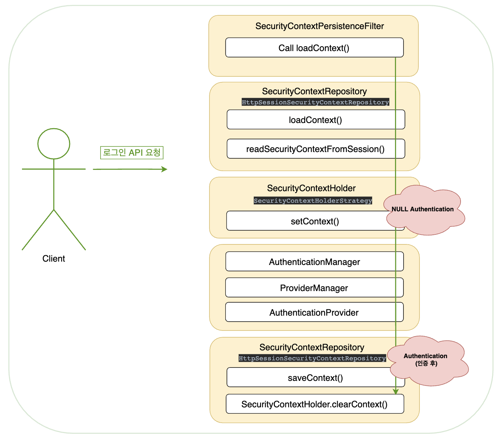
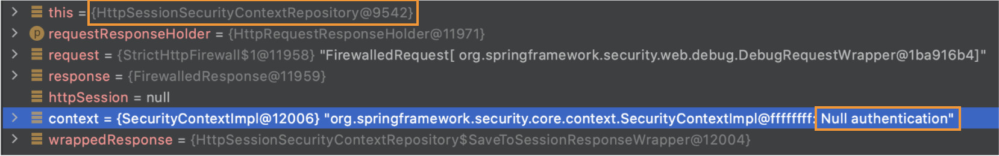
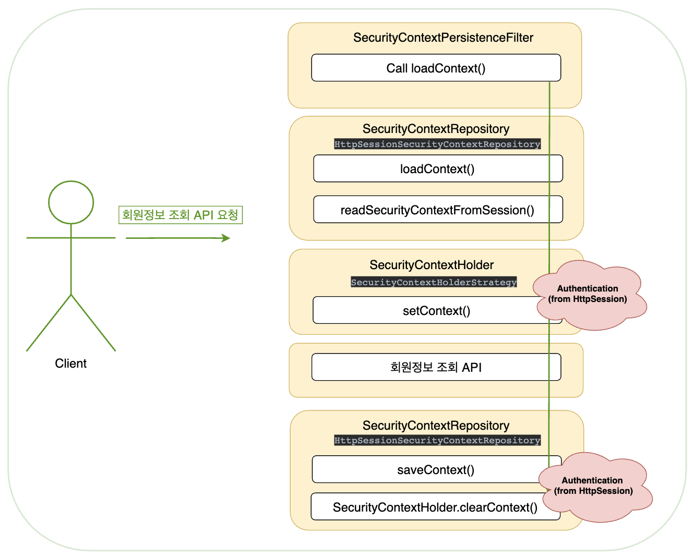
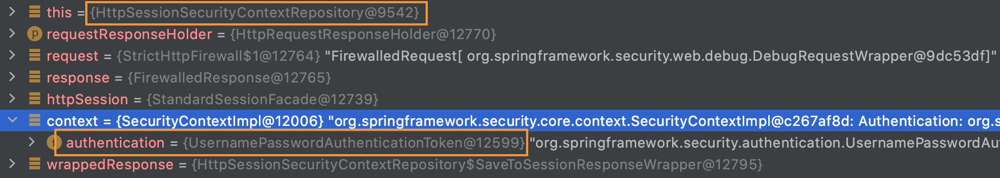

# [Security Filter] SecurityContextPersistenceFilter (2)


<그림 1> 

### | SecurityContextPersistenceFilter 역할

`SecurityContextPersistenceFilter`의 역할을 두 가지로 간추리면, 다음과 같다. 

###### 1) SecurityContext를 SecurityContextHolder에 저장 (from HttpSession)

###### 2) HTTP 요청 완료 전, SecurityContext 제거 + HttpSession에 SecurityContext 저장

이번 글에서는 위 역할을 처리하는 메소드 코드를 분석한다.

### | loadContext(HttpRequestResponseHolder requestResponseHolder) :

```java
    public SecurityContext loadContext(HttpRequestResponseHolder requestResponseHolder) {
        HttpServletRequest request = requestResponseHolder.getRequest();
        HttpServletResponse response = requestResponseHolder.getResponse();
      	// HttpSession 객체 생성 시점 
        HttpSession httpSession = request.getSession(false);
        SecurityContext context = this.readSecurityContextFromSession(httpSession);
        if (context == null) {
            if (this.logger.isDebugEnabled()) {
                this.logger.debug("No SecurityContext was available from the HttpSession: " + 
                                  httpSession + 
                                  ". A new one will be created.");
            }
            context = this.generateNewContext();
        }

        HttpSessionSecurityContextRepository.SaveToSessionResponseWrapper wrappedResponse = new HttpSessionSecurityContextRepository.SaveToSessionResponseWrapper(response, request, httpSession != null, context);
        requestResponseHolder.setResponse(wrappedResponse);
        requestResponseHolder.setRequest(new HttpSessionSecurityContextRepository.SaveToSessionRequestWrapper(request, wrappedResponse));
        return context;
    }
```

`SecurityContext`를 `SecurityContextHolder`에 저장하기 위해서 `SecurityContextPersistenceFilter`에서는 `SecurityContextRepository` 구현체인 `HttpSessionSecurityContextRepository`를 활용한다. 이름에서 쉽게 추론할 수 있듯이 `HttpSession`을 `SecurityContext`의 저장소 개념으로 활용한다. 

`SecurityContextPersistenceFilter`의 역할 중 하나인, HTTP 요청 처리를 완료하기 전 `SecurityContext`를 제거하고 `HttpSession`에 `SecurityContext`를 저장하게 된다. 따라서 이전 요청에서 `HttpSession`에 저장되어 있는 `SecurityContext`가 있는 지 확인하기 위해 `HttpSession` 객체를 생성한다. 

```java
HttpSession httpSession = request.getSession(false); 

// 참고
HttpSession httpSession = request.getSession() = HttpSession httpSession = request.getSession(true)
```

`HttpServletRequest`의 `getSession(boolean create)` 메소드는 `HttpSession` 객체를 생성하는데, boolean 타입의 파라미터에 따라서 다음과 같은 차이가 있다. 

###### - true : 현재 생성되어 있는 세션이 있는 경우 현재 세션을 반환하고, 생성되어 있는 세션이 없는 경우 새로 생성해서 반환

###### - false : 현재 생성되어 있는 세션이 있는 경우 현재 세션을 반환하고, 생성되어 있는 세션이 없는 경우 NULL 반환

`HttpSession` 객체가 생성되면, 이 객체를 통해서 `SecurityContext`가 저장되어 있는 지 확인하기 위해 `HttpSessionSecurityContextRepository.readSecurityContextFromSession(httpSession)`을 호출한다.

```java
    private SecurityContext readSecurityContextFromSession(HttpSession httpSession) {
        boolean debug = this.logger.isDebugEnabled();
        if (httpSession == null) {
            if (debug) {
                this.logger.debug("No HttpSession currently exists");
            }
            return null;
        } else {
          	// private String springSecurityContextKey = "SPRING_SECURITY_CONTEXT";
            Object contextFromSession = httpSession.getAttribute(this.springSecurityContextKey);
            if (contextFromSession == null) {
                if (debug) {
                    this.logger.debug("HttpSession returned null object for SPRING_SECURITY_CONTEXT");
                }

                return null;
            } else if (!(contextFromSession instanceof SecurityContext)) {
                if (this.logger.isWarnEnabled()) {
                    this.logger.warn(this.springSecurityContextKey + " did not contain a SecurityContext but contained: '" + contextFromSession + "'; are you improperly modifying the HttpSession directly (you should always use SecurityContextHolder) or using the HttpSession attribute reserved for this class?");
                }

                return null;
            } else {
                if (debug) {
                    this.logger.debug("Obtained a valid SecurityContext from " + this.springSecurityContextKey + ": '" + contextFromSession + "'");
                }

                return (SecurityContext)contextFromSession;
            }
        }
    }
```

`HttpSessionSecurityContextRepository.readSecurityContextFromSession(httpSession)` 메소드에서는 `HttpSession`에 `attribute`에 `SPRING_SECURITY_CONTEXT`를 키로 저장된 값을 조회한다. 그리고 해당 키 값에 대응되는 값이 `SecurityContext` 인스턴스인 경우  해당 `SecurityContext`를 반환하는 역할을 한다. 

 `HttpSession`에서 `SecurityContext` 가져오는 것은 위와 같은 흐름으로 구현되어 있었다. 

____

###### ! 참고 ! 클라이언트 요청에 대한 HttpSession을 어떻게 특정할 수 있을까? 

###### 결론부터 먼저 설명하자면, Spring Security에서 Session-tracking을 할 때 디폴트로 사용하는 것이 HTTP Cookies다. Apache Tomcat(WAS)는 기본적 JSESSIONID를 쿠키 키 값으로 생성하고 해당 키 값에 세션 아이디를 값으로 저장한다. 클라이언트 요청 시, HTTP Cookie를 통해서 고유 세션 아이디를 확보하고 해당 값을 통해서 특정 세션 객체를 참조할 수 있게 된다.

###### Reference - https://springhow.com/session-tracking-modes-in-spring-security/

___

### | saveContext(SecurityContext context) 

HTTP 요청 처리를 완료하기 전에 위에서 언급한 `SecurityContextPersistenceFilter` 역할 처럼 `HttpSession`에 `SecurityContext`를 저장하고 `SecurityContext`를 제거한다. 

```java
        protected void saveContext(SecurityContext context) {
            Authentication authentication = context.getAuthentication();
            HttpSession httpSession = this.request.getSession(false);
            if (authentication != null && !HttpSessionSecurityContextRepository.this.trustResolver.isAnonymous(authentication)) {
                if (httpSession == null) {
                    httpSession = this.createNewSessionIfAllowed(context);
                }

                if (httpSession != null && (this.contextChanged(context) || httpSession.getAttribute(HttpSessionSecurityContextRepository.this.springSecurityContextKey) == null)) {
                    httpSession.setAttribute(HttpSessionSecurityContextRepository.this.springSecurityContextKey, context);
                    this.isSaveContextInvoked = true;
                    if (HttpSessionSecurityContextRepository.this.logger.isDebugEnabled()) {
                        HttpSessionSecurityContextRepository.this.logger.debug("SecurityContext '" + context + "' stored to HttpSession: '" + httpSession);
                    }
                }

            } else {
                if (HttpSessionSecurityContextRepository.this.logger.isDebugEnabled()) {
                    HttpSessionSecurityContextRepository.this.logger.debug("SecurityContext is empty or contents are anonymous - context will not be stored in HttpSession.");
                }

                if (httpSession != null && this.authBeforeExecution != null) {
                    httpSession.removeAttribute(HttpSessionSecurityContextRepository.this.springSecurityContextKey);
                    this.isSaveContextInvoked = true;
                }

            }
        }
```

`HttpSession`에 `SecurityContext`를 저장하는 상황에서 여러 조건이 있지만, 현재는 `HttpSession`과 `Authentication`이 모두 NULL이 아닌 상황에서 `HttpSession`에 `attribute`에 `SPRING_SECURITY_CONTEXT` 키 값으로 `SecurityContext`를 저장한다는 것만 정리한다.

### | 예시 상황 

###### 유저가 로그인 API 요청을 통해 인증을 완료하고, 인증이 요구되는 회원정보 조회 API 요청 시 SecurityContext 내 Authentication 객체를 조회하는 상황에서 위 흐름을 직접 확인해보자. (via IntelliJ Debugging Mode)



<그림 2 최초 로그인 API 요청> 



<그림 3 최초 로그인 API 요청 시, HttpSession 객체에 저장된 NULL Authentication>



<그림 4 인증 후, 회원정보 API 요청>



<그림 5 HttpSession 객체에 저장된 Authentication 확인>

### | 결론 

###### 1) SecurityContext를 SecurityContextHolder에 저장 (from HttpSession)

###### 2) HTTP 요청 완료 전, SecurityContext 제거 + HttpSession에 SecurityContext 저장

`SecurityContextPersistenceFilter`의 역할 그 자체에 대해 이해하는 것은 어렵지 않을 것이다. 보다 더 중요한 것은 Spring Security에서 하나의 필터가 수행하는 역할 뿐만 아니라 `Security Filters`간 의존성 관계를 파악하는 것이라고 생각한다. `SecurityContextPersistenceFilter`에 대한 이해를 기반으로 `SecurityFilterChain`에 속한 다른 필터들과 어떤 관계를 맺는 지에 대해서 공부할 예정이다. 

### | Reference

###### https://docs.spring.io/spring-security/site/docs/3.2.8.RELEASE/apidocs/org/springframework/security/web/context/SecurityContextPersistenceFilter.html

###### https://www.programmersought.com/article/5943639580/

###### https://soon-devblog.tistory.com/2 : HttpSession 생성 시점

