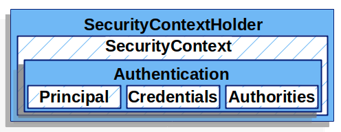

# [Spring Security]  Authentication (1)

`Spring Security Framework` 이 동작하는 상대적인 위치에 대해서 이해가 됐다면, 이 프레임워크에서 인증을 어떻게 수행하는 지를 알아보자. `Security Filters` 중에서 어떤 필터가 인증을 담당하는 지, 인증을 하는 방식에는 어떤 것들이 있는 지 그리고 인증을 처리하기 위해 필요한 개념(컴포넌트)에는 무엇이 있는 지에 대해서 알아볼 것이다. 

Github 주소 (데모 프로젝트) : https://github.com/taekwon-dev/spring-demo/tree/main/spring-security

___

### | Architecture Components (9)

###### - SecurityContextHolder 

###### - SecurityContext 

###### - Authentication 

###### - GrantedAuthority

###### - AuthenticationManager ◀︎ **현재 글**

###### - ProviderManager ◀︎ **현재 글**

###### - AuthenticationProvider ◀︎ **현재 글**

###### - Request Credentials with AuthenticationEntryPoint ◀︎ **현재 글**

###### - AbstractAuthenticationProcessingFilter ◀︎ **현재 글**

---

### | SecurityContextHolder

\# Contains SecurityContext # ThreadLocal 

Spring 공식 레퍼런스에서는 `SecurityContextHolder`를 인증 개념에서 '심장'에 비유한다. 이름에서 쉽게 추론할 수 있듯이 `SecurityContext` 를 감싸고 있다. `SecurityContextHolder` 는 `Spring Security`에서 **누가** 인증됐는 지에 대한 정보를 저장하는 공간으로 이해하면 된다. 아래 <그림 1>을 보면, 지금은 자세히 다루지 않았지만 인증 주체에 대한 정보를 담고 있는 것을 확인할 수 있다. 

​													<그림 1>

기본 설정으로 `SecurityContextHolder`는 `TheadLocal`을 사용해서 <그림 1>에서 포함하고 있는 인증한 유저의 정보를 저장한다. 이는 동일한 스레드에서 `SecurityContext` 에 접근할 수 있도록 한다. 

### | SecurityContext 

<그림 1>에서 알 수 있듯이 `SecurityContext`는 `SecurityContextHolder`에서 조회할 수 있으며, `Authentication` 객체를 가지고 있다. 

### | Authentication 

`Authentication` 객체는 <그림 1>에서도 알 수 있듯이 `Principal`, `Credentials`, `Authorities`를 가지고 있다.

##### - Principal :

<u>특정 유저를 식별</u>할 수 있는 정보를 갖는다. 예를 들어, ID/Password로 인증을 시도할 때 이러한 정보는 `UserDetails`의 인스턴스이다.

##### - Credentials :

비밀번호 개념으로 활용된다. `Spring Security`에서는 대부분의 경우 인증 후 유출되지 않도록 초기화한다. (인증 직후에 가지고 있을 필요가 없다.)

##### - Authorities : 

인증된 유저의 접근 권한을 의미하고, `GrantedAuthority` 객체를 통해 관리된다. 

### | GrantedAuthority 

`Spring Security` 공식 레퍼런스에서 "GrantedAuthoritys are high level permissions the user is granted." 확인할 수 있는데, 여기서 <u>high level</u> 의미를 정확히는 이해하지 못했다. 다만 확실한 것은 인증된 유저에게 포함된 개념이라는 것이다. 이는 너무나 당연한 것인데, 인증된 유저의 접근권한의 맥락에서 이해하면 아주 쉽다. `ROLE_ADMIN` , `ROLE_MEMBER` 등으로 각 유저에게 부여된 권한을 정의할 수 있다. 또한 이러한 접근 권한을 기준으로 특정 API 서버를 구축한 경우 (<u>예를 들어 관리자만 요청할 수 있는 API</u>) `Spring Security Framework` 에서는 해당 유저에게 `ROLE_ADMIN` 권한이 있는 지 체크하게 된다. 

ID/Password로 인증을 시도할 때 해당 유저의 `GrantedAuthority(s)` 는  `UserDetailsService`에서 로드된다. 

___

### | Reference 

https://catsbi.oopy.io/f9b0d83c-4775-47da-9c81-2261851fe0d0

https://docs.spring.io/spring-security/site/docs/current/reference/html5/#servlet-authentication

https://nathanh.tistory.com/131
