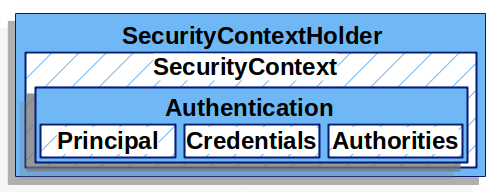
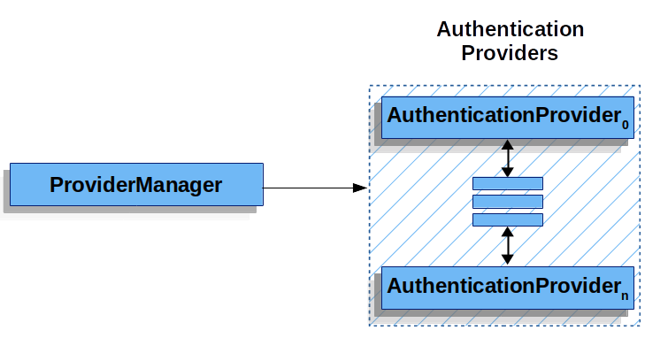
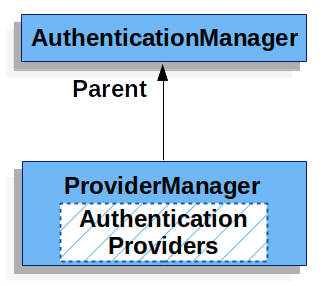
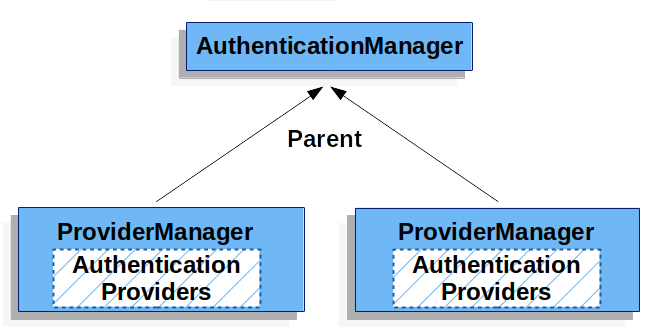
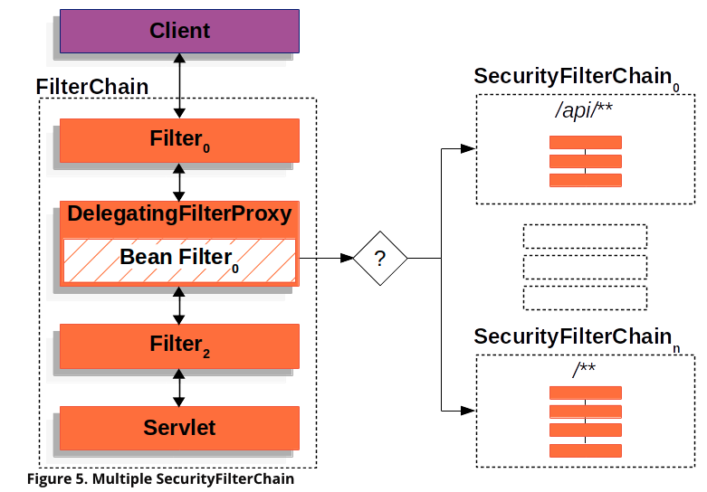

# [Spring Security]  Authentication (2)

Github 주소 (데모 프로젝트) : https://github.com/taekwon-dev/spring-demo/tree/main/spring-security

___

### | Architecture Components (9)

###### - SecurityContextHolder 

###### - SecurityContext 

###### - Authentication 

###### - GrantedAuthority

###### - AuthenticationManager ◀︎ **현재 글**

###### - ProviderManager ◀︎ **현재 글**

###### - AuthenticationProvider ◀︎ **현재 글**

###### - Request Credentials with AuthenticationEntryPoint 

###### - AbstractAuthenticationProcessingFilter 

---

### | AuthenticationManger 

```java
package org.springframework.security.authentication;

import org.springframework.security.core.Authentication;
import org.springframework.security.core.AuthenticationException;

public interface AuthenticationManager {
    Authentication authenticate(Authentication var1) throws AuthenticationException;
}
```



​													<그림 1> 

"`AuthenticaitonManager` is the API that defines how `Spinrg Security's Filter` perfom authentication" / 스프링 Security Filter가 어떻게 인증을 처리할 지에 대한 인터페이스다. `authenticate()` 를 통해 반환된 `Authentication` 객체는 이후 `SecurityContextHolder`에 세팅되는데 이 과정을 `Spring Security Filters`에서 처리한다. 

이 인터페이스를 직접 처리하는 구현체는 `ProviderManager`이다. (가장 일반적)

### | AuthenticationProvider 

`SecurityFilterChain`에 여러 `Spring Filters`가 포함된다. 여기서 `AuthenticationProvider`은 `Spring Filters`에 비유할 수 있다. 인증 방식을 떠올리면 일반적으로 ID/Password를 기입해서 인증하는 방식을 떠올리기 쉽지만 이 외에도 토큰을 기반으로한 인증 방식 등 다양한 인증 방식이 있다. 다양한 인증 방식에 맞춰 각각의 `AuthenticationProvider`가 있을 수 있다. 예를 들어, `DaoAuthenticationProvider`는 위에서 나온 username/password 기반으로 인증을 처리하고, `JwtAuthenticationProvider`는 JWT 토큰을 기반으로 인증을 처리하는 역할을 한다. 

### | ProviderManager 



​					   <그림 2> 

`AuthenticationManager`에 대해서 가장 일반적으로 많이 사용하는 구현체는 `ProviderManager`다. <그림 2>에서 알 수 있듯이 `ProviderManager`는 `AuthenticationProvider` 리스트 형태로 가지고 있는데, 실제 인증 처리를 위임하기 위함이다. `ProviderManager`에는 N개의 `AuthenticationProvider`가 올 수 있는데 이는 인증 방식 다양한 경우에도 대비할 수 있도록 해준다. 각각의 `AuthenticationProvider`는 인증 처리에 대한 결과를 판단하고 알려주는 역할을 하는데, 모든 `AuthentictaionProvider`에서 인증 성공 케이스가 나오지 않은 경우 `ProviderNotFoundException`이 발생한다. `ProviderNotFoundException`은 `ProviderManager`에 설정된 인증 방식으로 인증이 처리되지 못함을 의미한다. 

`AuthenticationProvider` 에서 지원하는 인증 타입이 없는 경우에는 직접 `AuthenticationManager`를 구현해서 인증 처리를 진행할 수도 있다. 단, `AuthenticationManager`의 구현체여야 한다. 다형성을 가지고 다시 표현하면, `AuthenticationManager` 타입이어야 한다.

```java
public class ProviderManager implements AuthenticationManager, MessageSourceAware, InitializingBean {
    private static final Log logger = LogFactory.getLog(ProviderManager.class);
    private AuthenticationEventPublisher eventPublisher;
    private List<AuthenticationProvider> providers;
    protected MessageSourceAccessor messages;
    private AuthenticationManager parent;
    private boolean eraseCredentialsAfterAuthentication;
...
```



​																	  <그림 3>

`ProviderManager` 필드를 보면, `AuthenticationManager` 타입으로 parent가 선언된 것을 확인할 수 있다.  이는 <그림 3>을 통해 보다 직관적으로 이해할 수 있다. `ProviderManager`에서 인증 처리를 위임 받은 N개의  `AuthenticationProvider`에서 지원하지 않는 인증타입에 대해서 선택적으로 `AuthenticationManager` 타입의 다른 구현체를 통해서도 인증을 처리할 수 있는 것이다. 

```java
    public Authentication authenticate(Authentication authentication) throws AuthenticationException {
        Class<? extends Authentication> toTest = authentication.getClass();
        AuthenticationException lastException = null;
        AuthenticationException parentException = null;
        Authentication result = null;
        Authentication parentResult = null;
        boolean debug = logger.isDebugEnabled();
        Iterator var8 = this.getProviders().iterator();

        while(var8.hasNext()) {
            AuthenticationProvider provider = (AuthenticationProvider)var8.next();
            if (provider.supports(toTest)) {
                if (debug) {
                    logger.debug("Authentication attempt using " + provider.getClass().getName());
                }

                try {
                    result = provider.authenticate(authentication);
                    if (result != null) {
                        this.copyDetails(authentication, result);
                        break;
                    }
                } catch (InternalAuthenticationServiceException | AccountStatusException var13) {
                    this.prepareException(var13, authentication);
                    throw var13;
                } catch (AuthenticationException var14) {
                    lastException = var14;
                }
            }
        }
      
      	// AuthenticationProvider에서 인증 처리 결과가 없는 경우 그리고 
      	// 지정한 parent (instanceof AuthenticationManager)가 null이 아닌 경우 
        if (result == null && this.parent != null) {
            try {
              	// 인증 처리 결과를 parent의 authenticate()을 통해서 활용한다.
                result = parentResult = this.parent.authenticate(authentication);
            } catch (ProviderNotFoundException var11) {
            } catch (AuthenticationException var12) {
                parentException = var12;
                lastException = var12;
            }
        }
				...
    }

```

위 코드를 통해 `AuthentcaitonProvider`에서 인증 처리 결과가 없는 경우에는 `AuthenticationManager` 타입의 다른 구현체를 통해서 인증을 처리할 수 있음을 알 수 있다. 

두개 이상의 `ProviderManager` 인스턴스는 동일한 `AuthenticationManager`와의 관계로 표현할 수 있다(그림 4). 이러한 패턴은 `FilterChainProxy`가 `SecurityFilterChain`을 리스트로 가지고 있는 것과 유사하다(그림 5). 

##### ! AuthenticationManager - ProviderManager - AuthenticationProvider(s) 관계가 어떻게 정의되는 지 확인해야 <그림 4>가 이해될 것 같다.



​								  <그림 4> 



​					<그림 5> 

보통 `ProviderManager`는 인증 처리가 성공한 직후 비밀번호 정보(Credentials)를 초기화를 통해서 `HttpSession`에서 필요한 것보다 길게 남아 있지 않도록 처리한다. 성능 향상과 최적화를 위해 캐시를 통해서 유저의 `Authenticaiton` 객체에 접근할 수 있는 경우 비밀번호 정보가 남아 있지 않아 인증 과정에서 문제가 발생하게 된다. 이러한 경우 인증 처리 후 반환된 `Authentication` 객체를 캐시에 복사해서 저장시키거나 `eraseCredentialsAfterAuthentication` 옵션을 사용하지 않음으로써 문제를 해결할 수 있다.

___

### | Reference 

###### https://catsbi.oopy.io/f9b0d83c-4775-47da-9c81-2261851fe0d0

###### https://docs.spring.io/spring-security/site/docs/current/reference/html5/#servlet-authentication

###### https://nathanh.tistory.com/131

###### https://github.com/eugenp/learn-spring-security/issues/27 (on "How to create a custom ProvierManager")

###### https://www.baeldung.com/spring-security-multiple-auth-providers 

