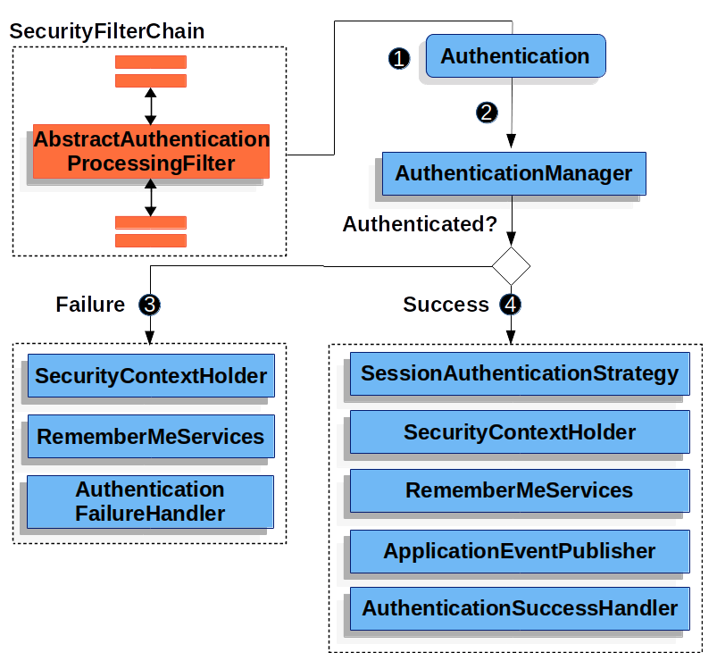

# [Spring Security]  Authentication (3)

Github 주소 (데모 프로젝트) : https://github.com/taekwon-dev/spring-demo/tree/main/spring-security

___

### | Architecture Components (9)

###### - SecurityContextHolder 

###### - SecurityContext 

###### - Authentication 

###### - GrantedAuthority

###### - AuthenticationManager 

###### - ProviderManager 

###### - AuthenticationProvider 

###### - Request Credentials with AuthenticationEntryPoint ◀︎ **현재 글**

###### - AbstractAuthenticationProcessingFilter ◀︎ **현재 글**

___

### | Request Crendentials with AuthenticationEntryPoint 

`AuthenticationEntryPoint`에서 `Credentials` 정보를 요청하는데, 쉽게 추론할 수 있듯이 인증 처리를 할 수 없을 경우에 `AuthenticationEntyPoint` 구현체에서 로그인 페이지로 리다이렉트 응답을 하더나 또는 커스텀해서 예외 응답을 반환할 수도 있다. 서버가 클라이언트에 인증을 요구할 때 `WWW-Authenticate` 헤더를 전송할 수 있다. 

### | AbstractAuthenticationProcessingFilter 

`AbstractAuthenticationProcessingFilter` 는 유저의 `Credentials` 인증을 처리하는데 있어서 베이스가 되는 필터이다. `AuthenticationEntryPoint`에서도 언급했듯이 일반적으로 유저의 `Credentials`에 대한 인증 처리를 하기 전, `AuthenticationEntryPoint`를 통해서 `Credentials`을 요청한다. 그 이후, `AbstractAuthenticationProcessingFilter`에서 인증 처리를 한다.

​				 <그림 1> 

##### 1) 유저가 Credentials 정보를 서버에 제출하면, `AbstractAuthenticationProcessingFilter`가 `Authentication` 객체를 `HttpServletRequest`로부터 생성한다. 이 때 생성된 `Authentication` 객체는 `AbstractAuthenticationProcessingFilter` 상속 받은 자식 클래스에 의존하는데, 예를 들어 `UsernamePasswordAuthenticationFilter`는 `UsernamePasswordAuthenticationToken`(Type of Authentication)을 `HttpServletRequest` 에 전송된 username, password 값을 통해서 생성한다.

##### 2) 생성한 `Authentication` 이 `AuthenticationManager`로 전달되어 인증 처리된다. 

##### 3) (인증 실패) 

- `SecurirtyContextHolder` 삭제
- `RememberMeServices.loginFail` 호출 (단, 관련 설정이 있는 경우)
- `AuthenticationFailureHandler` 호출

##### 4) (인증 성공)

- `SessionAuthenticationStrategy` 새로운 로그인 인지
- `SecurityContextHolder`에 `Authentication` 세팅, 이후 `SecurityContextPersistenceFilter`가 `SecurityContext`를 `HttpSession`에 저장한다.
- `RememberMeServices.loginSuccess` 호출 (단, 관련 설정이 있는 경우)
- `ApplicationEventPublisher`가 `InteractiveAuthenticationSuccessEvent` 발행 
- `AuthenticationSuccessHandler` 호출 

위 내용은 Spring 공식 레퍼런스에 있는 내용을 정리한 것인데, 각 세부 내용 보다는 전체적인 인증 흐름을 잡는데 초점을 맞췄다. 여기서 중요한 점은 `AbstractAuthenticationProcessFilter`는 `SecurityFilterChain`에 포함된 `Security Filter`이라는 것과 `AuthenticationManager`를 통해 인증 처리 결과에 따라서 (성공 또는 실패) 서비스 로직이 나뉘는 점을 이해하는 것이 중요한 것 같다. 

실제 데모 프로젝트에서 인증 처리 과정에서 개입되는 것들을 눈으로 직접 확인하면서 내용을 복기하면 좋을 것 같다!

### | Reference 

###### https://docs.spring.io/spring-security/site/docs/current/reference/html5/#servlet-authentication

