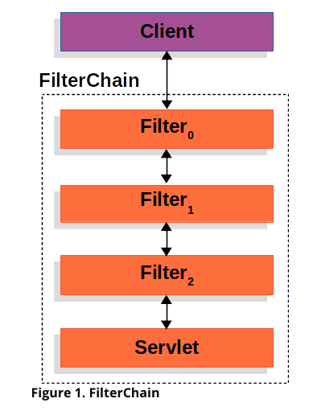
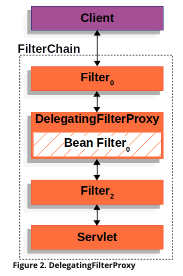
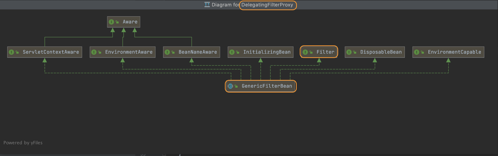
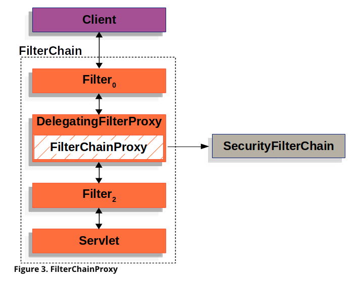
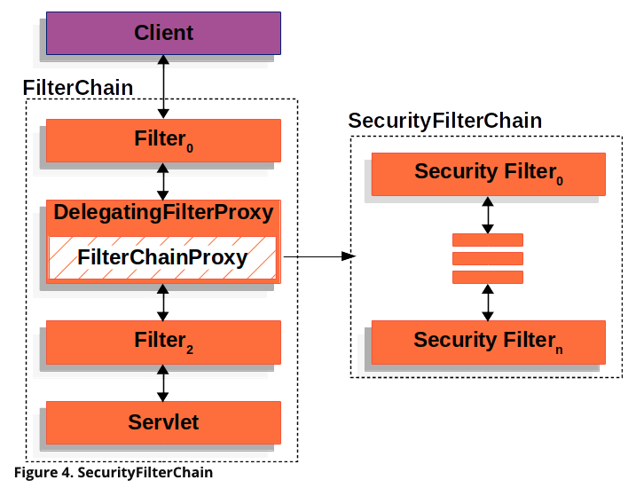
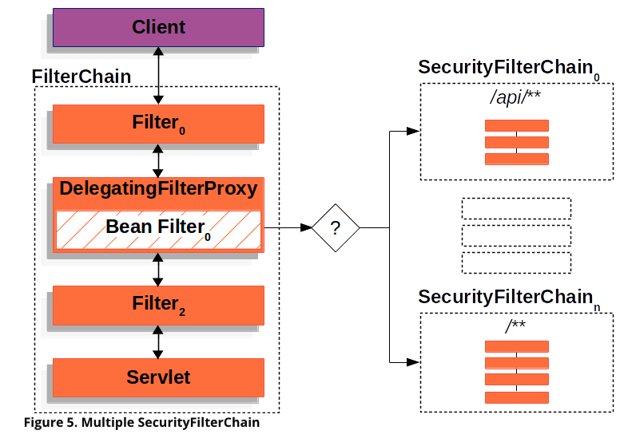

# [Spring Security] - The Big Picture

```
This section discusses Spring Security's high level architecture within Servlet based applications.
```

### | Spring Security은 어떻게 동작할까? 

Spring Security가 무엇인 지 질문을 받거나, 내 프로젝트에 Spring Security를 작성했지만 어디에서, 어떻게 작동하는 지에 대해 모호했었다. 아래 코드는 클라이언트의 HTTP 모든 요청에 대해 인증 여부를 `체크` 또는 `체크하지 않음` 을 설정하는 예제 코드이다. 코드를 작성하는 과정에서는 사실 아래 코드는 매우 충분히 직관적이고 코드 자체에 대한 이해는 어렵지 않다. 따라서 구글링을 통해 접하는 수많은 예제 코드를 통해서 `Spring Security`를 이용하는 것은 어렵지 않다. 

```java
@Override
protected void configure(HttpSecurity http) throws Exception {
  
  // 모든 요청에 대해 인증 여부를 체크하지 않고 허용 
  http.authorizeRequests().anyRequest().permitAll();
  
  // 모든 요청에 대해 인증 여부를 체크 (= 비인증 대상에게는 요청에 대한 정상 응답 반환 X)
  http.authorizeRequests().anyRequest().authenticated();
}
```

누군가 만들어 놓은 툴을 사용하는 것은 편하지만, 개발자로서 내부 동작원리를 이해하지 않고 가져다 쓰기만한 상황이 매우 찝찝했다. 아래 글은 Spring Security는 어떻게 동작하는 지를 이해하기 위한 과정을 담고 있다. 

서블릿과 서블릿 컨테이너 등에 대한 개념이 생소하신 분들은 해당 개념을 어느정도 이해하고 보는 것을 추천한다.

____

### | Spring Security를 이해하기 

Spring Security’s Servlet support is based on **Servlet `Filter`s**, so it is helpful to look at the role of **`Filter`s** generally first. The picture below shows the typical layering of the handlers for a single HTTP request.

"Spring Security가 <u>서블릿 필터</u>를 기반으로 <u>서블릿</u>을 지원한다" 에서 알 수 있듯이 Spring Security가 동작하는 원리 그리고 동작하는 상대적인 위치를 이해하는데 있어 가장 중요한 개념은 **Servlet Filter**이다. 결국 Spring Security에서 제공하는 Filter Chain을 서블릿 컨테이너가 관리하는 서블릿 필터로써 작동할 수 있도록 하는 것이 핵심이기 때문이다. 따라서, 이번 글에서 가장 전달하고 싶은 부분 역시 Spring Security과 (서블릿) 필터의 **연결고리**이다. 



​																<그림 1> 

<u>클라이언트가 HTTP 요청을 보냈을 때 웹 서버는 해당 요청을 포워딩을 통해 적합한 서블릿에 전달</u>을 하게 되는데, 그 요청이 서블릿에 도달하기 전에 <그림 1> 사진에서 볼 수 있듯이 여러 필터들이 존재할 수 있다. 그리고 필터가 여러 개인 점에서 **필터 체인** 이라 불린다. (이 필터체인은 서블릿을 관리하는 서블릿 컨테이너에서 생성한다) 

필터체인에서 가장 중요한 것은 각 필터들의 **순서** 인데, 이는 각 필터가 아래 방향으로만 진행되기 때문이다. 위 <그림 1>을 통해 설명하자면, Filter0 → Filter1 → Filter2 순서 흐름으로만 작동한다. 



​																  <그림 2>

그렇다면, **Spring**에서는 필터를 어떻게 관리할까? <그림 1>과 <그림 2>의 차이를 보면, **Filter** 자리에 **DelegatingFilterProxy** 로 바뀌어 있다. Spring은 서블릿 필터 인터페이스를 구현한 **DelegatingFilterProxy** 제공한다. 이 때 **DelegatingFilterProxy** 는 서블릿 컨테이너의 생명주기와 Spring의 `ApplicationContext(spring container)` 의 가교 역할을 한다.  여기서 <u>가교 역할</u>의 의미는 다음과 같다. 

서블릿 컨테이너는 필터의 등록을 처리한다. 이 때 Spring에서 정의한 `Bean` 으로 인식되기 위한 어떠한 연결 고리가 없으면,  Spring에서 관리할 수 없게 된다. **DelegatingFilterProxy** 역시 서블릿 컨테이너에 의해 관리되는 서블릿 필터 중 하나이지만, `Filter` (서블릿 필터)를 구현한 Spring Bean에게 HTTP 요청을 <u>위임</u>시키는 역할을 함으로써 Spring Security를 통해 전개할 인증 / 인가 로직을 가능하게 한다. **DelegatingFilterProxy** 는 `ApplicationContext`에 등록된 Bean Filter를 찾고, 있는 경우 해당 필터를 대신 작동(실행)시키는 역할을 하는 것이다.



<참고: DelegatingFilterProxy Class Diagram>

```java
public void doFilter(ServletRequest request, ServletResponse response, FilterChain chain) {
  // Lazily get Filter that was registered as a Spring Bean
  // For the example in DelegatingFilterProxy delegate is an instance of Bean Filter0
 	Filter delegate = getFilterBean(someBeanName);
  // delegate work to the Spring Bean (-> FilterChainProxy)
  delegate.doFilter(request, response); 
}
```

<참고 : doFilter() method in DelegatingFilterProxy Class>

위 클래스 다이어그램을 보면 알 수 있듯이, 표준 서블릿 필터를 구현하고 있고, 내부에 서블릿 필터 역할을 위임할 **FilterChainProxy**를 스프링 컨테이너로부터 받아온다 **(via getFilterBean() method)**. 이러한 구조 속에서 서블릿 컨테이너에서 관리하는 서블릿 필터 단위에서 스프링에서 제공하는 **Security Filters** 들이 동작될 수 있도록 가교 역할을 하는 것이다.



​						    <그림 3>

**FilterChainProxy**는 Spring Security에서 제공하는 필터로, **SecurityFilterChain**을 통해 많은 필터 인스턴스에 요청을 위힘하는 역할을 한다.  <그림 3>에서 볼 수 있듯이 **DelegatingFilterProxy**에 감싸져 있는 형태로 있는데, **DelegatingFilterProxy**가 서블릿 컨테이너에 의해 서블릿 필터로 등록되고, 이 필터에서 클라이언트의 요청을 인터셉트한 후, 이 요청에 대한 처리를 Spring Bean으로 등록된 **FilterChainProxy**에게 위임시키는 것이다. 



​							<그림 4> 

`SecurityFilterChain` 은 `FilterChainProxy` 에 의해서 사용되고, 클라이언트로부터 받은 HTTP 요청에 대해서 Spring Security에서 제공하는 필터 중 <u>어떤</u> 필터를 실행 시켜야 할 지를 결정하기 위함이다. (위 화살표 방향 관계를 설명) 

<그림 4>를 보면, `FilterChainProxy` 에 `SecurityFilterChain` 를 포함하고 있다. 아래 코드는 실제 Spring Security에서 제공하는 `FilterChainProxy.class` 중 일부이다 (필드 확인)

```java
public class FilterChainProxy extends GenericFilterBean {
    private static final Log logger = LogFactory.getLog(FilterChainProxy.class);
    private static final String FILTER_APPLIED = FilterChainProxy.class.getName().concat(".APPLIED");
    // 리스트 형태로 SecurityFilterChain을 가지고 있다. 
  	private List<SecurityFilterChain> filterChains;
    private FilterChainProxy.FilterChainValidator filterChainValidator;
    private HttpFirewall firewall;
    private RequestRejectedHandler requestRejectedHandler;
}
    
```

 Security Filters 는 `SecurityFilterChain` 의 형태로 조합되어 있고, 빈으로 등록되어 있다. 이는 <그림 4> 또는 바로 위 코드를 통해서도 알 수 있듯이 `FilterChainProxy`에 등록되어 있다. Security Filters가 `Servlet Container` 혹은 `DelegatingFilterProxy` 에  등록되지 않고, `FilterChainProxy` 에 등록되어 있음으로 다음과 같은 이점이 있다. 

1. 디버그 포인트 (Debug point) 

   https://www.baeldung.com/spring-security-registered-filters

2. <u>관리자 역할</u> (메모리 관리, HttpFirewall 보안 등)

3. 유연성 

   여기서 말하는 유연성은, 클라이언트로부터 받은 요청에 대해서 <u>어떤</u> `SecurityFilterChain`을 실행시킬 것인 지에 대해서 보다 다양한 옵션을 제공하는 것을 의미한다. `서블릿 컨테이너`에 등록된 필터들은 URL 패턴에만 의존해서 요청을 위임시키지만, `FilterChainProxy` 는 `RequestMatcher` 인터페이스에 있는 여러 기능들을 활용하여 `HttpServletRequest` 내부에 있는 여러 필드를 활용해 더 다양하고 유연한 전제를 활용해서 필터를 실행시킬 수 있다. 



​					<그림 5> 

`FilterChainProxy` 는 여러 `SecurityFilterChain` 중 어떤 것을 사용해야 할 지를 결정하는 역할을 하고, 이는 애플리케이션에 대한 여러 요청 패턴에 대해서 각각의 `SecurityFilterChain` 을 동작시킬 수 있음을 의미한다. 

```java
@Override
protected void configure(HttpSecurity http) throws Exception {
  
  // 모든 요청에 대해 인증 여부를 체크하지 않고 허용 
  // SecurityFilterChain은 0개의 필터도 가질 수 있다. (-> 이 경우 인증 관련 필터링을 하지 않는다.)
  http.authorizeRequests().anyRequest().permitAll();
  
  // ("/api 로 시작하는 URL 패턴) 요청에 대해 인증 여부를 체크 
  // 이 때 필요한 필터들이 SecurityFilterChain에 위치하고, 해당 필터들을 순서대로 통과 
  http.authorizeRequests().anyRequest("/api/**").authenticated();
}
```

<그림 5>에서도 볼 수 있듯이, `SecurityFilterChain` 은 서로 독립적으로 동작할 수 있다.

___

### | Summary - Spring Security는 어떻게 동작할까? 

Spring Security의 작업 흐름을 이해하기 위해 **서블릿 필터**부터 논의를 시작했다. 또한 서블릿 필터를 관리하는 주체인 서블릿 컨테이너의 작업 흐름에서 Spring에서 제공하는 여러 필터들을 호출하고 연결하기 위해서 어떠한 연결고리가 있는 지를 찾을 수 있었다. 물론 위 내용에서 각 클래스명이나 익숙하지 않은 것들이 등장해서 이 글을 이해하는 난이도가 다소 높아졌지만, 본질은 Spring Security의 작업 흐름은 결국 **서블릿 필터**에서 시작된 것임을 이해하는 것이 중요하다는 것을 강조하고 싶다. 


​																 <그림 1 서블릿 필터> 


​					<그림 5> 

____

### | Reference :

###### https://docs.spring.io/spring-security/site/docs/current/reference/html5/#servlet-architecture

###### https://velog.io/@yaho1024/spring-security-delegatingFilterProxy

