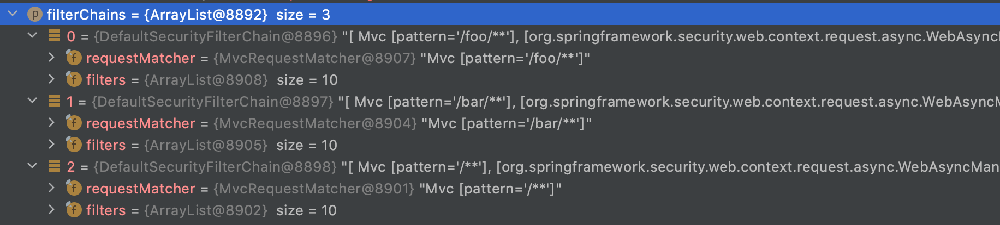
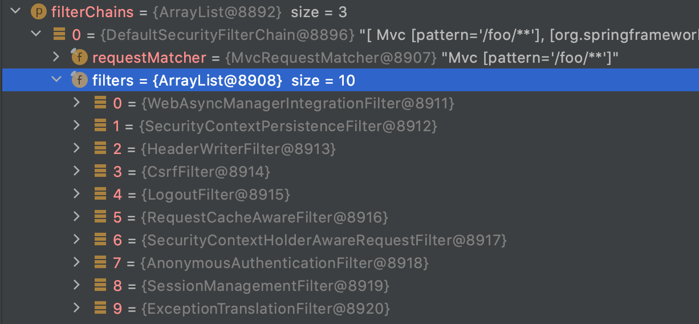
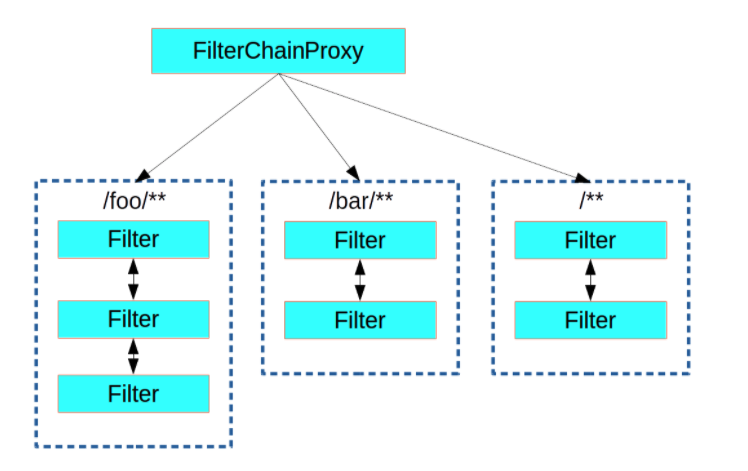

# [Spring Security] DelegatingFilterProxy, FilterChainProxy

### | Topic : 

<u>[Spring Security] The Big Picture</u> 글에서는Spring Security와 Servlet Filter의 상관 관계에 대해서 설명했고, 해당 글에서 중요한 컴포넌트인 `DelegatingFilterProxy`, `FilterChainProxy` 역할에 대해서 말로만 풀었었다. 이번 글에서는 두 컴포넌트의 관계가 어떻게 정의되는 지 Spring Security Framework 코드에 대한 디버깅을 통해 직접 눈으로 확인하고자 한다. 

- `FilterChainProxy` is a Bean, it is typically wrapped in a [DelegatingFilterProxy](https://docs.spring.io/spring-security/site/docs/current/reference/html5/#servlet-delegatingfilterproxy). 

- [`SecurityFilterChain`](https://docs.spring.io/spring-security/site/docs/5.5.1/api/org/springframework/security/web/SecurityFilterChain.html) is used by [FilterChainProxy](https://docs.spring.io/spring-security/site/docs/current/reference/html5/#servlet-filterchainproxy) to determine which Spring Security `Filter`s should be invoked for this request.

  

### | DelegatingFilterProxy Wraps FIlterChainProxy 

"A가 B를 감싸고 있다" 라는 문장에서 A가 B를 포함하고 있다고 해석할 수 있다. 그렇다면 왜 감싸고 있을까? 결론부터 말하면 Spring Security에서 제공하는 여러 역할을 하는 필터들을 서블릿 필터 레이어에서 동작할 수 있도록 하기 위함이다. 여기서 중요한 부분은 Spring Security Framework와 서블릿 컨테이너 (= 서블릿 필터 관리 주체) 간의 다리 역할에 대한 이해이다. 아직까지 두 사이를 잇는 연결고리에 대한 필요성을 이해하지 못했다면, 다시 한 번 글 초반 언급했던 글을 차분히 읽어보길 바란다. 

`DelegatingFilterProxy`는 `FilterChainProxy`를 감싸고 있는데, 이는 Spring Security Framework에서 제공하는 여러 필터들을 서블릿 필터 레이어에서 동작할 수 있도록 하기 위함이다. `DelegatingFilterProxy`는 스프링 컨테이너(IoC 또는 DI 컨테이너)에서 관리하는 빈이 아니고, 표준 서블릿 필터를 구현한 서블릿 필터이고, 클라이언트 요청이 들어왔을 때 해당 요청을 `FilterChainProxy` 위임한다. `FilterChainProxy`는 빈으로 등록되어 있고, 여기서 관리하는 `SecurityFilterChain`을 동작시키면서 요청에 대한 필터 작업을 수행하게 된다. 

```java
[SecurityFilterAutoConfiguration.class]

@Configuration(proxyBeanMethods = false)
@ConditionalOnWebApplication(type = Type.SERVLET)
@EnableConfigurationProperties({SecurityProperties.class})
@ConditionalOnClass({AbstractSecurityWebApplicationInitializer.class, SessionCreationPolicy.class})
@AutoConfigureAfter({SecurityAutoConfiguration.class})
public class SecurityFilterAutoConfiguration {
    private static final String DEFAULT_FILTER_NAME = "springSecurityFilterChain";

    public SecurityFilterAutoConfiguration() {
    }

    @Bean
    @ConditionalOnBean(name = {"springSecurityFilterChain"})
 
    public DelegatingFilterProxyRegistrationBean securityFilterChainRegistration(SecurityProperties securityProperties) {
        DelegatingFilterProxyRegistrationBean registration = new DelegatingFilterProxyRegistrationBean("springSecurityFilterChain", new ServletRegistrationBean[0]);
        registration.setOrder(securityProperties.getFilter().getOrder());
        registration.setDispatcherTypes(this.getDispatcherTypes(securityProperties));
        return registration;
    }
  ...
}
```

```java
[DelegatingFilterProxy.class]

public class DelegatingFilterProxy extends GenericFilterBean {
    @Nullable
    private String contextAttribute;
    @Nullable
    private WebApplicationContext webApplicationContext;
    @Nullable
    private String targetBeanName;
    private boolean targetFilterLifecycle;
    @Nullable
    private volatile Filter delegate;
    private final Object delegateMonitor;

  	// 확인하고 싶은 것 (2021/07/16) 
		// 1. targetBeanName 값 
 		// 2. WebApplicationContext 객체에 값 할당되는 시점
  	// 최초 앱 실행했을 때는 초기화가 안 되는데, 필터가 필요한 HTTP 요청이 있는 경우에 어떻게 되는 지 체크해보고 싶음.
    protected Filter initDelegate(WebApplicationContext wac) throws ServletException {
        String targetBeanName = this.getTargetBeanName();
        Assert.state(targetBeanName != null, "No target bean name set");
        Filter delegate = (Filter)wac.getBean(targetBeanName, Filter.class);
        if (this.isTargetFilterLifecycle()) {
            delegate.init(this.getFilterConfig());
        }

        return delegate;
    }

    protected void invokeDelegate(Filter delegate, ServletRequest request, ServletResponse response, FilterChain filterChain) throws ServletException, IOException {
        delegate.doFilter(request, response, filterChain);
    }
...
}

```


### | How FilterChainProxy manages SecurityFIlterChain from Spring Security ? 

```java
public class FilterChainProxy extends GenericFilterBean {
  ... 
    // 필드
    private static final Log logger = LogFactory.getLog(FilterChainProxy.class);
    private static final String FILTER_APPLIED = FilterChainProxy.class.getName().concat(".APPLIED");
  	
    private List<SecurityFilterChain> filterChains;
    private FilterChainProxy.FilterChainValidator filterChainValidator;
    private HttpFirewall firewall;
  
  ... 
}
```

`FilterChainProxy` 는 스프링 컨테이너에서 관리되는 빈이고, 필드에 리스트 형태의 `SecurityFilterChain` 을 가지고 있다. 데이터 타입에서 볼 수 있듯이 `SecurityFilterChain` 은 여러 개가 될 수 있고, 각 `SecurityFilterChain`에 포함되는 `Security Filters` 역시 상이할 수 있다.

실제 코드를 통해 `SecurityFilterChain`을 등록해보자.

 

```java
package com.spring.security.config;

import org.springframework.context.annotation.Bean;
import org.springframework.context.annotation.Configuration;
import org.springframework.context.annotation.Import;
import org.springframework.security.config.annotation.web.builders.HttpSecurity;
import org.springframework.security.config.annotation.web.configuration.EnableWebSecurity;
import org.springframework.security.config.annotation.web.configuration.WebSecurityConfigurerAdapter;

@Configuration
@EnableWebSecurity(debug = false)
@Import({WebSecurityConfig.FooSecurityConfig.class, WebSecurityConfig.BarSecurityConfig.class, WebSecurityConfig.AllSecurityConfig.class})
public class WebSecurityConfig {

		@Order(100)
    static class FooSecurityConfig extends WebSecurityConfigurerAdapter {

        @Override
        protected void configure(HttpSecurity http) throws Exception {
            http.mvcMatcher("/foo/**");
        }
    }
		@Order(200)
    static class BarSecurityConfig extends WebSecurityConfigurerAdapter {

        @Override
        protected void configure(HttpSecurity http) throws Exception {
            http.mvcMatcher("/bar/**");
        }
    }

  	@Order(300)
    static class AllSecurityConfig extends WebSecurityConfigurerAdapter {

        @Override
        protected void configure(HttpSecurity http) throws Exception {
            http.mvcMatcher("/**");
        }
    }
}

```

위와 같이 두 개 이상의 `SecurityFilterChain`을 등록할 때,    `@Order` 어노테이션을 따로 명시하지 않는 경우 아래와 같은 에러 메시지가 출력되면서 앱이 실행되지 않는다. (<u>@Order on WebSecurityConfigurers must be unique</u>) 



<그림 1> 



<그림 2>

앱을 디버깅 모드로 실행하면, 위 그림과 같이 3개의 `SecurityFilterChain`이 등록된 것을 확인할 수 있고, <그림 2>와 같이 디폴트로 10개의 `Security Filters`가 해당 체인에 등록된 것을 확인할 수 있다. Spring 공식문서에서 위 상황을 도식화한 그림을 보면 매우 직관적으로 이해할 수 있다. 



​						<그림 3>

___

### | Reference :

https://docs.spring.io/spring-security/site/docs/current/reference/html5/#servlet-architecture

https://docs.spring.io/spring-framework/docs/current/javadoc-api/org/springframework/web/filter/DelegatingFilterProxy.html

https://velog.io/@yaho1024/series/spring-security

https://fenderist.tistory.com/413?category=362017
