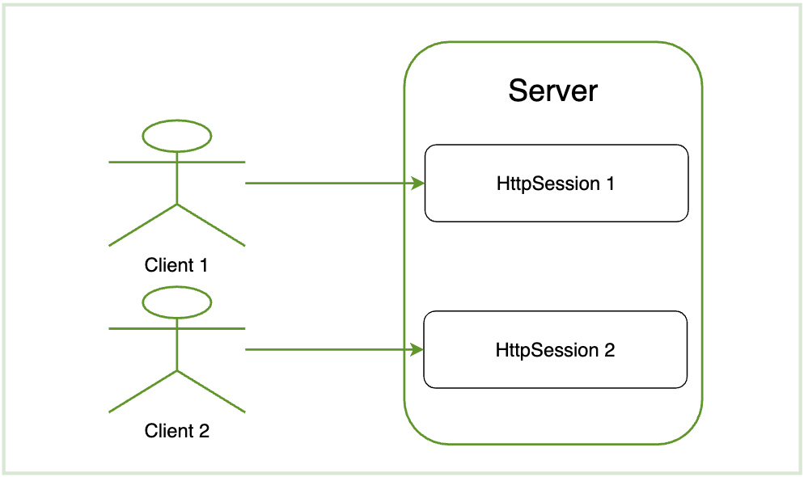

# [Spring Security] Life cycle of HttpSession

이번 글에서는 `HttpSession` 생명주기에 관해서 다룬다. 서블릿 컨테이너의 클라이언트에 대한 HTTP 요청 처리 맥락과 관련이 깊고 특히 `Spring Security` 에서 `Session-based Authentication` 관련해서 `HttpSession`의 생명주기를 이해하는 것이 매우 중요하다. 



### | When to create the HttpSession object:

```java
// 1
request.getSession();
// 2
request.getSession(ture or false);
```

`HttpSession` 객체는 1 또는 2번 코드 중 하나가 호출될 때 생성된다. 2번 코드에서 파라미터의 값에 따라서 차이가 있는데 그 차이는 다음과 같다. 

```java
request.getSession(true); 생성되어 있는 HttpSession이 있으면 반환, 없으면 새로 생성 

request.getSession(false); 생성되어 있는 HttpSession이 있으면 반환, 없으면 NULL 반환
```

### | When to destroy the HttpSession object: 

세션이 소멸되는 시점은 다음과 같다.

###### - 세션 기간 만료 

###### - Directly call the HttpSession's <u>invalidate()</u> method


### | Reference 

###### https://eehoeskrap.tistory.com/5

###### https://soon-devblog.tistory.com/2

###### https://www.programmersought.com/article/55251600442/

###### https://www.waitingforcode.com/tomcat/session-storage-in-tomcat/read
