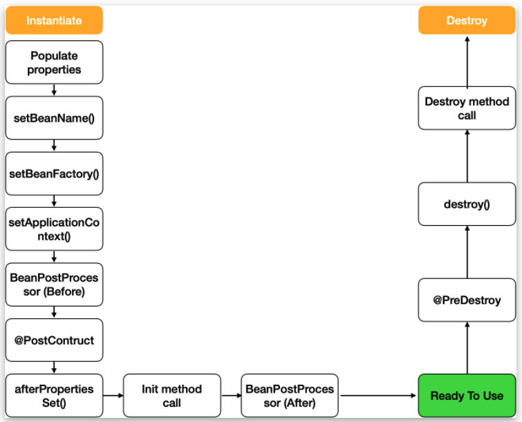
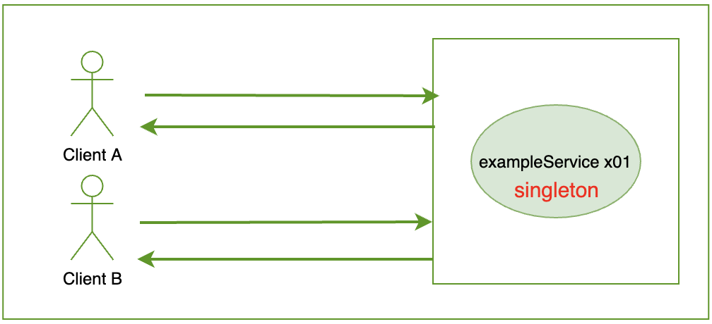
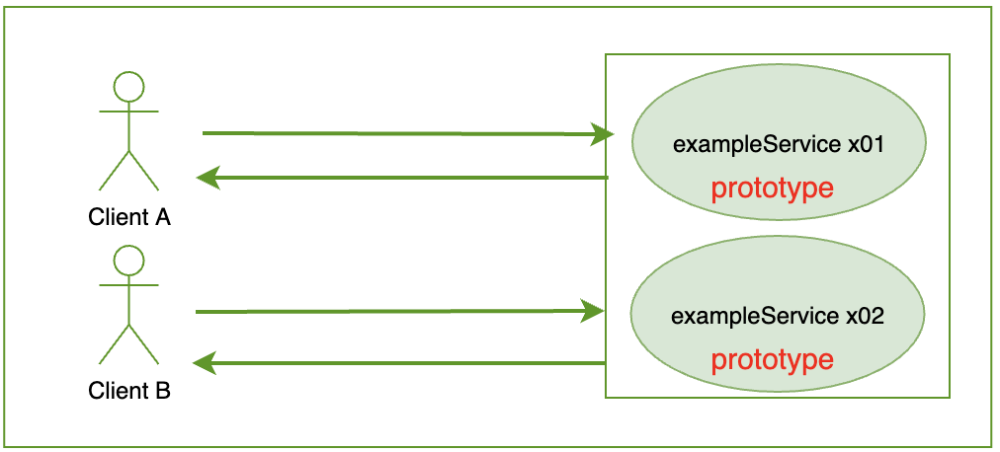
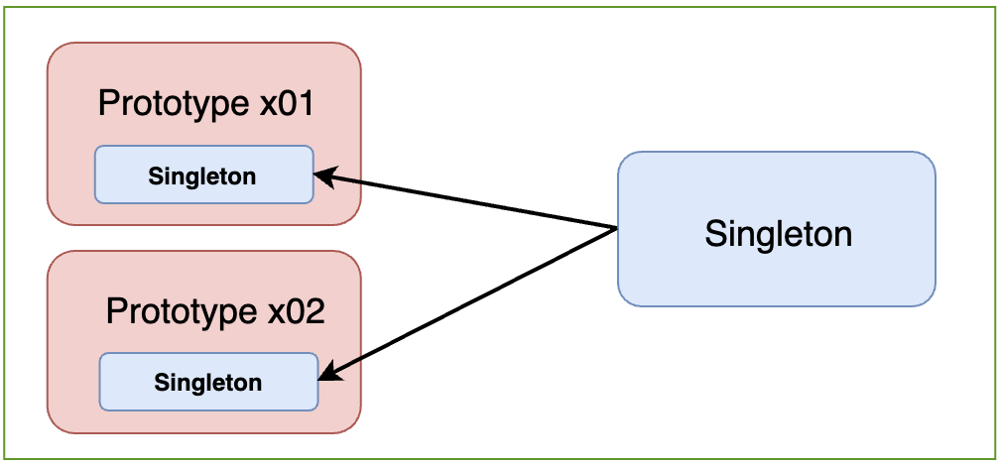
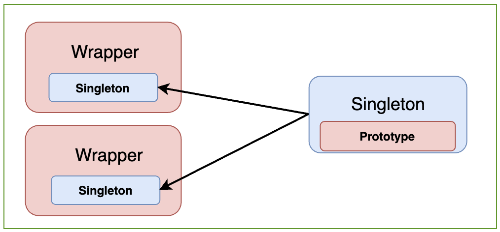

# [Spring] Life cycle of a Bean, Scope (1)

**Github** :  

`Bean Scope` 를 설명할 때 공식 Spring Reference 에서는 *recipe* 라는 표현을 사용해서 설명한다. 요리를 할 때 다양한 레시피가 있는 것 처럼 <u>빈을 생성할 때</u> 스프링 프레임워크에서는 다양한 레시피를 제공한다. 그렇다면, 빈을 생성할 때 어떤 레시피들이 있을까? 스프링 컨테이너에서 관리하는 빈은 대부분 알고 있듯이 싱글톤 방식으로 생성된다. 싱글톤 구조에서는 등록된 빈이 *stateless* 했을 때가 가장 이상적이다. 하지만, *mutable* 한 빈의 경우에는 대처하기 곤란하다. 

스프링 프레임워크에서는 이러한 문제를 해결하기 위해서 위에서 언급한 것 처럼 *mutable* 한 빈의 경우에는 해당 빈을 요청할 때마다 새로운 인스턴스를 생성하는 방식으로 관리할 수 있도록 **Bean Scope**를 제공한다. 또한 단순히 빈의 상태가 변동 여부에서 그치지 않고, 웹 환경에서 클라이언트의 요청과 서버의 응답 범위 내에서 빈을 관리할 수 있도록 기능을 제공한다. 

여러 `Bean Scope`를 제공함으로써 싱글톤 방식으로만 빈을 관리하지 않고 각 상황 별로 유연하게 대처할 수 있도록 한다. `Bean scope`는 결국 스프링 컨테이너에서 관리되는 빈이 어떠한 <u>생명주기</u>를 갖는 지에 따라서 나뉘는 것이다. 스프링에서 제공하는 `Bean Scope`는 아래와 같다. `Singleton`, `Prototype` 스코프를 제외하고는 `Web Aware Scopes` 컨텍스트에서만 유효하다. 

##### ! 참고 What does 'Web aware' mean?

##### Web aware menas when the application provides web endpoints for third party client. i.e When the application contains at least one RestController.

###### https://stackoverflow.com/questions/8057077/what-does-it-mean-in-spring-3-web-aware-application-context

___

###### - Singleton Bean Scope (<u>Default</u>) ◀︎ **현재 글**

###### - Prototype Bean Scope ◀︎ **현재 글**

###### - Singletone beans with prototype-bean dependencies 

###### - Request and Session Bean Scope (Related with Web)

###### - Application Bean Scope 

###### - Websocket Bean Scope 

____

위에서도 언급했듯이 `Web Context`를 제외하고 Spring에서는 기본적으로 `singleton`, `prototype` 빈 스코프를 제공한다. 

```java
public interface ConfigurableBeanFactory extends HierarchicalBeanFactory, SingletonBeanRegistry {
	...
	String SCOPE_SINGLETON = "singleton";
  String SCOPE_PROTOTYPE = "prototype";
  ...
}
```

빈으로 등록될 때 기본적으로 `singleton` 스코프가 적용되어 관리된다. 따라서 `singleton`을 제외한 나머지 빈 스코프를 적용할 때는 명시적(어노테이션 등) 해당 스코프를 사용할 것을 직접 설정해야 한다. 

___

### | Singleton Bean Scope

위에서 언급한 것과 같이, 특정한 `Scope`를 명시하지 않는 경우, `singleton` 빈 스코프가 적용된다. 빈 스코프는 결국 빈의 생성 방식부터 소멸까지 빈의 생명주기를 정의한 것과 같은데, `singleton`으로 등록된 빈은 아래 <그림 1>과 같은 생명주기를 갖는다. 



​					   <그림 1 - https://taes-k.github.io/2020/06/14/spring-bean-scope-lifecycle/> 

위 그림과 같이 빈이 생성되고, 의존관계를 주입 받은 뒤 초기화 콜백 (`@PostConstruct`)이 호출되고 사용된 후 소멸 전 콜백 (`@PreDestory`)가 호출 되면서 소멸되는 사이클로 빈이 관리된다. 즉 스프링 컨테이너의 시작과 종료까지 유지되는 <u>가장 넓은 범위</u>의 스코프라고 할 수 있다.



<그림 2> 

여러 클라이언트가 `exampleService` 빈을 요청했을 때 동일한 빈을 반환하는 구조이다. 

### | Prototype Bean Scope 



<그림 3> 

<그림 2>과 <그림 3>의 차이에서 쉽게 볼 수 있듯이, `prototype` 빈 스코프는 클라이언트의 각 요청 시마다 새로운 빈을 생성하고 의존관계를 주입하는 주기로 관리된다. 이러한 차이에서 생각할 가장 중요한 부분은 객체의 *상태*이다. 클라이언트의 요청에 매번 새로운 빈을 생성하는 구조이기 때문에 개별 요청에 따라 각각의 상태를 보장할 수 있게 된다. `Bean Scopes`에 관한 Spring 공식 레퍼런스 원문에서도 `singleton`과 `prototype` 빈 스코프의 차이에서 객체의 상태를 강조한다. (<u>아래 원문 참고</u>) 

> ###### "... You should use the prototype scope for all beans that are <u>stateful</u>, while the singleton scope should be used for <u>statelessful</u> beans."

`singletone`과 `prototype` 빈 스코프의 차이에서 또 중요한 것은 Spring Container에서 `prototype`으로 지정된 빈의 경우에는 빈의 생성과 의존관계 주입 그리고 초기화까지만 관려하고 해당 빈의 소멸 과정까지는 관여하지 않는다는 것이다. 즉,  `prototype` 인스턴스의 경우에는 종료 메소드가 호출되지 않고, 클라이언트가 직접 해당 인스턴스에 대한 관리를 해야 한다.

<그림 4>

> ###### There is one quite important thing to be aware of when deploying a bean in the prototype scope, in that the lifecycle of the bean changes slightly. <u>Spring does not manage the complete lifecycle of a prototype bean</u>: the container instantiates, configures, decorates and otherwise assembles a prototype object, hands it to the client and then has no further knowledge of that prototype instance. This menas that while *initialzation* lifecylce callback methods will be called on all objects regardless of scope, in the case of prototypes, <u>any configured *destruction* lifecycle callbacks will *not* be called</u>. It is <u>the responsibility of the client code to clean up prototype scoped objects</u> and release any expensive resources that the prototype bean(s) are holding onto. (One possible way to get the Spring container to release resources used by prototype-scoped beans is through the use of a custom bean post-processor which would hold a reference to the beans that need to be cleaned up.)


### | Singleton beans with prototype-bean dependencies

`singleton`  빈과 `prototype` 빈이 서로 의존관계가 있는 경우, 인스턴스의 생성 시점에 두 의존관계가 결정된다. 

> ###### when using singleton-beans that have dependencies on beans that are scoped as prototypes, please be aware that *dependencies are resolved at instantiation time*. 

인스턴스가 생성되는 시점에 의존관계가 결정된다는 것이 핵심이다. 



<그림 5>

<그림 5>와 같이 `prototype` 빈이  `singleton` 빈에 의존하는 경우에는 각 빈 스코프의 특성에 맞게 의도한대로 동작할 것이다. 



<그림 6>

반면, <그림 6>과 같이 `singleton` 빈이 `prototype` 빈에 의존하고 있는 경우 (= `singleton` 빈이 `prototype` 빈을 가지고 있는 경우) `prototype` 빈 스코프에 맞지 않게 `singleton` 빈이 생성되는 시점에 한 번만 생성되므로 매번 동일한 `prototype` 빈을 클라이언트에 반환하게 된다. 의존관계가 인스턴스가 생성되는 시점에 결정됐기 때문이다. 

다음 글에서는 <그림 6>과 같은 상황에서 클라이언트 요청 시 매번 새로운 `prototype` 빈을 생성하여 의존관계를 주입할 수 있도록 하는 방법에 대해서 알아볼 것이다. 

### | Reference 

###### https://docs.spring.io/spring-framework/docs/3.0.0.M3/reference/html/ch04s04.html

###### https://taes-k.github.io/2020/06/14/spring-bean-scope-lifecycle/ 

###### http://lifeinhurry.com/spring-bean-scope/

###### https://renuevo.github.io/spring/scope/spring-scope/

###### 인프런 강의 - 스프링 기본원리 (김영한)

