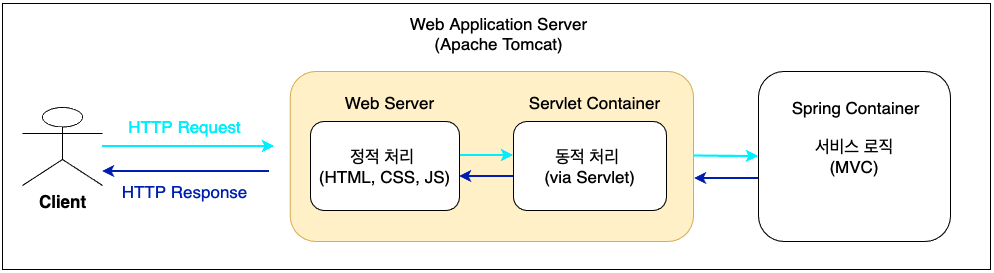
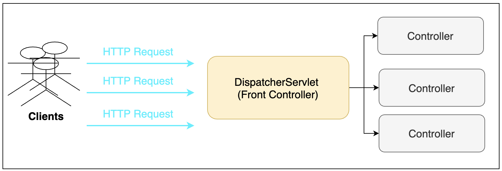
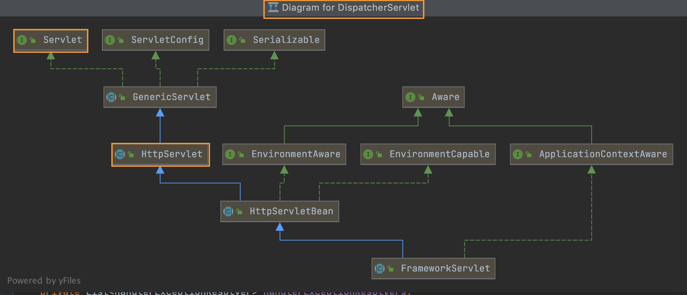

# Spring MVC 동작 과정 

\# Tomcat, # Web Server # Servlet (Container)

### | Spring + Tomcat 

Spring Boot 기본 설정을 통해 `Embeded Tomcat` 이 연동되어 있고, 웹 애플리케이션 서버를 통해 다음과 같은 프로세스로 클라이언트와 통신하게 된다. 

<그림 1>

보통 기본 값으로 설정되면, **8080** 포트로 설정되어 있어서 로컬에서 Spring Boot 애플리케이션을 실행시키면 `localhost:8080` 으로 접속하게 된다. 일반적으로 `Web Server`와 `Web Application Server` 를 비교하는 과정에서 정적 처리와 동적 처리를 중점적으로 비교하게 되어 Tomcat에는 정적 처리를 하지 않는 식으로 이해할 수 있지만, 웹서버인 Apache 기능 일부를 가지고와서 <그림 1>과 같이 정적 처리와 동적 처리 기능을 모두 포괄하고 있다. 

일반적으로 실제 서비스를 배포하기 위해서 위 구조에서 웹 서버 (Apache, Nginx 등)을 앞 단에 두고 활용하기도 하는데, 이와 같은 웹 서버를 통해 얻을 수 있는 구조적인 이점에 대해서는 다른 글을 통해서 설명하겠다. (Proxy, ...)

### | Servlet과 DispatcherServlet (Front Controller)

<그림 1>에서 서블릿을 통해 클라이언트 처리 중 DB 트랜잭션이 포함된 경우와 같이 동적으로 요청을 처리하는 경우 서블릿이 활용된다. 서블릿은 웹 페이지 또는 응답 값을 동적으로 생성하는 역할을 한다. Spring MVC에서는 `DispatcheSerlvet`을 통해 클라이언트의 모든 요청을 처리하는 전면에 두고 클라이언트의 요청을 처리하는 컨트롤러에 해당 요청에 대한 처리를 위임하는 구조로 클라이언트의 요청을 처리한다. 이러한 디자인 패턴을 `Front Controller Design Pattern` 이라고 한다. 이미 Spring 프레임워크에서 `DispatcherServlet` 제공하고 있기 때문에 직접 서블릿을 작성하지 않고 실제 요청을 처리하는 컨트롤러를 구현하기만 하면 되는 것이다. 

<그림 2 DispatcherServlet Process> 

<참고 : DispatcherServlet Class Diagram>

`DispatcherServlet`가 `Front Controller` 역할을 하고, 다운스트림에 있는 여러 컨트롤러 중 적절한 컨트롤러에 요청을 위임한다. 그렇다면, <u>각 요청을 적절한 컨트롤러에 매핑해주고 해당 컨트롤러에서 처리할 수 있도록 해주는 역할을 수행하는 주체</u>는 무엇일까? 이번 글에서는 요청을 파악해서 특정 컨트롤러에 매핑하는 `HandlerMapping`과 특정 컨트롤러를 매핑 된 후 해당 컨트롤러에 Request 처리 요청을 보내서 실제로 해당 요청을 처리할 수 있도록 하는 `HandlerAdapter`만 우선 간단히 소개하고 추후 `Resolver` 등 다른 역할과 해당 역할을 수행하는 주체에 대해서 소개할 예정이다. 

#### - HandlerMapping  

이 인터페이스는 클라이언트의 요청 정보를 기준으로 다운스트림의 컨트롤러 중 어떤 컨트롤러에 매핑할 지에 대해서 결정하는 역할을 갖는다. 한 가지 방식만 있는 것이 아니고, 다음과 같은 여러 방법이 있다.

- BeanNameUrlHandlerMapping
- SimpleUrlHandlerMapping
- RequestMappingHandlerMapping 	

#### - HandlerAdapter

이 인터페이스는 HandlerMapping에서 결정된 핸들러 정보로 해당 컨트롤러의 메소드를 직접 호출해주는 역할을 한다. 이 역시 다양한 구현이 있다. 

- SimpleControllerHandlerAdapter
- HttpRequestHandlerAdapter
- SimpleServletHandlerAdapter
- RequestMappingHandlerAdapter

### | Spring + Tomcat Process More Details 

### | Reference : 

https://taes-k.github.io/2020/02/16/servlet-container-spring-container/

http://wonwoo.ml/index.php/post/2308

https://docs.spring.io/spring-framework/docs/3.2.x/spring-framework-reference/html/mvc.html