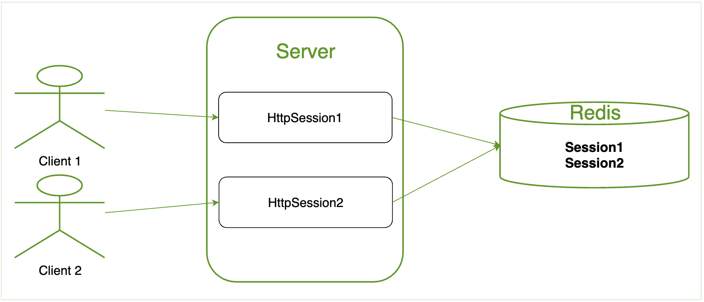
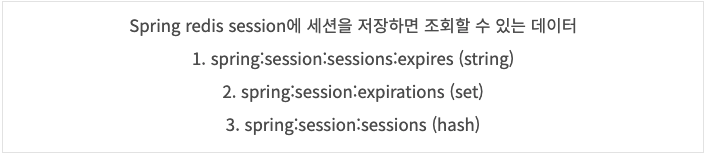
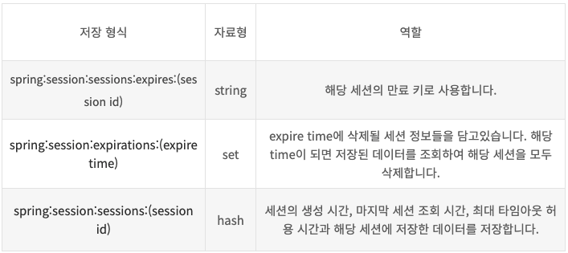
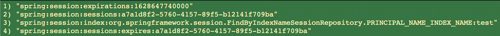

# [Spring Session] Spring Session Data Redis

### | How does `Spring Session` work?

> Instead of using Tomcat's `HttpSession`, we persist the values in `Redis`. Spring Session replaces the `HttpSession` with an implemenatation that is backed by Redis. When Sprign Security's `SecurityContextPersistenceFilter` saves the `SecurityContext` to the `HttpSession`, it is then persisted into Redis. 
>
> <u>When a new `HttpSession` is created</u>, Spring Session creates a cookie name `SESSION` in you browser. That cookie contains the ID of your session.   



<그림 1> 

`Spring Session` 설정을 통해서 기존 WAS 내 메모리에 세션을 저장하는 형태에서 Redis로 저장소를 이전할 수 있다. 이러한 이전은 다중 WAS를 구성한 서버 환경에서 매우 유용할 수 있다. 아래 <그림 2>에서 볼 수 있듯이 Redis에 저장되어 있는 세션에 대한 고유 식별 값을 갖고 있는 클라이언트가 다중 WAS 환경에서 WAS에 의존하지 않아도 되기 때문이다. 


<그림 2> 


### | What are saved on Redis? 

그렇다면, `Spring Session` 설정을 통해서 실제로 Redis 서버에 저장되는 데이터에는 어떤 것들이 있을까? Spring Session 설정 값에 따라서 세션의 생성 시점은 차이가 있을 수 있지만 (FlushMode 참고) 실제 세션이 저장될 때 사용되는 커맨드는 아래와 같다.

> The following example shows an example of creating a new session.

###### https://docs.spring.io/spring-session/docs/current/reference/html5/#api-redisindexedsessionrepository-storage

```sql
# 세션 생성을 위한 커맨드 (using HMSET, EXPIRE, APPEND, SADD)
HMSET spring:session:sessions:33fdd1b6-b496-4b33-9f7d-df96679d32fe creationTime 1404360000000 \
	maxInactiveInterval 1800 \
	lastAccessedTime 1404360000000 \
	sessionAttr:attrName someAttrValue \
	sessionAttr:attrName2 someAttrValue2
EXPIRE spring:session:sessions:33fdd1b6-b496-4b33-9f7d-df96679d32fe 2100
APPEND spring:session:sessions:expires:33fdd1b6-b496-4b33-9f7d-df96679d32fe ""
EXPIRE spring:session:sessions:expires:33fdd1b6-b496-4b33-9f7d-df96679d32fe 1800
SADD spring:session:expirations:1439245080000 expires:33fdd1b6-b496-4b33-9f7d-df96679d32fe
EXPIRE spring:session:expirations1439245080000 2100
```

위 커맨드를 통해서 저장되는 데이터는 아래와 같다. 잘 정리된 자료가 있어서 참고했다. 



​							<그림 3, 출처 - https://deveric.tistory.com/76> 



​							<그림 4, 출처 - https://deveric.tistory.com/76>

### | Demo 프로젝트 

https://github.com/taekwon-dev/spring-demo/tree/main/spring-session/spring-session-redis

데모 프로젝트에서는 `Spring Security` + `Spring Session with Redis`을 활용해서 Redis 서버에 `SecurityContext`를 저장하고, 저장된 세션 정보를 활용 그리고 저장된 세션을 소멸시키는 것을 다룬다.  

##### | 세션 생성 via 로그인 API

###### \# SecurityContextPersistenceFilter 


FlushMode 선택 기준 - 필터 내에서 SessionRepository.createsSession() 호출 시점을 찾아봐야 함 

IMMEDIATE인 경우, NULL Authentication이 등록될 수 있는 지 확인

실제 유저 정보를 저장할 필요는 없음 (필터 내에서 SecurityContext 저장해줌)



<그림 5> 

##### | 회원정보 조회 (저장된 세션 정보 활용)

활용하면 돼. NULL이 아닌 SecurityContext 활용해서 재로그인 안하고 유저의 정보를 빼올 수 있는 지 확인

필터를 적용할 수도 있고, 인터셉터를 통해서 앞 단에서 인증 상태 여부를 확인할 수 있음 (이 때도 위에서 언급한 필터 사용)

##### | 세션 삭제(소멸)시키기 via 로그아웃 API 

실제로 소멸 로직이 시작되는 코드 설명 

왜 5분이 추가되는 지 (사실 운영 과정에서 그렇게 중요하지는 않아 보임), 원리 측면

### | Reference

###### https://redislabs.com/wp-content/uploads/2018/04/Spring-Session-Redis-Why-How-and-Production-Pitfalls.pdf

###### https://docs.spring.io/spring-session/docs/current/reference/html5/guides/java-security.html

###### https://www.javainuse.com/spring/springboot_session_redis

###### https://www.baeldung.com/spring-session

###### https://deveric.tistory.com/76

###### https://pasudo123.tistory.com/379