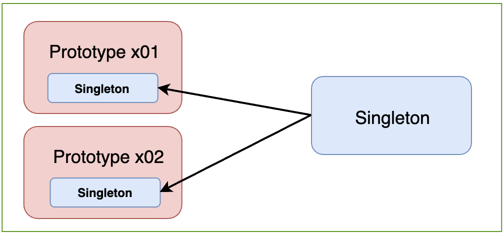
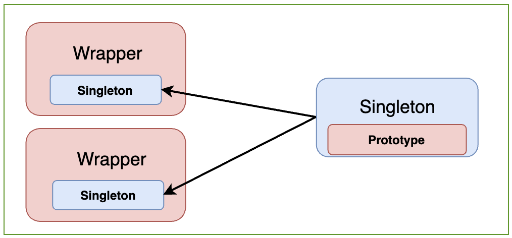

# [Spring] Life cycle of a Bean, Scope (2)

이 번 글에서는 `singleton` 빈이 `prototype` 빈에 의존하고 있는 상황에서 발생할 수 있는 문제의 해결 과정을 다룬다.

###### - Singleton Bean Scope (<u>Default</u>) 

###### - Prototype Bean Scope 

###### - Singletone beans with prototype-bean dependencies ◀︎ **현재 글**

###### - Request and Session Bean Scope (Related with Web) 

###### - Application Bean Scope 

###### - Websocket Bean Scope 

___

### | Singleton beans with prototype-bean dependencies

\# DL (Dependency Lookup) \# Method Injection \# Scoped Proxy

`singleton`  빈과 `prototype` 빈이 서로 의존관계가 있는 경우, 인스턴스의 생성 시점에 두 의존관계가 결정된다. 

> ###### when using singleton-beans that have dependencies on beans that are scoped as prototypes, please be aware that *dependencies are resolved at instantiation time*. 

**인스턴스가 생성되는 시점에 의존관계가 결정**된다는 것이 핵심이다. 



<그림 5>

<그림 5>와 같이 `prototype` 빈이  `singleton` 빈에 의존하는 경우에는 각 빈 스코프의 특성에 맞게 의도한대로 동작할 것이다. 이제 보다 Spring Framework에서 일반적인 상황인 `singleton` 빈이 `prototype` 빈에 의존하고 있는 경우를 생각해보자. 

> 스프링은 일반적으로 싱글톤 빈을 사용하므로, 싱글톤 빈이 프로토타입 빈을 사용하게 된다. (인프런 - 스프링 기본원리(김영한))



<그림 6>

반면, <그림 6>과 같이 `singleton` 빈이 `prototype` 빈에 의존하고 있는 경우 (= `singleton` 빈이 `prototype` 빈을 가지고 있는 경우) `prototype` 빈 스코프에 맞지 않게 `singleton` 빈이 생성되는 시점에 한 번만 생성되므로, 매번 동일한 `prototype` 빈을 클라이언트에 반환하게 된다 (`prototype` 빈 기대에 부합하지 않음). 의존관계가 인스턴스가 생성되는 시점에 결정됐기 때문이다. 단, 의존관계가 설정되는 시점에 `prototype` 빈이 생성되지 않는 것은 아니다. 아래 테스트 코드에서도 동일한 `prototype` 빈을 반환하는 것을 확인할 수 있었다.

```java
@Test
@DisplayName("Singleton → Prototype Dependency : Return the same prototype instance per each request")
void seeProblemsTest() {
    ApplicationContext ac = new AnnotationConfigApplicationContext(AppConfig.class);

    SingletonBean singletonBeanA = ac.getBean(SingletonBean.class);
    SingletonBean singletonBeanB = ac.getBean(SingletonBean.class);
		
    PrototypeBean prototypeBeanA = singletonBeanA.getPrototypeBean();
    PrototypeBean prototypeBeanB = singletonBeanB.getPrototypeBean();

    System.out.println("prototypeBeanA = " + prototypeBeanA);
    System.out.println("prototypeBeanB = " + prototypeBeanB);

    // prototypeBeanA = com.spring.basic.scope.PrototypeBean@14f9bf58
    // prototypeBeanB = com.spring.basic.scope.PrototypeBean@14f9bf58

    assertThat(prototypeBeanA).isSameAs(prototypeBeanB);
}
```

그러면, 클라이언트가 `singleton` 빈 내 `prototype` 빈을 사용할 때마다 새로 생성한 `prototype` 빈으로 의존관계를 설정하기 위해서 어떻게 해야할까? 먼저 `DL(Dependency Lookup)` 의존관계 탐색을 기반으로한 `ObjectProvider`를 활용한 방법과 `Method Injection` 그리고 `Scoped Proxy`를 통해 이 문제를 해결하는 과정을 소개할 것이다. 

##### | DL (Dependency Lookup)

###### - Method Injection

```java
    @Test
    @DisplayName("Singleton → Prototype Dependency : Solution 1 via DL (Dependency Lookup) - Method Injection")
    void solutionViaMethodInjectionTest() {
        SingletonLookupBean singletonBeanA = ac.getBean(SingletonLookupBean.class);
        SingletonLookupBean singletonBeanB = ac.getBean(SingletonLookupBean.class);

        PrototypeBean protoTypeInstanceA = singletonBeanA.getPrototypeBean();
        PrototypeBean protoTypeInstanceB = singletonBeanB.getPrototypeBean();

        System.out.println("protoTypeInstanceA = " + protoTypeInstanceA);
        System.out.println("protoTypeInstanceB = " + protoTypeInstanceB);

        // protoTypeInstanceA = com.spring.basic.scope.PrototypeBean@11f559de
        // protoTypeInstanceB = com.spring.basic.scope.PrototypeBean@e7bc191

        assertThat(protoTypeInstanceA).isNotSameAs(protoTypeInstanceB);
    }
```


###### - ObjectFactory, ObjectProvider

```java
    @Test
    @DisplayName("Singleton → Prototype Dependency : Solution 2  via DL (Dependency Lookup) - ObjectProvider")
    void solutionViaObjectProviderTest() {
        SingletonBean singletonBeanA = ac.getBean(SingletonBean.class);
        SingletonBean singletonBeanB = ac.getBean(SingletonBean.class);

        PrototypeBean protoTypeInstanceA = singletonBeanA.getProtoTypeInstance();
        PrototypeBean protoTypeInstanceB = singletonBeanB.getProtoTypeInstance();

        System.out.println("protoTypeInstanceA = " + protoTypeInstanceA);
        System.out.println("protoTypeInstanceB = " + protoTypeInstanceB);

        // protoTypeInstanceA = com.spring.basic.scope.PrototypeBean@7f5fc42c
        // protoTypeInstanceB = com.spring.basic.scope.PrototypeBean@15c142d3

        assertThat(protoTypeInstanceA).isNotSameAs(protoTypeInstanceB);

    }
```


##### | Scoped Proxy 

```java
    @Test
    @DisplayName("Singleton → Prototype Dependency : Solution 3 via Scoped Proxy")
    void solutionViaScopedProxyTest() {
        Singleton4ProxyBean singleton4ProxyBeanA = ac.getBean(Singleton4ProxyBean.class);
        Singleton4ProxyBean singleton4ProxyBeanB = ac.getBean(Singleton4ProxyBean.class);

        assertThat(singleton4ProxyBeanA).isSameAs(singleton4ProxyBeanB);

        PrototypeProxyBean prototypeProxyBeanA = singleton4ProxyBeanA.getPrototypeProxyBean();
        PrototypeProxyBean prototypeProxyBeanB = singleton4ProxyBeanB.getPrototypeProxyBean();

        System.out.println("prototypeProxyBeanA = " + prototypeProxyBeanA);
        System.out.println("prototypeProxyBeanB = " + prototypeProxyBeanB);

        // prototypeProxyBeanA = com.spring.basic.scope.proxy.PrototypeProxyBean@55400c3d
        // prototypeProxyBeanB = com.spring.basic.scope.proxy.PrototypeProxyBean@17ff5238

        // ? 실제 주소 값은 다른데, 아래 테스트 통과된다.
        assertThat(prototypeProxyBeanA).isSameAs(prototypeProxyBeanB);
    }
```


### | Reference 

###### https://docs.spring.io/spring-framework/docs/3.0.0.M3/reference/html/ch04s04.html

###### https://renuevo.github.io/spring/scope/spring-scope/

###### 인프런 강의 - 스프링 기본원리 (김영한) - 빈 스코프

###### https://www.baeldung.com/spring-inject-prototype-bean-into-singleton

###### https://engkimbs.tistory.com/698
