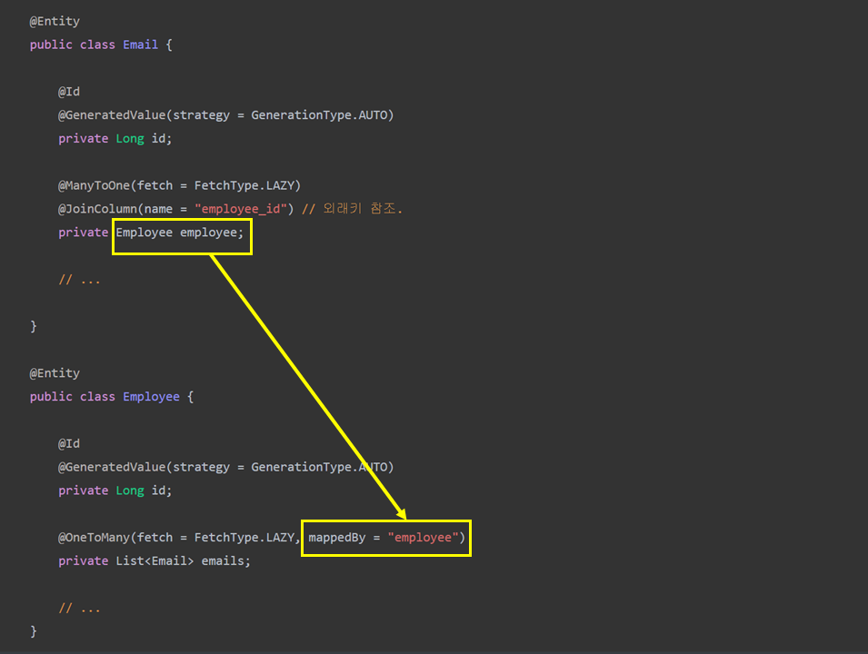

## 1. Introduction

JPA Relationships can be either unidirectional or bidirectional. It simply means we can model them as an attribute on exactly one of the associated entities or both.

**Defining the direction of the relationship between entities has no impact on the database mapping.** It only defines the directions in which we use that relationship in our domain model.

For a bidirectional relationship, we usually define:

- the owning side
- inverse or the referencing side

The [*@JoinColumn*](https://www.baeldung.com/jpa-join-column) annotation helps us specify the column we'll use for joining an entity association or element collection. On the other hand, the *mappedBy* attribute is used to define the referencing side (non-owning side) of the relationship.

@JoinColumn 어노테이션을 통해 참조하는 외래키를 지정할 수 있고, 반대로 mappedBy 속성을 통해서 (양방향 관계) 참조되는 엔티티를 지정할 수 있다. 

In this quick tutorial, we'll look at **the difference between \*@JoinColumn\* and \*mappedBy\*** **in JPA. We'll also present how to use them in a one-to-many association.**

___

## 2. Initial Setup

To follow along with this tutorial, let's say we have two entities: *Employee* and *Email.*

Clearly, an employee can have multiple email addresses. However, a given email address can belong exactly to a single employee.

It means they share a one-to-many association:

[](https://www.baeldung.com/wp-content/uploads/2018/11/12345789.png)

Also in our RDBMS model, we'll have **a foreign key *employee_id* in our *Email* entity referring to the *id* attribute of an *Employee***.

___

## 3. *@JoinColumn* Annotation

In a One-to-Many/Many-to-One relationship, **the owning side is usually defined on the ‘\*many'\* side of the relationship.** It's usually the side which owns the foreign key.

일반적으로, One-to-Many/Many-to-One 관계에서 Many Side를 **Owing Side**로 지정한다. 이 때 **Owing Side**는 참조하는 외래키를 가지고 있다. 

The *@JoinColumn* annotation defines that actual physical mapping on the owning side:

```java
@Entity
public class Email {

    @Id
    @GeneratedValue(strategy = GenerationType.AUTO)
    private Long id;
    
    @ManyToOne(fetch = FetchType.LAZY)
    @JoinColumn(name = "employee_id") // 외래키 참조. 
    private Employee employee;

    // ...

}
```

It simply means that our *Email* entity will have a foreign key column named ***employee_id* referring to the primary attribute *id* of our *Employee* entity.**

___

## 4. *mappedBy* Attribute

Once we have defined the owning side of the relationship, Hibernate already has all the information it needs to map that relationship in our database. To make this association bidirectional, all we'll have to do is to define the referencing side. The inverse or the referencing side simply maps to the owning side.

양방향 관계를 지정하기 위해서는 **Non-owing side**에서도 관계를 정의해야 한다. 이 때 활용되는 속성이 *mappedBy*이다. 

We can easily use the *mappedBy* attribute of *@OneToMany* annotation to do so. So, let's define our *Employee* entity:



Here, **the value of mappedBy is the name of the association-mapping attribute on the owning side.** With this, we have now established a bidirectional association between our *Employee* and *Email* entities.

