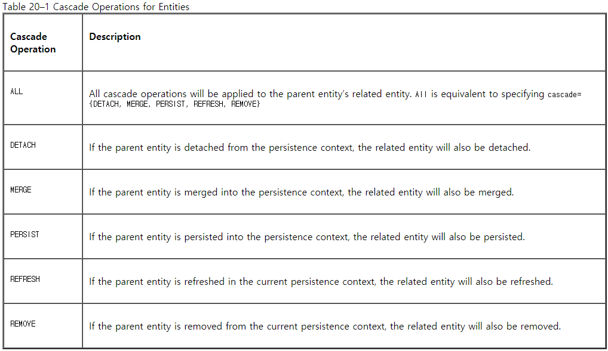

### Direction in Entity Relationships 

___

#### Bidirectional Relationships

In a *bidirectional* relationship, each entity has a relationship field or property that refers to the other entity. Through the relationship field or property, an entity class's code can access its related object. If an entity has a related field, the entity is said to "know" about its related object. For example, If **Order** knows what **LineItem** instances it has and if **LineItem** knows what **Order** it belongs to, they have a bidirectional relationship. 

Bidirectional relationships must follow these rules. 

- The inverse side of a bidirectional relationship must refer to its owing side by using the **mappedBy** element of the @OneToOne, @OneToMany, or @ManyToMany annotation. The **mappedBy** element designates the property of field in the entity that is the owner of the relationship. 
- The many side of many-to-one bidirectional relationships must not define the **mappedBy** element. **The many side is always the owning side of the relationship**. 
- For one-to-one bidirectional relationships, **the owning side corresponds to the side that contains the corresponding foreign key.** 
- For many-to-many bidirectional relationships, either side may be the owning side. 

___

DguMarket 프로젝트에서는 양방향 관계의 예시는 무엇이 있을까? 

1) Member : Product = One : Many(<u>owing</u>) 

회원 입장 - 회원이 업로드한 중고물품의 정보를 확인한다. 

중고물품 입장 - **어떤** 회원이 업로드했는 지에 대한 정보를 확인한다. 

2) Member : ProductCategory = Many : Many

3) Member : ChatRoom = One : Many(<u>owing</u>)

4) Member : ChatMessage = One : Many(<u>owing</u>)

5) Product : ChatRoom = One : Many(<u>owing</u>) 

6) Product : ChatMessage = One : Many(<u>owing</u>) 

___

#### Unidirectional Relationships 

In a *unidirectional* relationship, only one entity has a relationship field or property that refers to the other. For example, **LineItem** would have a relationship field that identifies **Product**, but **Product** would not have a relationship field or property for **LineItem**. In other words, LineItem knows about **Product**, but **Product** doesn’t know which **LineItem** instances refer to it.

____

#### Queries and Relationship Direction

Java Persistence query language and Criteria API queries often navigate across relationships. The direction of a relationship determines whether a query can navigate from one entity to another. For example, a query can navigate from **LineItem** to **Product** but cannot navigate in the opposite direction. For **Order** and **LineItem**, <u>a query could navigate in both directions because these two entities have a bidirectional relationship</u>.

____

#### Cascade Operations and Relationships

Entities that use relationships often have dependencies on the existence of the other entity in the relationship. For example, a line item is part of an order; if the order is deleted, the line item also should be deleted. This is called a cascade delete relationship.

두 Entity과 서로 관계를 맺고 있을 때, 한 Entity의 데이터가 삭제되면 그 Entity와 관계를 맺고 있는 다른 Entity의 데이터를 어떻게 처리해야 할까? 

예를 들어, **Product** & **ChatRoom**의 관계에서 **Product**가 삭제된 경우, 해당 Product와 관련된 **ChatRoom**은 모두 삭제되는가? - 기획에 따라서 다를 수 있지만 이러한 상황에서 고려해야 하는 것이 **Cascade Operations**이다.

___

#### Orphan Removal in Relationships

When a target entity in one-to-one or one-to-many relationship is removed from the relationship, it is often desirable to cascade the remove operation to the target entity. Such target entities are considered “orphans,” and the `orphanRemoval` attribute can be used to specify that orphaned entities should be removed. For example, if an order has many line items and one of them is removed from the order, the removed line item is considered an orphan. If `orphanRemoval` is set to `true`, the line item entity will be deleted when the line item is removed from the order.

___

### 참고

https://docs.oracle.com/cd/E19798-01/821-1841/bnbqi/index.html

