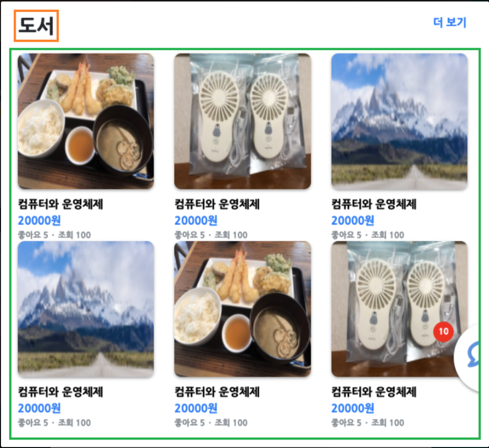
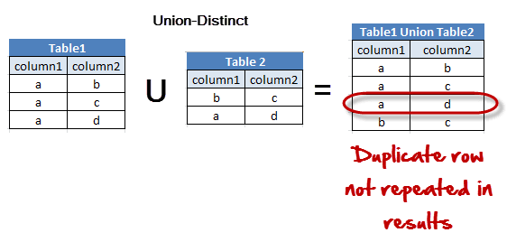
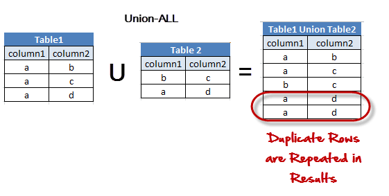
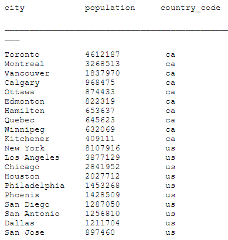

###  적용 상황 



<그림 1 : index.html> 

<그림 1>과 같이 index 페이지에서는 각 카테고리에 따라서 N개의 상품을 진열한다. 최초 페이지를 로드할 때 카테고리 3개, 각 카테고리 별 상품 N개를 불러와서 진열하게 된다. 유저의 관심카테고리가 3개 이상인 경우, **무한 스크롤**을 기반한 페이징을 적용하여 같은 형식(카테고리, 카테고리별 N개 상품)으로 데이터를 불러와서 진열한다. 

___

## 1. What is a Union?

https://www.guru99.com/unions.html

**Union 검색 이유**

각 카테고리 별 (Group) N개의 상품 데이터를 불러와야 하므로, <Product Table>에 쿼리를 날릴 때 조건이 두개이다. 따라서 각 조건 별로 조합을 해서 사용하면 어떨까? 

Unions combine the results from multiple SELECT queries into a consolidated result set. The only requirement for this to work is that the number of columns should be the same from all the SELECT queries which needs to be combined. 

<u>유니온을 적용할 때 두 테이블에서 가져오는 컬럼의 수가 동일해야 한다.</u> 

### Options  (Distinct vs ALL)

```sql
SELECT column1, column2 FROM `table1`
UNION DISTINCT
SELECT  column1,column2  FROM `table2`;
```



​											<그림 2 : DISTINCT>

```sql
SELECT `column1`,` column1` FROM `table1`
UNION ALL
SELECT ` column1`,` column1`  FROM `table2`;
```



​											<그림 3 : ALL> 

### Why use Unions 

Suppose there is a flaw in your database design and you are using two different tables meant for the same purpose. You want to consolidate these two tables into one while omitting any duplicate records from creeping into the new table. You can use UNION in such cases.

___

## 2.Selecting the Top N Results by Group in MySQL 

https://www.databasejournal.com/features/mysql/selecting-the-top-n-results-by-group-in-mysql.html

#### One solution that Works : UNION with LIMIT 

```sql
# 캐나다, 미국의 도시 중 인구순으로 각각 10개 도시를 추출한 결과를 합쳐서 추출 
(
  SELECT city, population, country_code
  FROM   cities 
  WHERE  country_code = 'ca'
  ORDER BY population DESC
  LIMIT 10
)
UNION
(
  SELECT city, population, country_code
  FROM   cities 
  WHERE  country_code = 'us'
  ORDER BY population DESC
  LIMIT 10
);
```



​																<그림 4 : 결과> 


#### A Better Solution : <u>Ranking</u>

**The way using (UNION with LIMIT)** doesn’t take much imagination to envision the nightmare of applying this statement to hundreds of cities! We need something that has built-in scalability so that it works with two or two hundred countries. 

Currently MySQL does not support the ROW_NUMBER() function, but as a workaround we can use MySQL session variables. Session variables do not require declaration, and can be used in a query to perform calculations and to store intermediate results. 

MySQL에는 Oracle에서 제공하는 **ROW_NUMBER() FUNCTION**이 없다. 따라서 동일한 프로세스를 구현하기 위해 MySQL 세션 변수를 활용한다. 세션 변수는 초기화 할 필요 없고, 쿼리가 수행되는 시점에 활용할 수 있다. 

```sql
SELECT city, population, country_code
 FROM
 (
   SELECT city, population, country_code,
   @country_rank := IF(@current_country = country_code, 
                         @country_rank + 1, 
                         1
                      ) AS country_rank,
   @current_country := country_code
   FROM cities
   WHERE country_code = 'us' OR country_code = 'ca'
   ORDER BY country_code, population DESC
 ) ranked
 WHERE country_rank <= 10;
```

@current_country가 같은 경우, @country_rank값을 +1 한다. 그렇지 않은 경우 다시 1로 초기화 한다. 최초 @current_country 값은 null 이므로, 이 경우는 1로 초기화한다. @current_code가 @current_country에 저장되고 다음 반복 작업에 활용된다. 

___

### 문제 발생  

```sql
SELECT city, population, country_code
 FROM
 (
   SELECT city, population, country_code,
   @country_rank := IF(@current_country = country_code, 
                         @country_rank + 1, 
                         1
                      ) AS country_rank,
   @current_country := country_code
   FROM cities
   WHERE country_code = 'us' OR country_code = 'ca'
   ORDER BY country_code, population DESC
 ) ranked
 WHERE country_rank <= 10;
```

위 방식을 그대로 JpaRepository 상속 받은 인터페이스에서 아래와 같이 설정 후 진행했지만, 마지막 줄의 Where 절의 조건이 적용되지 않는 문제가 있었다. (<u>현재 DB에 저장된 모든 Row가 추출되는 상황</u>)

우선 당장 클라이언트 측과 협업을 진행하기 위해 아래 쿼리를 적용 후 프로젝트 진행을 하기로 결정했고, JPA에서 위 문제가 왜 발생했고, 다른 방법은 없는 지 찾아보기로 결정했다. 

___

### 해결 과정 

우선 클라이언트 측에 최종적으로 전달 할 JSON을 먼저 제공하고 서버 통신 부분을 제외한 부분에서 테스트할 수 있도록 협의하고 위 문제에 접근했다. 

https://dzone.com/articles/best-performance-practices-for-hibernate-5-and-spr-2

