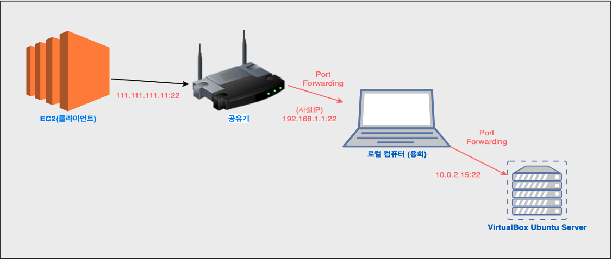

# VirtualBox Ubuntu Server 외부접속 (via Port Forwarding, NAT)

2021-1 OSSP 수업 내 팀 프로젝트 중, AWS Free tier 인스턴스 환경에서 `tensorflow` 설치 과정에서 문제가 생겨 부득이 하게 VirtualBox 내 Ubuntu Server를 운용했다. 이 서버에 접근하는 클라이언트는 AWS 인스턴스에서 구축된 서버가 전부인 상황이었다. 

포트 포워딩 (NAT) 활용하여 IP:특정포트번호 형식의 요청을 다른 IP:Port로 ... 

