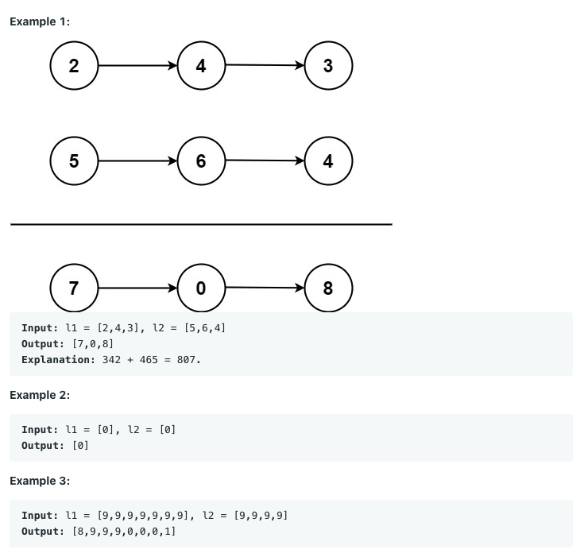

# [LeetCode-2] Add Two Numbers

`Linked List`

### | Question

#### You are given <u>two non-empty linked lists</u> representing <u>two non-negative integers</u>. 

#### The digits are stored <u>in reverse order</u>, and <u>each of their nodes contains a single digit</u>. 

#### <u>Add the two numbers and return sum as a linked list</u>.

#### You may assume the two numbers do not contain any leading zero, except the number 0 itself. 

### | Example 

____

